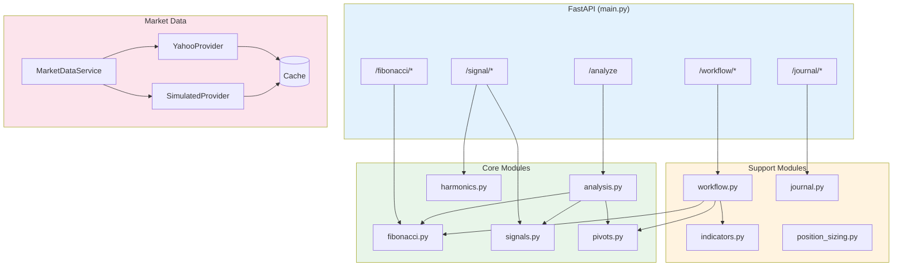
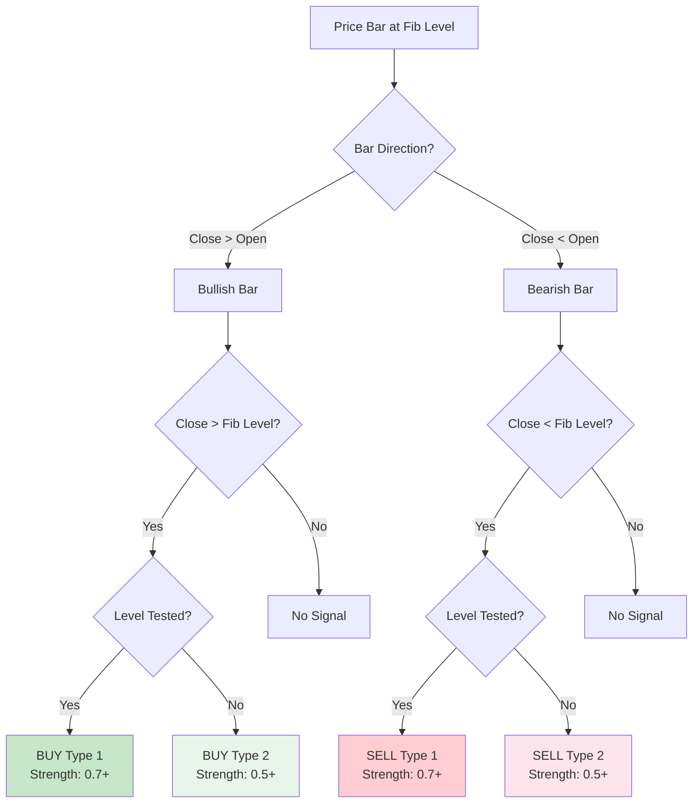
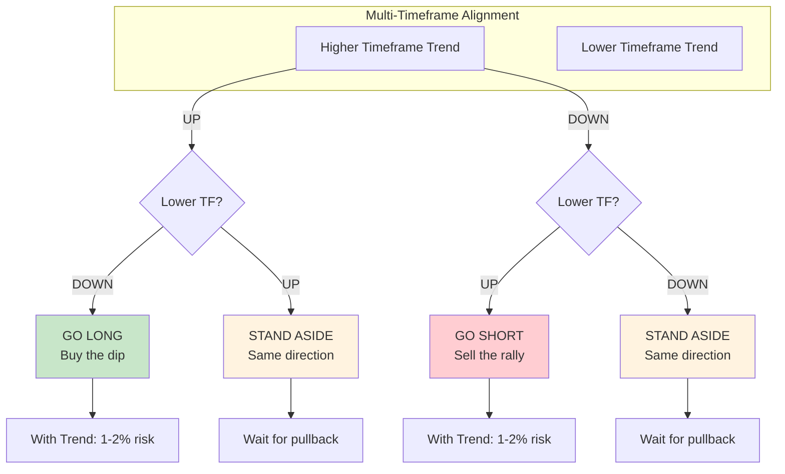
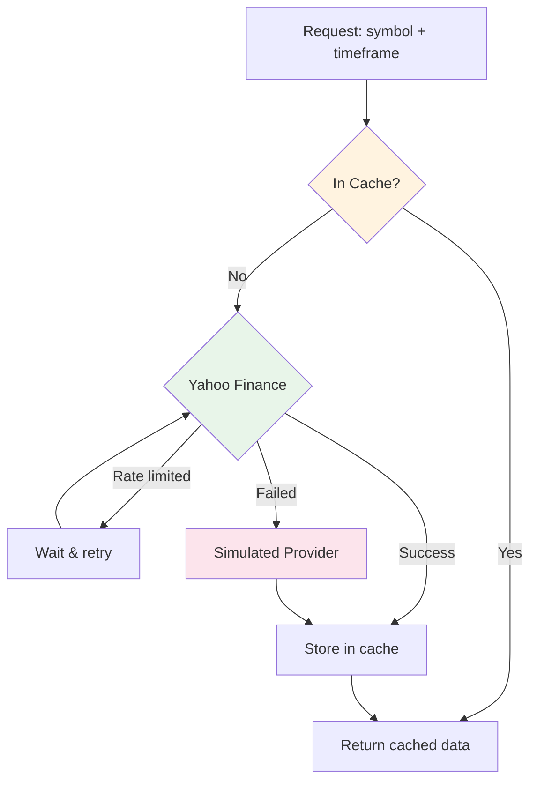

# Backend Documentation

Technical documentation for the Python/FastAPI backend.

## Module Overview



## Modules

### analysis.py

Unified analysis orchestration combining all analysis operations.

| Component | Description |
|-----------|-------------|
| `AnalysisOrchestrator` | Coordinates market data, pivots, Fibonacci, and signals |
| `FullAnalysisRequest` | Request with symbol, timeframe, periods, and config |
| `FullAnalysisResponse` | Complete response with all analysis sections |
| `AnalysisConfig` | Configuration for pivot lookback, Fibonacci direction, signals |

**Single endpoint** reduces frontend complexity and network round-trips.

### fibonacci.py

Four Fibonacci calculation tools for trading analysis.

| Function | Description | Parameters |
|----------|-------------|------------|
| `calculate_retracement_levels()` | Pullback levels (38.2%, 50%, 61.8%, 78.6%) | high, low, direction |
| `calculate_extension_levels()` | Extension levels (127.2%, 161.8%, 261.8%) | high, low, direction |
| `calculate_projection_levels()` | Three-point AB=CD projection | point_a, point_b, point_c, direction |
| `calculate_expansion_levels()` | Expansion from point B | point_a, point_b, direction |

### signals.py

Signal bar detection at Fibonacci levels.



| Component | Description |
|-----------|-------------|
| `Bar` | OHLC price bar dataclass with `is_bullish`/`is_bearish` properties |
| `Signal` | Detected signal with direction, type, strength, level |
| `SignalType` | TYPE_1 (level tested) or TYPE_2 (no deep test) |
| `detect_signal()` | Main detection function |

**Signal Rules:**
- **BUY**: Close > Open AND Close > Fibonacci Level
- **SELL**: Close < Open AND Close < Fibonacci Level

**Signal Strength:** 0.0-1.0 based on signal type and price distance from level.

### harmonics.py

Harmonic pattern detection using XABCD points.

| Pattern | AB Ratio | D Level |
|---------|----------|---------|
| Gartley | 61.8% | 78.6% retracement |
| Butterfly | 78.6% | 127.2-161.8% extension |
| Bat | 38.2-50% | 88.6% retracement |
| Crab | 38.2-61.8% | 161.8% extension |

| Function | Description |
|----------|-------------|
| `validate_pattern()` | Check if XABCD points form valid harmonic pattern |
| `calculate_reversal_zone()` | Calculate potential reversal zone (D point) for pattern completion |

### pivots.py

Swing high/low detection for chart analysis.

| Component | Description |
|-----------|-------------|
| `OHLCBar` | OHLC bar with time field |
| `PivotPoint` | Detected pivot with index, price, type, time |
| `PivotResult` | All pivots, recent pivots, swing high/low |
| `detect_pivots()` | Detect swing points with configurable lookback |

### position_sizing.py

Risk management and position sizing calculations.

| Function | Description |
|----------|-------------|
| `calculate_position_size()` | Position size from entry, stop, and risk capital |
| `calculate_risk_reward()` | Risk/reward ratio with target analysis |

### indicators.py

Technical indicator calculations for trend confirmation.

| Function | Description |
|----------|-------------|
| `calculate_ema()` | Exponential Moving Average with configurable period |
| `calculate_macd()` | MACD line, signal line, histogram (default 12/26/9) |
| `calculate_rsi()` | Relative Strength Index (default period 14) |

**RSI Interpretation:**
- Overbought: RSI > 70
- Oversold: RSI < 30
- Neutral: 30 < RSI < 70

### workflow.py

8-step trading workflow with multi-timeframe analysis.



| Function | Description |
|----------|-------------|
| `assess_trend()` | Analyze trend from swing patterns (HH/HL/LH/LL) |
| `check_alignment()` | Check multi-timeframe trend alignment |
| `identify_levels()` | Find Fibonacci levels with confluence scoring |
| `confirm_indicators()` | RSI/MACD confirmation for entry |
| `categorize_trade()` | Classify as with_trend, counter_trend, or reversal |
| `scan_opportunities()` | Scan symbols for trade setups |

**Confluence Scoring:**
- Base: 1 point per Fibonacci level
- Same timeframe confluence: +1 per level
- Higher timeframe confluence: +2 per level
- Previous pivot proximity: +2
- Psychological level (round numbers): +1

**Trade Categories:**
| Category | Risk | Description |
|----------|------|-------------|
| With Trend | 1-2% | Aligned with higher timeframe |
| Counter Trend | 0.5-1% | Against higher timeframe |
| Reversal | 0.25-0.5% | Speculative reversal attempt |

### journal.py

Trade journaling and analytics.

| Component | Description |
|-----------|-------------|
| `JournalEntry` | Trade record with entry, exit, P&L, R-multiple |
| `JournalAnalytics` | Aggregated statistics (win rate, profit factor) |
| `JournalService` | CRUD operations for journal entries |

**Analytics Fields:**
- Total trades, wins, losses, breakevens
- Win rate percentage
- Total P&L and average R-multiple
- Profit factor (gross profit / gross loss)
- Largest win and largest loss

### market_data/

Multi-provider market data with caching and fallback.



| Component | Description |
|-----------|-------------|
| `MarketDataService` | Orchestrates providers, caching, rate limiting |
| `YahooProvider` | Yahoo Finance data provider (priority 1) |
| `SimulatedProvider` | Fallback with generated data (priority 999) |
| `MarketDataCache` | TTL-based caching for OHLC data |
| `RateLimiter` | Per-provider rate limiting |

**Features:** Provider fallback, caching, rate limiting, market status.

### main.py

FastAPI application with REST endpoints.

See [API Endpoints](../../README.md#api-endpoints) in main README.

## Architecture

```
backend/
├── src/trader/
│   ├── __init__.py
│   ├── main.py             # FastAPI application (45+ endpoints)
│   ├── analysis.py         # Unified analysis orchestration
│   ├── fibonacci.py        # Fibonacci calculations (4 tools)
│   ├── signals.py          # Signal bar detection (Type 1/2)
│   ├── harmonics.py        # Harmonic pattern detection (XABCD)
│   ├── pivots.py           # Swing high/low detection
│   ├── indicators.py       # Technical indicators (EMA, MACD, RSI)
│   ├── workflow.py         # 8-step trading workflow
│   ├── journal.py          # Trade journaling & analytics
│   ├── position_sizing.py  # Risk management
│   └── market_data/        # Market data providers
│       ├── __init__.py
│       ├── cache.py        # TTL caching
│       ├── models.py       # Data models
│       ├── rate_limiter.py # Rate limiting
│       ├── service.py      # Service orchestration
│       └── providers/      # Data providers
│           ├── base.py     # Provider interface
│           ├── yahoo.py    # Yahoo Finance
│           └── simulated.py # Fallback provider
├── tests/
│   ├── unit/               # Unit tests for each module
│   │   └── market_data/    # Market data tests
│   └── integration/        # API endpoint tests
├── pyproject.toml          # Project configuration
└── README.md               # Backend quick start
```

## Related Documentation

- [Strategy Knowledge](../references/fibonacci_strategy_knowledge.md) - Trading strategy theory
- [App Specification](../references/fibonacci_trading_app_specification.md) - Feature requirements
- [ADRs](../adr/) - Architecture decisions
