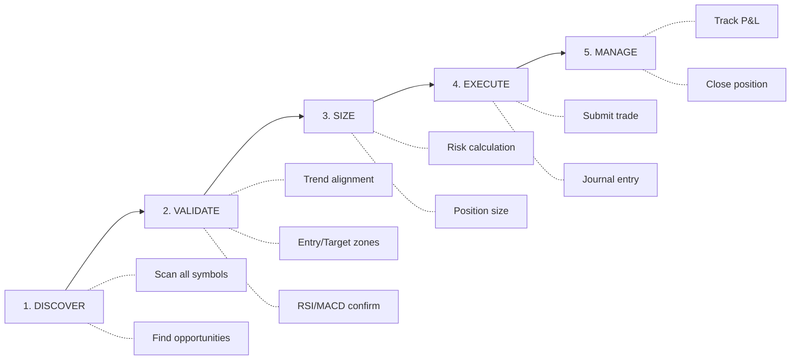
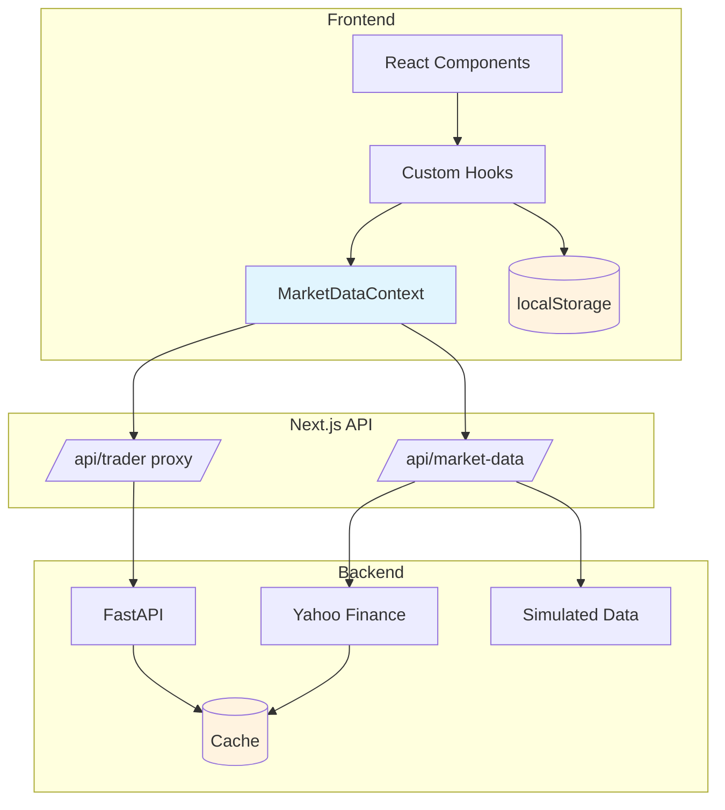

# Frontend Documentation

Technical documentation for the Next.js/TypeScript frontend.

## Status

**Active Development** - Core charting functionality complete with Yahoo Finance integration.

## Technology Stack

| Component | Technology | Version |
|-----------|------------|---------|
| Framework | Next.js | 16.1.1 |
| Language | TypeScript | 5.x |
| Charting | TradingView Lightweight Charts | 5.x |
| Styling | Tailwind CSS | 4.x |
| UI Components | shadcn/ui | Latest |
| State | React hooks + localStorage | - |
| Data Source | Yahoo Finance (yahoo-finance2) | 3.x |

## Features

### Chart Component
- Candlestick, Bar (OHLC), and Heikin Ashi chart types
- Configurable color schemes (green-red, blue-red, blue-orange, teal-pink)
- Light and dark theme support
- Responsive with auto-resize

### Fibonacci Levels
- Retracement levels (0%, 23.6%, 38.2%, 50%, 61.8%, 78.6%, 100%)
- Extension levels (127.2%, 141.4%, 161.8%, 200%, 261.8%)
- Expansion levels from swing low
- Projection levels using A-B-C pattern

### Pivot Point Detection
- Automatic swing high/low detection
- Alternating pivot pattern enforcement
- Manual pivot override option
- Visual pivot lines connecting points

### Market Data
- Yahoo Finance integration for real-time data
- Auto-refresh with configurable intervals by timeframe
- Market status display (Open, Pre-Market, After Hours, Closed)
- Countdown timer showing next refresh
- Support for indices (DJI, SPX, NDX), crypto (BTC), forex (EUR/USD), commodities (Gold)

### Settings
- Persistent settings via localStorage
- Cross-tab synchronization
- Chart preferences (type, theme, colors)
- Default symbol and timeframe
- Fibonacci visibility toggles
- Workflow auto-validation toggle

### Trading Workflow V2 (Chart-Centric)

The new 5-phase workflow is chart-centric, focusing on discovering and executing trades:



| Phase | Name | Description |
|-------|------|-------------|
| 1 | **DISCOVER** | Find opportunities across all symbols and timeframes |
| 2 | **VALIDATE** | Check trade criteria (trend alignment, zones, indicators) |
| 3 | **SIZE** | Calculate position size with risk management |
| 4 | **EXECUTE** | Submit trade with journal entry |
| 5 | **MANAGE** | Monitor active trade and P&L |

**Validation Checks:**
- Trend alignment (required/warning/ignored modes)
- Entry zone exists
- Target zone exists
- RSI confirmation
- MACD confirmation

**Features:**
- Signal suggestions based on Fibonacci proximity
- Trade discovery scanning all symbols
- Confidence scoring (0-100)
- Fallback data when backend unavailable
- State persistence to localStorage

### Legacy Workflow (8-Step)

The original 8-step workflow remains available at `/workflow`:

| Step | Name | Description |
|------|------|-------------|
| 1 | Market Selection | Choose symbol, timeframes, trading style |
| 2 | Trend Alignment | Analyze higher/lower timeframe trends |
| 3 | Fibonacci Setup | Select pivots and configure Fibonacci levels |
| 4 | Pattern Scan | Scan for harmonic patterns and signals |
| 5 | Entry Signal | Confirm entry with signal bar detection |
| 6 | Position Sizing | Calculate position size and R:R ratio |
| 7 | Pre-Trade Checklist | Final GO/NO-GO validation |
| 8 | Trade Management | Active trade monitoring and management |

## Pages

| Page | URL | Description |
|------|-----|-------------|
| Dashboard | `/dashboard` | Overview with symbol cards, market status |
| Chart | `/chart` | Main charting with Fibonacci and pivot detection |
| Chart Pro | `/chart-pro` | Advanced analysis with levels table and strategy panel |
| Workflow V2 | `/workflow-v2` | New 5-phase chart-centric trading workflow |
| Workflow | `/workflow` | Legacy 8-step trading workflow |
| Timeframes | `/timeframes` | Multi-timeframe viewer with trends and OHLC |
| Trend Analysis | `/trend-analysis` | Multi-timeframe trend alignment analysis |
| Position Sizing | `/position-sizing` | Position size and risk calculator |
| Journal | `/journal` | Trade journal with P&L tracking |
| TradingView | `/tradingview` | TradingView integration and PineScript info |
| Settings | `/settings` | User preferences and configuration |
| Dev | `/dev` | Development utilities and debugging tools |

## Architecture

```
frontend/
├── src/
│   ├── app/                    # Next.js app router
│   │   ├── api/                # API routes (market-data, trader proxy)
│   │   ├── chart/              # Main chart page
│   │   ├── chart-pro/          # Advanced chart with levels table
│   │   ├── dashboard/          # Dashboard overview
│   │   ├── workflow-v2/        # New 5-phase workflow
│   │   ├── workflow/           # Legacy 8-step workflow
│   │   ├── timeframes/         # Multi-timeframe viewer
│   │   ├── trend-analysis/     # Trend analysis page
│   │   ├── position-sizing/    # Position sizing calculator
│   │   ├── journal/            # Trade journal
│   │   ├── tradingview/        # TradingView integration
│   │   ├── settings/           # Settings page
│   │   └── dev/                # Development utilities
│   ├── components/
│   │   ├── trading/            # Trading components
│   │   │   ├── tools/          # Workflow step tools
│   │   │   └── scanners/       # Pattern scanners
│   │   ├── workflow/           # Legacy workflow components
│   │   ├── workflow-v2/        # New workflow components
│   │   │   ├── DiscoveryModePanel.tsx
│   │   │   ├── ValidationPanel.tsx
│   │   │   ├── SizingPanel.tsx
│   │   │   ├── ExecutionPanel.tsx
│   │   │   └── ManagePanel.tsx
│   │   └── ui/                 # shadcn/ui components
│   ├── contexts/               # React contexts
│   │   ├── MarketDataContext   # Centralized market data with deduplication
│   │   └── RefreshContext      # Auto-refresh coordination
│   ├── hooks/                  # Custom React hooks (45+)
│   │   ├── use-settings.ts     # Settings with localStorage
│   │   ├── use-market-data.ts  # Market data fetching
│   │   ├── use-pivot-analysis.ts    # Pivot detection
│   │   ├── use-fibonacci-api.ts     # Fibonacci API integration
│   │   ├── use-trend-analysis.ts    # Trend analysis
│   │   ├── use-signal-suggestions.ts # Signal recommendations
│   │   ├── use-workflow-v2-state.ts  # Workflow V2 state
│   │   ├── use-trade-discovery.ts    # Trade opportunity scanning
│   │   ├── use-trade-validation.ts   # Validation checks
│   │   └── use-trade-execution.ts    # Trade execution
│   └── lib/
│       ├── utils.ts            # Utility functions
│       └── chart-constants.ts  # Trading constants
├── public/
├── package.json
└── next.config.ts
```

## Key Hooks

| Hook | Description |
|------|-------------|
| `use-market-data` | Fetch OHLC with caching and deduplication |
| `use-pivot-analysis` | Detect and classify swing points |
| `use-fibonacci-api` | Calculate Fibonacci levels via backend |
| `use-trend-analysis` | Analyze trend direction with RSI/MACD |
| `use-signal-suggestions` | Generate trade signals at Fibonacci levels |
| `use-workflow-v2-state` | Manage 5-phase workflow state |
| `use-trade-discovery` | Scan for trade opportunities |
| `use-trade-validation` | Validate trade setup criteria |
| `use-opportunities` | Aggregate opportunities across symbols |
| `use-watchlist` | Manage watched symbols |

## Data Flow



**Data Flow Patterns:**
- **Market Data**: Component → Hook → Context → API → Yahoo/Backend → Cache → Response
- **Settings**: Component → Hook → localStorage → Sync across tabs
- **Workflow State**: Component → Hook → localStorage → Persist across sessions

## API Routes

### GET /api/market-data

Fetches OHLC data from Yahoo Finance.

**Query Parameters:**
- `symbol` - Market symbol (DJI, SPX, NDX, BTCUSD, EURUSD, GOLD)
- `timeframe` - Data interval (1m, 15m, 1H, 4H, 1D, 1W, 1M)

**Response:**
```json
{
  "symbol": "DJI",
  "timeframe": "1D",
  "data": [
    { "time": "2024-01-15", "open": 42500, "high": 42600, "low": 42400, "close": 42550 }
  ],
  "meta": {
    "currency": "USD",
    "exchangeName": "DJI",
    "regularMarketPrice": 42550
  },
  "market": {
    "state": "REGULAR",
    "stateDisplay": "Market Open",
    "isOpen": true,
    "isPreMarket": false,
    "isAfterHours": false,
    "isClosed": false
  }
}
```

## Auto-Refresh Intervals

| Timeframe | Refresh Interval | Rationale |
|-----------|------------------|-----------|
| 1m | 60 seconds | Match candle period |
| 15m | 60 seconds | Sub-candle updates |
| 1H | 5 minutes | Balance freshness/rate limits |
| 4H | 5 minutes | Balance freshness/rate limits |
| 1D | 15 minutes | Daily data changes slowly |
| 1W | 1 hour | Weekly data rarely urgent |
| 1M | 1 hour | Monthly data rarely urgent |

## Quick Start

```bash
cd frontend
npm install
npm run dev
```

Visit http://localhost:3000/chart for the main chart view.

## Related Documentation

- [Component Architecture](./component-architecture.md) - **Detailed component hierarchy and data flow diagrams**
- [UX Best Practices](./ux-best-practices.md) - Design system guidelines
- [Yahoo Finance ADR](../adr/20251230-yahoo-finance-market-data.md) - Data source decision
- [Auto-Refresh ADR](../adr/20251230-auto-refresh-market-data.md) - Refresh strategy
- [Design System ADR](../adr/20251230-frontend-design-system.md) - UI framework choices
- [TradingView Lightweight Charts](https://tradingview.github.io/lightweight-charts/) - Charting library
