# Frontend Component Architecture

Comprehensive documentation of all frontend screens, their components, data sources, and data flow.

## Table of Contents

1. [Application Overview](#application-overview)
2. [Chart Page](#chart-page)
3. [Dashboard Page](#dashboard-page)
4. [Trend Analysis Page](#trend-analysis-page)
5. [Position Sizing Page](#position-sizing-page)
6. [Settings Page](#settings-page)
7. [Workflow Page](#workflow-page)
8. [Shared Hooks](#shared-hooks)
9. [Data Flow Patterns](#data-flow-patterns)

---

## Application Overview

### Page Navigation

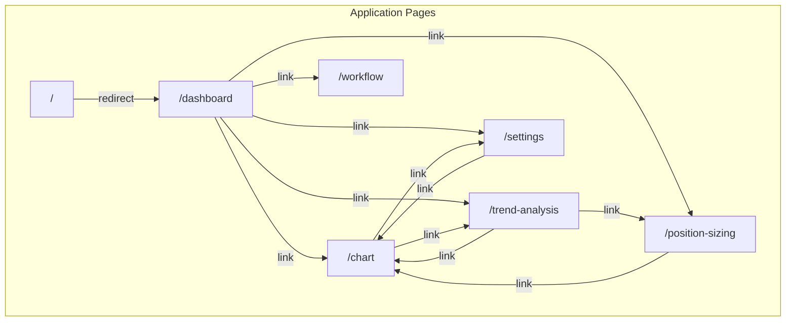
```mermaid
graph TB
    subgraph "Application Pages"
        HOME["/"] -->|redirect| DASH["/dashboard"]
        DASH -->|link| CHART["/chart"]
        DASH -->|link| TREND["/trend-analysis"]
        DASH -->|link| POS["/position-sizing"]
        DASH -->|link| SET["/settings"]
        DASH -->|link| WORK["/workflow"]

        CHART -->|link| TREND
        CHART -->|link| SET
        TREND -->|link| CHART
        TREND -->|link| POS
        POS -->|link| CHART
        SET -->|link| CHART
    end
```

### Global Data Sources

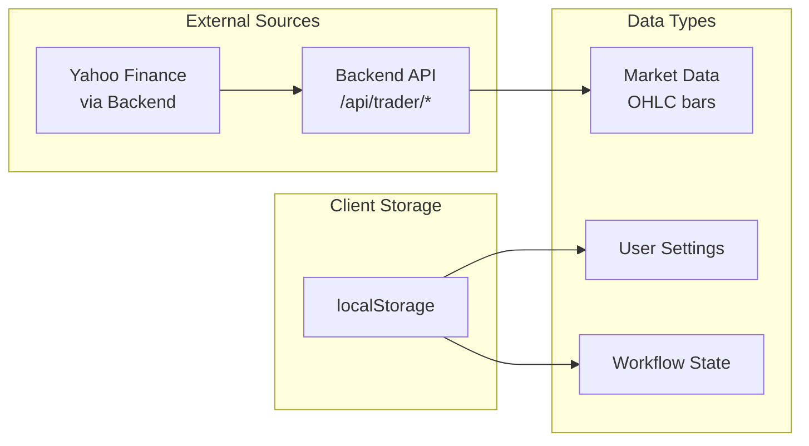
```mermaid
graph LR
    subgraph "External Sources"
        BACKEND[Backend API<br>/api/trader/*]
        YAHOO[Yahoo Finance<br>via Backend]
    end

    subgraph "Client Storage"
        LS[localStorage]
    end

    subgraph "Data Types"
        OHLC[Market Data<br>OHLC bars]
        SETTINGS[User Settings]
        WORKFLOW[Workflow State]
    end

    BACKEND --> OHLC
    YAHOO --> BACKEND
    LS --> SETTINGS
    LS --> WORKFLOW
```

---

## Chart Page

**File:** `src/app/chart/page.tsx`

The main trading chart with Fibonacci levels, pivot detection, and analysis tools.

### Component Hierarchy

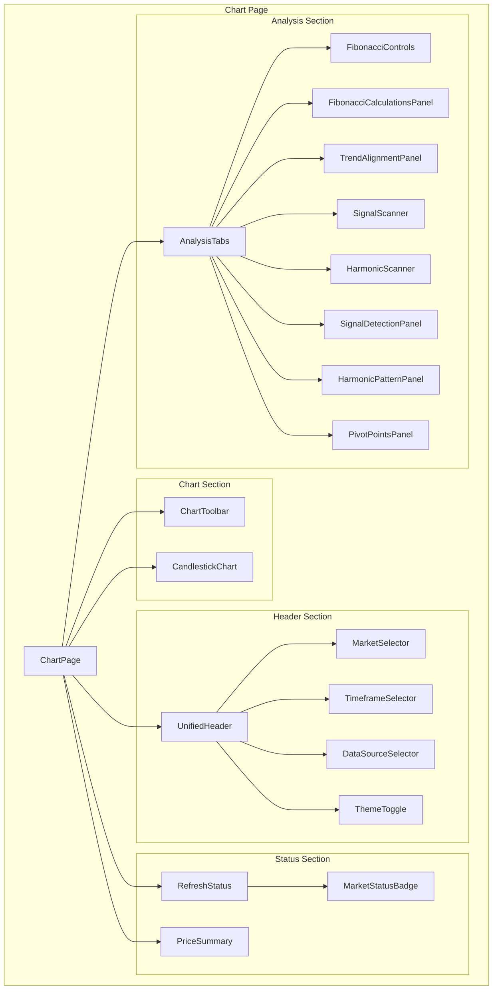
```mermaid
graph TB
    subgraph "Chart Page"
        PAGE[ChartPage]

        subgraph "Header Section"
            UH[UnifiedHeader]
            UH --> MS[MarketSelector]
            UH --> TFS[TimeframeSelector]
            UH --> DSS[DataSourceSelector]
            UH --> TT[ThemeToggle]
        end

        subgraph "Status Section"
            RS[RefreshStatus]
            RS --> MSB[MarketStatusBadge]
            PS[PriceSummary]
        end

        subgraph "Chart Section"
            CT[ChartToolbar]
            CC[CandlestickChart]
        end

        subgraph "Analysis Section"
            AT[AnalysisTabs]
            AT --> FC[FibonacciControls]
            AT --> FCP[FibonacciCalculationsPanel]
            AT --> TAP[TrendAlignmentPanel]
            AT --> SS[SignalScanner]
            AT --> HS[HarmonicScanner]
            AT --> SDP[SignalDetectionPanel]
            AT --> HPP[HarmonicPatternPanel]
            AT --> PPP[PivotPointsPanel]
        end

        PAGE --> UH
        PAGE --> RS
        PAGE --> PS
        PAGE --> CT
        PAGE --> CC
        PAGE --> AT
    end
```

### Data Flow

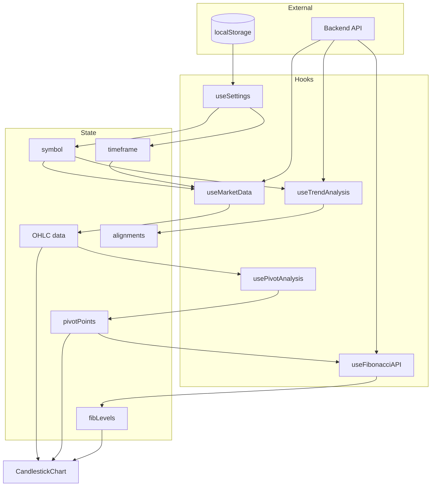
```mermaid
flowchart TB
    subgraph "Hooks"
        US[useSettings]
        UMD[useMarketData]
        UPA[usePivotAnalysis]
        UFA[useFibonacciAPI]
        UTA[useTrendAnalysis]
    end

    subgraph "External"
        LS[(localStorage)]
        BE[Backend API]
    end

    subgraph "State"
        SYMBOL[symbol]
        TF[timeframe]
        DATA[OHLC data]
        PIVOTS[pivotPoints]
        FIB[fibLevels]
        TREND[alignments]
    end

    LS --> US
    US --> SYMBOL
    US --> TF

    SYMBOL --> UMD
    TF --> UMD
    BE --> UMD
    UMD --> DATA

    DATA --> UPA
    UPA --> PIVOTS

    PIVOTS --> UFA
    BE --> UFA
    UFA --> FIB

    SYMBOL --> UTA
    BE --> UTA
    UTA --> TREND

    DATA --> CC[CandlestickChart]
    PIVOTS --> CC
    FIB --> CC
```

### Components Detail

| Component | Data Source | Purpose |
|-----------|-------------|---------|
| `UnifiedHeader` | Props from page state | Market/timeframe selection, navigation |
| `RefreshStatus` | `useMarketData` hook | Show refresh timer, market status, backend status |
| `PriceSummary` | `useMarketData` | Current price, change, crosshair price |
| `CandlestickChart` | `useMarketData`, `usePivotAnalysis` | Main chart with overlays |
| `AnalysisTabs` | Multiple hooks | Tabbed analysis panels |
| `FibonacciControls` | Local state | Toggle Fib level visibility |
| `TrendAlignmentPanel` | `useTrendAnalysis` | Multi-TF trend signals |
| `SignalScanner` | Backend API (per scan) | Scan for Type 1/2 signals |
| `HarmonicScanner` | Backend API (per scan) | Scan for harmonic patterns |
| `PivotPointsPanel` | `usePivotAnalysis` | Configure pivot detection |

---

## Dashboard Page

**File:** `src/app/dashboard/page.tsx`

Market overview with quick summary of all tracked symbols.

### Component Hierarchy

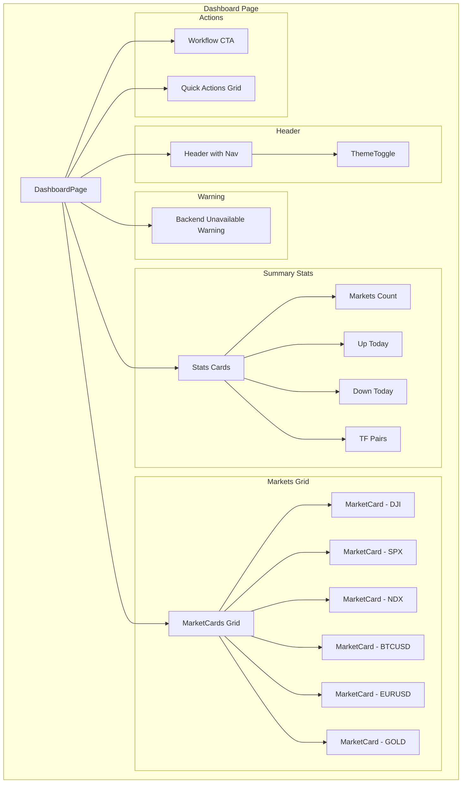
```mermaid
graph TB
    subgraph "Dashboard Page"
        PAGE[DashboardPage]

        subgraph "Header"
            H[Header with Nav]
            H --> TT[ThemeToggle]
        end

        subgraph "Warning"
            BUW[Backend Unavailable Warning]
        end

        subgraph "Summary Stats"
            STATS[Stats Cards]
            STATS --> MC1[Markets Count]
            STATS --> MC2[Up Today]
            STATS --> MC3[Down Today]
            STATS --> MC4[TF Pairs]
        end

        subgraph "Markets Grid"
            MG[MarketCards Grid]
            MG --> MK1[MarketCard - DJI]
            MG --> MK2[MarketCard - SPX]
            MG --> MK3[MarketCard - NDX]
            MG --> MK4[MarketCard - BTCUSD]
            MG --> MK5[MarketCard - EURUSD]
            MG --> MK6[MarketCard - GOLD]
        end

        subgraph "Actions"
            WF[Workflow CTA]
            QA[Quick Actions Grid]
        end

        PAGE --> H
        PAGE --> BUW
        PAGE --> STATS
        PAGE --> MG
        PAGE --> WF
        PAGE --> QA
    end
```

### Data Flow

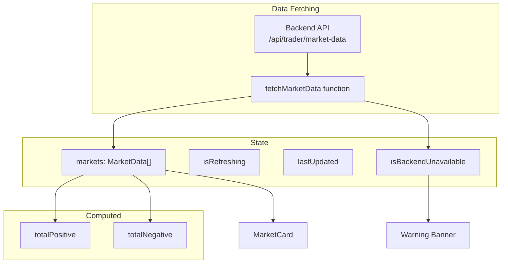
```mermaid
flowchart TB
    subgraph "Data Fetching"
        FMD[fetchMarketData function]
        BE[Backend API<br>/api/trader/market-data]
    end

    subgraph "State"
        MARKETS["markets: MarketData[]"]
        REFRESH[isRefreshing]
        UPDATED[lastUpdated]
        UNAVAIL[isBackendUnavailable]
    end

    subgraph "Computed"
        POS[totalPositive]
        NEG[totalNegative]
    end

    BE --> FMD
    FMD --> MARKETS
    FMD --> UNAVAIL

    MARKETS --> POS
    MARKETS --> NEG

    MARKETS --> MK[MarketCard]
    UNAVAIL --> BUW[Warning Banner]
```

### Components Detail

| Component | Data Source | Purpose |
|-----------|-------------|---------|
| `MarketCard` | `fetchMarketData()` | Display single market price/change |
| `ThemeToggle` | Local state | Toggle dark/light theme |
| Stats Cards | Computed from markets | Show up/down counts |
| Quick Actions | Static | Navigation shortcuts |

---

## Trend Analysis Page

**File:** `src/app/trend-analysis/page.tsx`

Multi-timeframe trend alignment analysis.

### Component Hierarchy

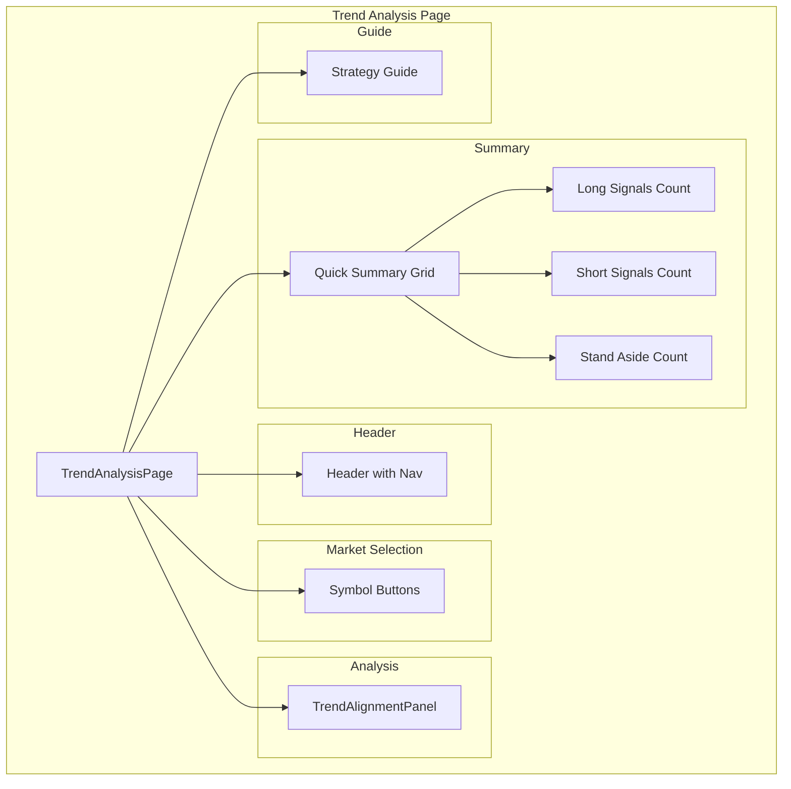
```mermaid
graph TB
    subgraph "Trend Analysis Page"
        PAGE[TrendAnalysisPage]

        subgraph "Header"
            H[Header with Nav]
        end

        subgraph "Market Selection"
            MS[Symbol Buttons]
        end

        subgraph "Summary"
            SUM[Quick Summary Grid]
            SUM --> LONG[Long Signals Count]
            SUM --> SHORT[Short Signals Count]
            SUM --> STAND[Stand Aside Count]
        end

        subgraph "Analysis"
            TAP[TrendAlignmentPanel]
        end

        subgraph "Guide"
            SG[Strategy Guide]
        end

        PAGE --> H
        PAGE --> MS
        PAGE --> SUM
        PAGE --> TAP
        PAGE --> SG
    end
```

### Data Flow

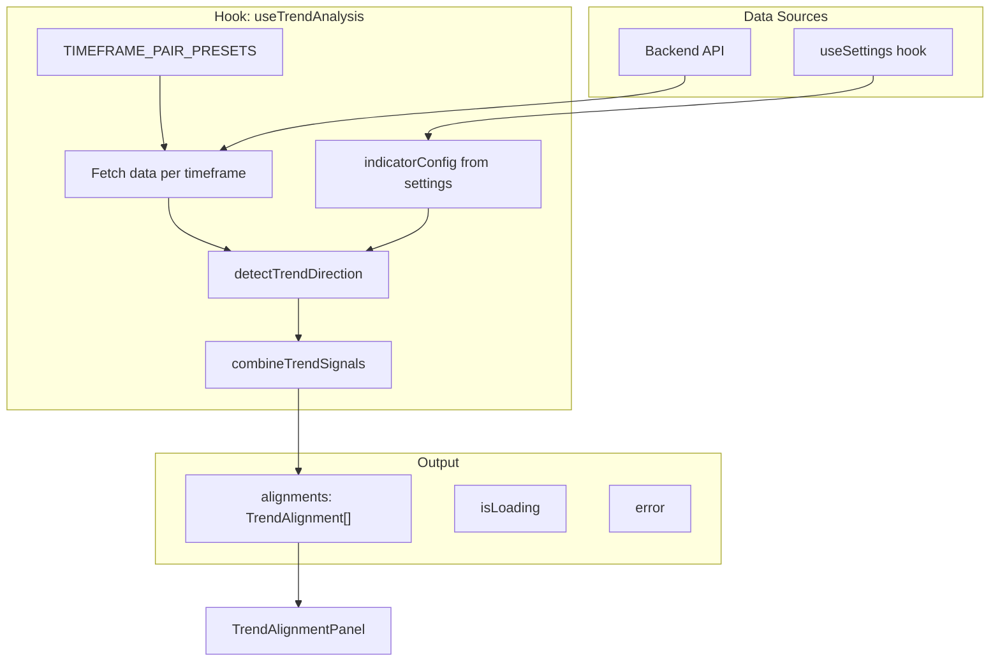
```mermaid
flowchart TB
    subgraph "Hook: useTrendAnalysis"
        CONFIG[indicatorConfig from settings]
        PAIRS[TIMEFRAME_PAIR_PRESETS]
        FETCH[Fetch data per timeframe]
        DETECT[detectTrendDirection]
        COMBINE[combineTrendSignals]
    end

    subgraph "Data Sources"
        US[useSettings hook]
        BE[Backend API]
    end

    subgraph "Output"
        ALIGN["alignments: TrendAlignment[]"]
        LOAD[isLoading]
        ERR[error]
    end

    US --> CONFIG
    PAIRS --> FETCH
    BE --> FETCH
    FETCH --> DETECT
    CONFIG --> DETECT
    DETECT --> COMBINE
    COMBINE --> ALIGN

    ALIGN --> TAP[TrendAlignmentPanel]
```

### Indicator Processing

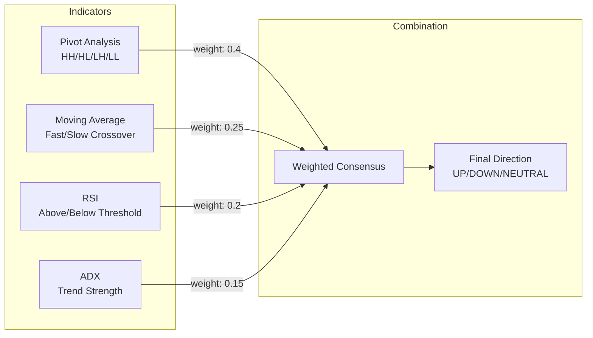
```mermaid
flowchart LR
    subgraph "Indicators"
        PIV[Pivot Analysis<br>HH/HL/LH/LL]
        MA[Moving Average<br>Fast/Slow Crossover]
        RSI[RSI<br>Above/Below Threshold]
        ADX[ADX<br>Trend Strength]
    end

    subgraph "Combination"
        WEIGHT[Weighted Consensus]
        DIR[Final Direction<br>UP/DOWN/NEUTRAL]
    end

    PIV -->|weight: 0.4| WEIGHT
    MA -->|weight: 0.25| WEIGHT
    RSI -->|weight: 0.2| WEIGHT
    ADX -->|weight: 0.15| WEIGHT
    WEIGHT --> DIR
```

---

## Position Sizing Page

**File:** `src/app/position-sizing/page.tsx`

Calculate trade position size based on risk parameters.

### Component Hierarchy

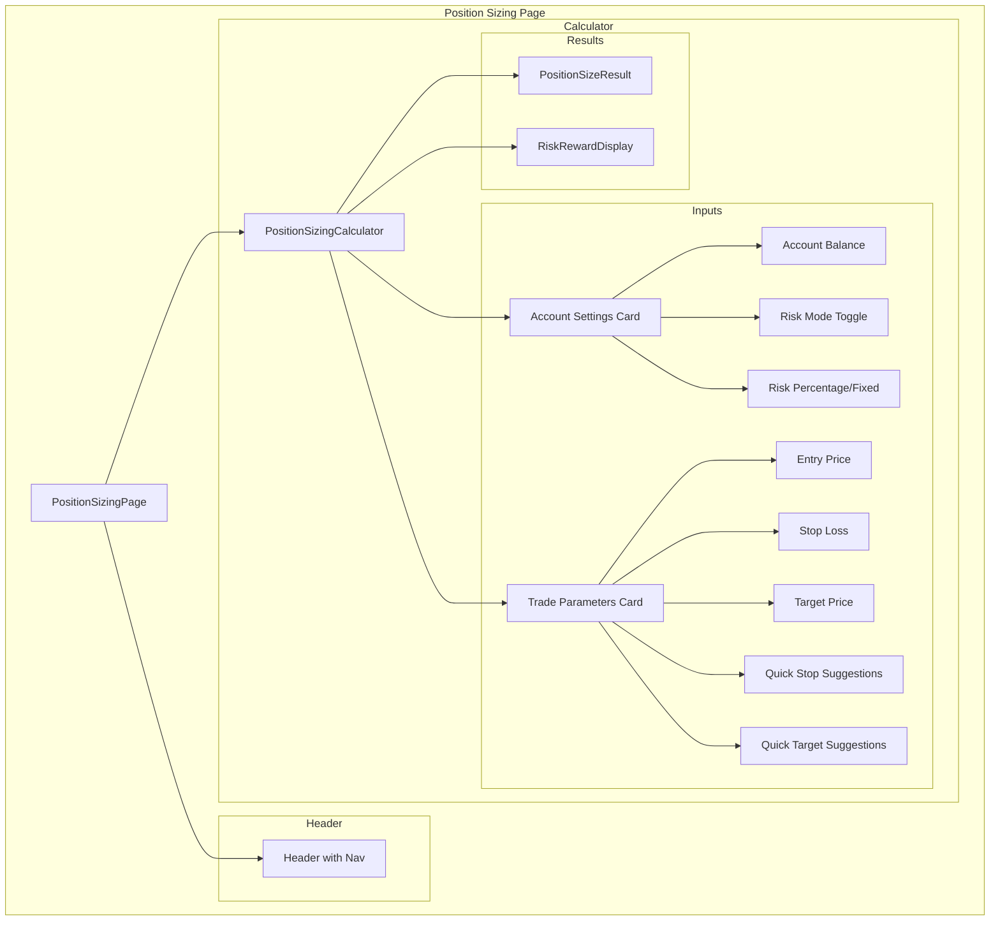
```mermaid
graph TB
    subgraph "Position Sizing Page"
        PAGE[PositionSizingPage]

        subgraph "Header"
            H[Header with Nav]
        end

        subgraph "Calculator"
            PSC[PositionSizingCalculator]

            subgraph "Inputs"
                ACCT[Account Settings Card]
                ACCT --> BAL[Account Balance]
                ACCT --> RISK[Risk Mode Toggle]
                ACCT --> RPCT[Risk Percentage/Fixed]

                TRADE[Trade Parameters Card]
                TRADE --> ENT[Entry Price]
                TRADE --> SL[Stop Loss]
                TRADE --> TGT[Target Price]
                TRADE --> QS[Quick Stop Suggestions]
                TRADE --> QT[Quick Target Suggestions]
            end

            subgraph "Results"
                PSR[PositionSizeResult]
                RRD[RiskRewardDisplay]
            end

            PSC --> ACCT
            PSC --> TRADE
            PSC --> PSR
            PSC --> RRD
        end

        PAGE --> H
        PAGE --> PSC
    end
```

### Data Flow

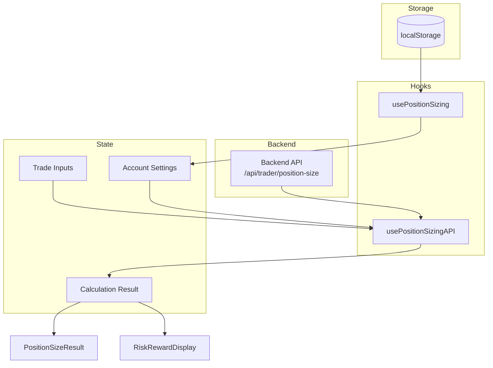
```mermaid
flowchart TB
    subgraph "Hooks"
        UPS[usePositionSizing]
        UPSA[usePositionSizingAPI]
    end

    subgraph "Storage"
        LS[(localStorage)]
    end

    subgraph "Backend"
        BE[Backend API<br>/api/trader/position-size]
    end

    subgraph "State"
        SETTINGS[Account Settings]
        INPUTS[Trade Inputs]
        RESULT[Calculation Result]
    end

    LS --> UPS
    UPS --> SETTINGS

    INPUTS --> UPSA
    SETTINGS --> UPSA
    BE --> UPSA
    UPSA --> RESULT

    RESULT --> PSR[PositionSizeResult]
    RESULT --> RRD[RiskRewardDisplay]
```

### Components Detail

| Component | Data Source | Purpose |
|-----------|-------------|---------|
| `PositionSizingCalculator` | `usePositionSizing`, `usePositionSizingAPI` | Main calculator UI |
| `PositionSizeResult` | API result | Show calculated position size |
| `RiskRewardDisplay` | API result | Show R:R ratio and recommendation |
| `PriceInput` | Props | Formatted price input field |

---

## Settings Page

**File:** `src/app/settings/page.tsx`

Configure default chart settings and indicators.

### Component Hierarchy

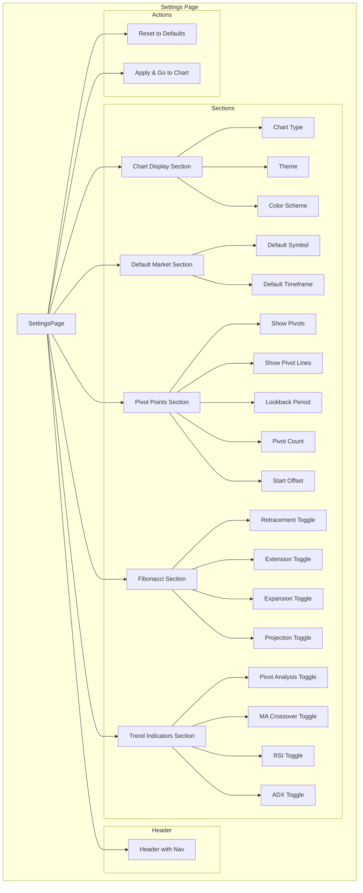
```mermaid
graph TB
    subgraph "Settings Page"
        PAGE[SettingsPage]

        subgraph "Header"
            H[Header with Nav]
        end

        subgraph "Sections"
            S1[Chart Display Section]
            S1 --> CT[Chart Type]
            S1 --> TH[Theme]
            S1 --> CS[Color Scheme]

            S2[Default Market Section]
            S2 --> SYM[Default Symbol]
            S2 --> TF[Default Timeframe]

            S3[Pivot Points Section]
            S3 --> SP[Show Pivots]
            S3 --> SPL[Show Pivot Lines]
            S3 --> LB[Lookback Period]
            S3 --> PC[Pivot Count]
            S3 --> OFF[Start Offset]

            S4[Fibonacci Section]
            S4 --> FR[Retracement Toggle]
            S4 --> FE[Extension Toggle]
            S4 --> FX[Expansion Toggle]
            S4 --> FP[Projection Toggle]

            S5[Trend Indicators Section]
            S5 --> TP[Pivot Analysis Toggle]
            S5 --> TM[MA Crossover Toggle]
            S5 --> TR[RSI Toggle]
            S5 --> TA[ADX Toggle]
        end

        subgraph "Actions"
            RST[Reset to Defaults]
            APL[Apply & Go to Chart]
        end

        PAGE --> H
        PAGE --> S1
        PAGE --> S2
        PAGE --> S3
        PAGE --> S4
        PAGE --> S5
        PAGE --> RST
        PAGE --> APL
    end
```

### Data Flow

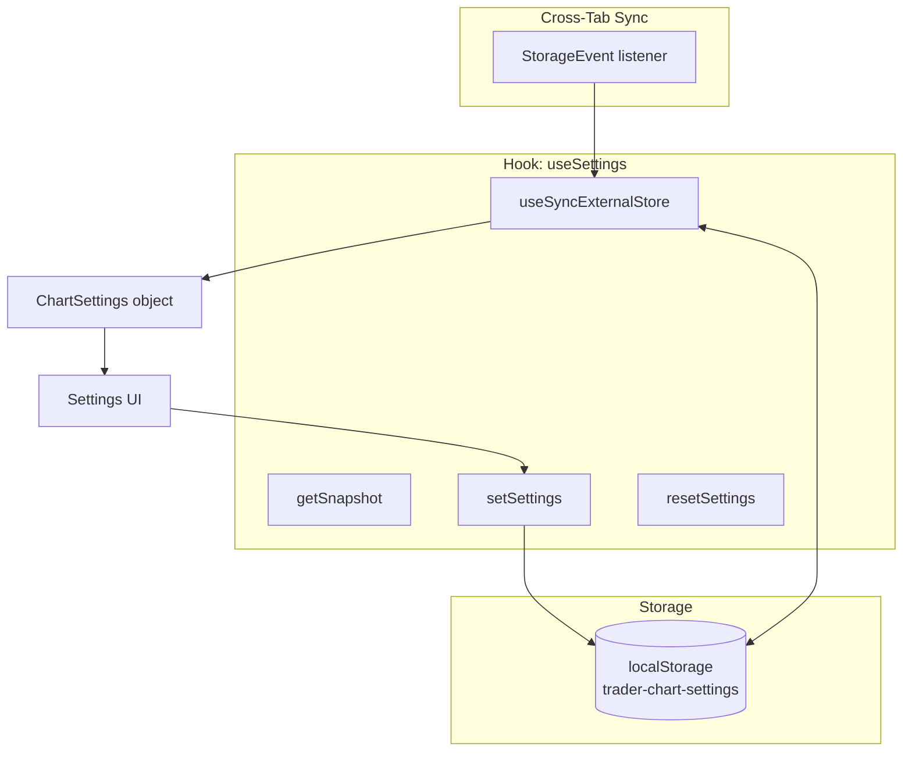
```mermaid
flowchart TB
    subgraph "Hook: useSettings"
        SYNC[useSyncExternalStore]
        GET[getSnapshot]
        SET[setSettings]
        RST[resetSettings]
    end

    subgraph "Storage"
        LS[(localStorage<br>trader-chart-settings)]
    end

    subgraph "Cross-Tab Sync"
        SE[StorageEvent listener]
    end

    LS <--> SYNC
    SE --> SYNC

    SYNC --> SETTINGS[ChartSettings object]
    SETTINGS --> UI[Settings UI]
    UI --> SET
    SET --> LS
```

### Settings Schema

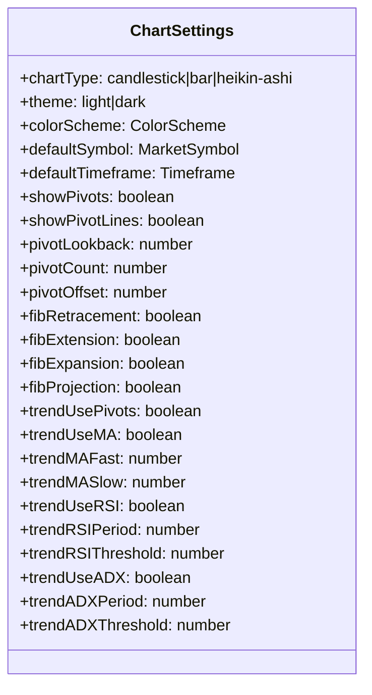
```mermaid
classDiagram
    class ChartSettings {
        +chartType: candlestick|bar|heikin-ashi
        +theme: light|dark
        +colorScheme: ColorScheme
        +defaultSymbol: MarketSymbol
        +defaultTimeframe: Timeframe
        +showPivots: boolean
        +showPivotLines: boolean
        +pivotLookback: number
        +pivotCount: number
        +pivotOffset: number
        +fibRetracement: boolean
        +fibExtension: boolean
        +fibExpansion: boolean
        +fibProjection: boolean
        +trendUsePivots: boolean
        +trendUseMA: boolean
        +trendMAFast: number
        +trendMASlow: number
        +trendUseRSI: boolean
        +trendRSIPeriod: number
        +trendRSIThreshold: number
        +trendUseADX: boolean
        +trendADXPeriod: number
        +trendADXThreshold: number
    }
```

---

## Workflow Page

**File:** `src/app/workflow/page.tsx`

Guided 8-step trading workflow manager.

### Component Hierarchy

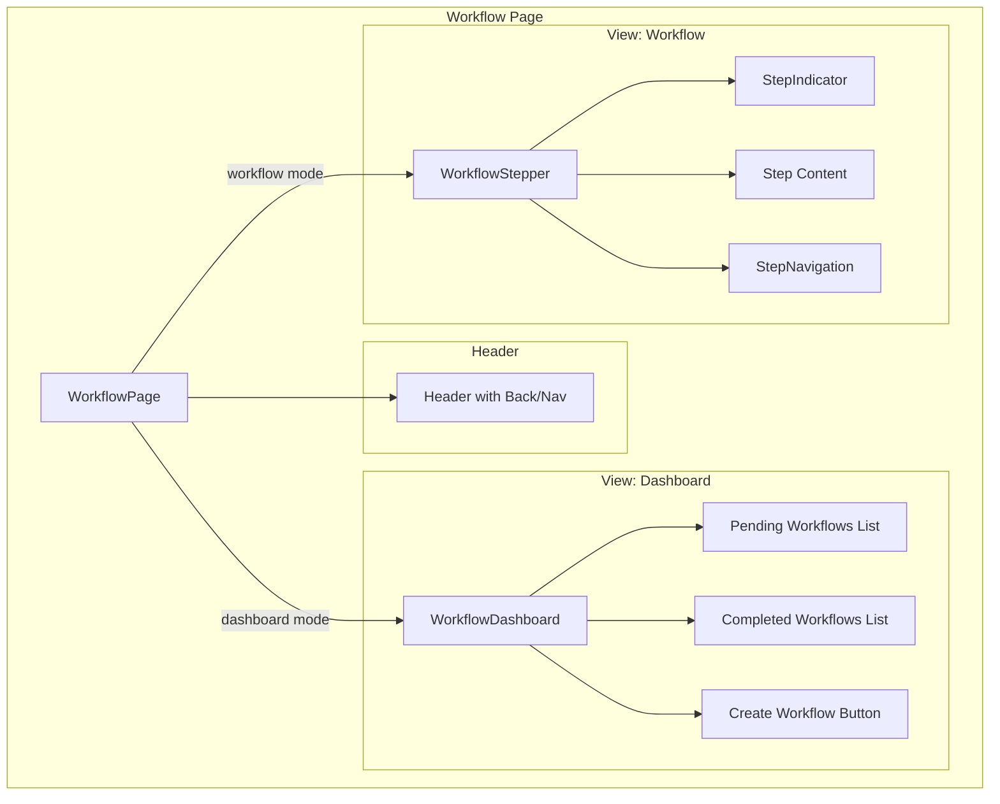
```mermaid
graph TB
    subgraph "Workflow Page"
        PAGE[WorkflowPage]

        subgraph "Header"
            H[Header with Back/Nav]
        end

        subgraph "View: Dashboard"
            WD[WorkflowDashboard]
            WD --> PWL[Pending Workflows List]
            WD --> CWL[Completed Workflows List]
            WD --> CW[Create Workflow Button]
        end

        subgraph "View: Workflow"
            WS[WorkflowStepper]
            WS --> SI[StepIndicator]
            WS --> SC[Step Content]
            WS --> SN[StepNavigation]
        end

        PAGE --> H
        PAGE -->|dashboard mode| WD
        PAGE -->|workflow mode| WS
    end
```

### Data Flow

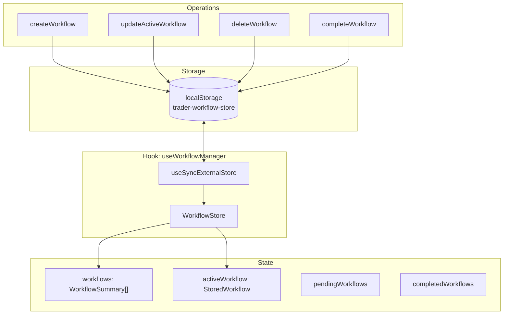
```mermaid
flowchart TB
    subgraph "Hook: useWorkflowManager"
        SYNC[useSyncExternalStore]
        STORE[WorkflowStore]
    end

    subgraph "Storage"
        LS[(localStorage<br>trader-workflow-store)]
    end

    subgraph "Operations"
        CREATE[createWorkflow]
        UPDATE[updateActiveWorkflow]
        DELETE[deleteWorkflow]
        COMPLETE[completeWorkflow]
    end

    subgraph "State"
        WORKFLOWS["workflows: WorkflowSummary[]"]
        ACTIVE[activeWorkflow: StoredWorkflow]
        PENDING[pendingWorkflows]
        COMPLETED[completedWorkflows]
    end

    LS <--> SYNC
    SYNC --> STORE
    STORE --> WORKFLOWS
    STORE --> ACTIVE

    CREATE --> LS
    UPDATE --> LS
    DELETE --> LS
    COMPLETE --> LS
```

### Workflow State

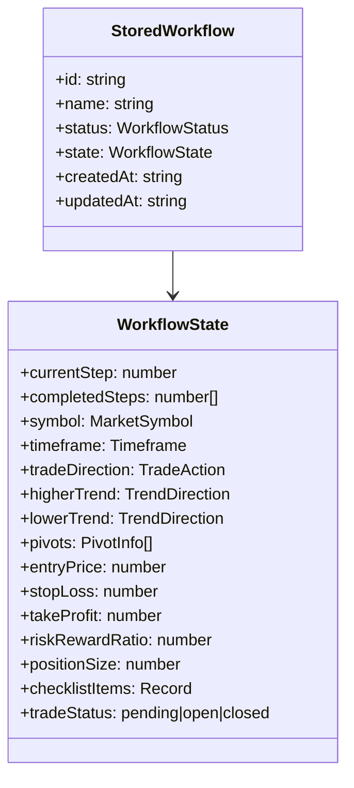
```mermaid
classDiagram
    class WorkflowState {
        +currentStep: number
        +completedSteps: number[]
        +symbol: MarketSymbol
        +timeframe: Timeframe
        +tradeDirection: TradeAction
        +higherTrend: TrendDirection
        +lowerTrend: TrendDirection
        +pivots: PivotInfo[]
        +entryPrice: number
        +stopLoss: number
        +takeProfit: number
        +riskRewardRatio: number
        +positionSize: number
        +checklistItems: Record
        +tradeStatus: pending|open|closed
    }

    class StoredWorkflow {
        +id: string
        +name: string
        +status: WorkflowStatus
        +state: WorkflowState
        +createdAt: string
        +updatedAt: string
    }

    StoredWorkflow --> WorkflowState
```

---

## Centralized Market Data Store

### MarketDataProvider Architecture

All market data fetching is centralized through `MarketDataContext` to ensure a **single source of truth** across all pages and components.

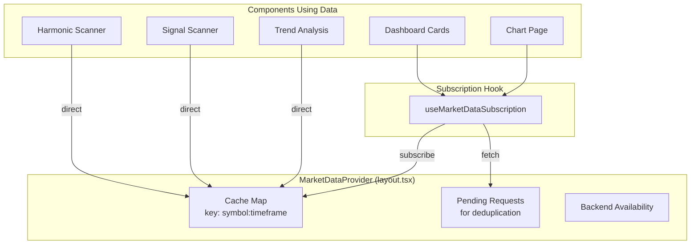
```mermaid
graph TB
    subgraph "MarketDataProvider (layout.tsx)"
        CACHE["Cache Map<br>key: symbol:timeframe"]
        PENDING["Pending Requests<br>for deduplication"]
        BACKEND_STATUS[Backend Availability]
    end

    subgraph "Components Using Data"
        CHART[Chart Page]
        DASH[Dashboard Cards]
        TREND[Trend Analysis]
        SIGNAL[Signal Scanner]
        HARMONIC[Harmonic Scanner]
    end

    subgraph "Subscription Hook"
        HOOK[useMarketDataSubscription]
        HOOK --> |subscribe| CACHE
        HOOK --> |fetch| PENDING
    end

    CHART --> HOOK
    DASH --> HOOK
    TREND --> |direct| CACHE
    SIGNAL --> |direct| CACHE
    HARMONIC --> |direct| CACHE
```

### Cache Key Strategy

Each unique symbol+timeframe combination has its own cache entry:

```typescript
type CacheKey = `${MarketSymbol}:${Timeframe}`;
// Examples: "DJI:1D", "SPX:4H", "BTCUSD:15m"
```

### Request Deduplication

Multiple components requesting the same data share a single API call:

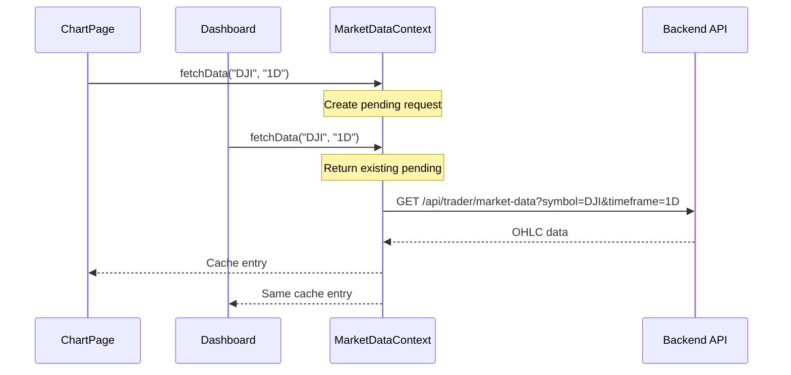
```mermaid
sequenceDiagram
    participant ChartPage
    participant Dashboard
    participant Context as MarketDataContext
    participant API as Backend API

    ChartPage->>Context: fetchData("DJI", "1D")
    Note over Context: Create pending request
    Dashboard->>Context: fetchData("DJI", "1D")
    Note over Context: Return existing pending
    Context->>API: GET /api/trader/market-data?symbol=DJI&timeframe=1D
    API-->>Context: OHLC data
    Context-->>ChartPage: Cache entry
    Context-->>Dashboard: Same cache entry
```

### TTL-Based Cache Expiration

Uses `TIMEFRAME_CONFIG[timeframe].refreshInterval` for cache TTL:
- 1m, 15m: 60 seconds
- 1H, 4H: 5 minutes
- 1D: 15 minutes
- 1W, 1M: 1 hour

---

## Shared Hooks

### Hook Dependency Graph

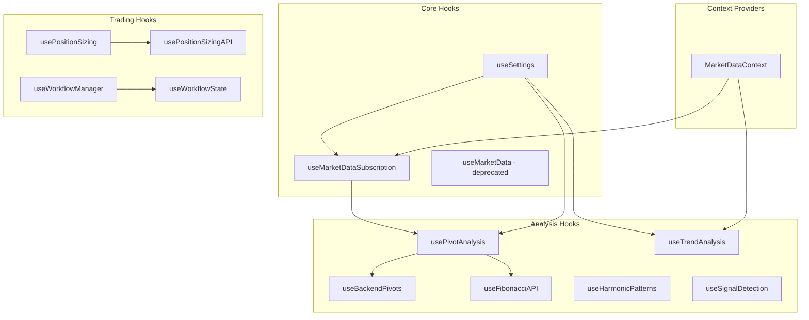
```mermaid
graph TB
    subgraph "Context Providers"
        MDC[MarketDataContext]
    end

    subgraph "Core Hooks"
        US[useSettings]
        UMDS[useMarketDataSubscription]
        UMD[useMarketData - deprecated]
    end

    subgraph "Analysis Hooks"
        UPA[usePivotAnalysis]
        UBP[useBackendPivots]
        UFA[useFibonacciAPI]
        UTA[useTrendAnalysis]
        UHP[useHarmonicPatterns]
        USD[useSignalDetection]
    end

    subgraph "Trading Hooks"
        UPS[usePositionSizing]
        UPSA[usePositionSizingAPI]
        UWM[useWorkflowManager]
        UWS[useWorkflowState]
    end

    MDC --> UMDS
    MDC --> UTA

    US --> UMDS
    US --> UTA
    US --> UPA

    UMDS --> UPA
    UPA --> UBP
    UPA --> UFA

    UPS --> UPSA
    UWM --> UWS
```

### Hook Summary

| Hook | Storage | API Calls | Purpose |
|------|---------|-----------|---------|
| `useMarketDataSubscription` | MarketDataContext | `/api/trader/market-data` | Shared OHLC data with auto-refresh |
| `useSettings` | localStorage | No | Chart/indicator settings |
| `usePivotAnalysis` | None | Optional backend | Detect swing highs/lows |
| `useBackendPivots` | None | `/api/trader/pivots` | Server-side pivot detection |
| `useFibonacciAPI` | None | `/api/trader/fibonacci/*` | Fib level calculations |
| `useTrendAnalysis` | MarketDataContext | Uses centralized store | Multi-TF trend alignment |
| `useSignalDetection` | None | `/api/trader/signal/detect` | Type 1/2 signal detection |
| `useHarmonicPatterns` | None | `/api/trader/harmonic/validate` | Pattern validation |
| `usePositionSizing` | localStorage | No | Account settings |
| `usePositionSizingAPI` | None | `/api/trader/position-size` | Position calculations |
| `useWorkflowManager` | localStorage | No | Manage trading workflows |
| `useWorkflowState` | None | No | Single workflow state |

---

## Data Flow Patterns

### Backend API Integration

```mermaid
sequenceDiagram
    participant UI as React Component
    participant Hook as Custom Hook
    participant Proxy as Next.js API Route<br>/api/trader/[...path]
    participant Backend as Python Backend<br>:8000
    participant Yahoo as Yahoo Finance

    UI->>Hook: Trigger fetch
    Hook->>Proxy: GET /api/trader/market-data
    Proxy->>Backend: Forward request
    Backend->>Yahoo: Fetch OHLC
    Yahoo-->>Backend: Market data
    Backend-->>Proxy: JSON response
    Proxy-->>Hook: Data with caching info
    Hook-->>UI: Update state
```

### Settings Persistence

```mermaid
sequenceDiagram
    participant UI as Settings Page
    participant Hook as useSettings
    participant Store as useSyncExternalStore
    participant LS as localStorage
    participant Other as Other Tabs

    UI->>Hook: setSettings(updates)
    Hook->>LS: localStorage.setItem()
    Hook->>Store: notifyListeners()
    Store->>UI: Re-render with new settings

    LS-->>Other: StorageEvent
    Other->>Store: Update from storage
    Other->>Other: Re-render
```

### Fallback Pattern (Backend Unavailable)

```mermaid
flowchart TB
    subgraph "Request"
        REQ[API Request]
    end

    subgraph "Backend Check"
        TRY{Try Backend}
        ERR{Connection Error?}
    end

    subgraph "Response"
        DATA[Real Data]
        SIM[Simulated Data]
        WARN[Show Warning UI]
    end

    REQ --> TRY
    TRY -->|Success| DATA
    TRY -->|Failure| ERR
    ERR -->|Yes - ECONNREFUSED| SIM
    ERR -->|No - Other Error| WARN
    SIM --> WARN
```

---

## Component Index

### By Page

| Page | Key Components |
|------|----------------|
| Chart | `CandlestickChart`, `AnalysisTabs`, `RefreshStatus`, `UnifiedHeader` |
| Dashboard | `MarketCard`, Stats Cards, Quick Actions |
| Trend Analysis | `TrendAlignmentPanel`, Symbol Selector |
| Position Sizing | `PositionSizingCalculator`, `PositionSizeResult`, `RiskRewardDisplay` |
| Settings | `SettingSection`, `ToggleSetting`, `SelectSetting` |
| Workflow | `WorkflowDashboard`, `WorkflowStepper`, `StepIndicator` |

### By Function

| Function | Components |
|----------|------------|
| Data Display | `CandlestickChart`, `MarketCard`, `PriceSummary` |
| User Input | `PriceInput`, `ToggleSetting`, `SelectSetting` |
| Status/Feedback | `RefreshStatus`, `MarketStatusBadge`, `Spinner` |
| Navigation | `UnifiedHeader`, `ChartToolbar`, `StepNavigation` |
| Analysis | `FibonacciControls`, `TrendAlignmentPanel`, `PivotPointsPanel` |
| Scanning | `SignalScanner`, `HarmonicScanner` |
