# Workflow V2 - Chart-Centric Trading System Architecture

## Overview

Workflow V2 is a chart-centric, discovery-first trading interface that keeps the chart always visible as the primary focus. It provides fluid trade discovery, validation, sizing, execution, and management across all timeframes.

**Route**: `/workflow-v2`

## Table of Contents

1. [System Architecture](#system-architecture)
2. [Phase Flow](#phase-flow)
3. [Component Hierarchy](#component-hierarchy)
4. [Hook Dependencies](#hook-dependencies)
5. [Data Flow](#data-flow)
6. [Business Logic](#business-logic)
7. [State Management](#state-management)
8. [Type Definitions](#type-definitions)

---

## System Architecture

### High-Level Architecture

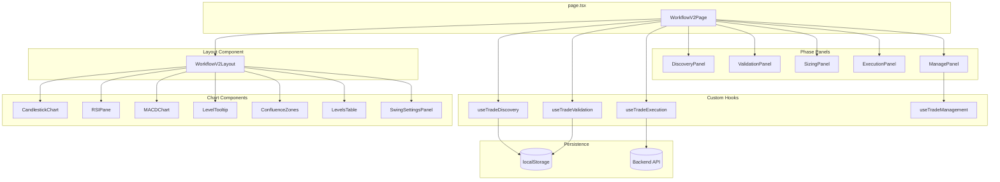

### File Structure

```
frontend/src/
├── app/workflow-v2/
│   └── page.tsx                    # Main page orchestrator (<100 lines)
├── components/workflow-v2/
│   ├── WorkflowV2Layout.tsx        # Main layout (chart + sidebar)
│   ├── DiscoveryPanel.tsx          # Trade opportunity list
│   ├── ValidationPanel.tsx         # Trade validation checklist
│   ├── SizingPanel.tsx             # Position sizing form
│   ├── ExecutionPanel.tsx          # Trade execution confirmation
│   ├── ManagePanel.tsx             # Active trade management
│   ├── LevelTooltip.tsx            # Fib level details on hover
│   ├── TrendAlignmentPanel.tsx     # Per-timeframe trend display
│   ├── TimeframeSettingsPopover.tsx # Fib ratio configuration
│   ├── DataSourcePanel.tsx         # Data source controls
│   └── LevelTooltip.test.ts        # Confluence zone tests
├── hooks/
│   ├── use-trade-discovery.ts      # Opportunity discovery
│   ├── use-trade-validation.ts     # Trade validation logic
│   ├── use-trade-execution.ts      # Position sizing + execution
│   └── use-trade-management.ts     # Active trade tracking
└── types/
    └── workflow-v2.ts              # Type definitions
```

---

## Phase Flow

### Workflow State Machine

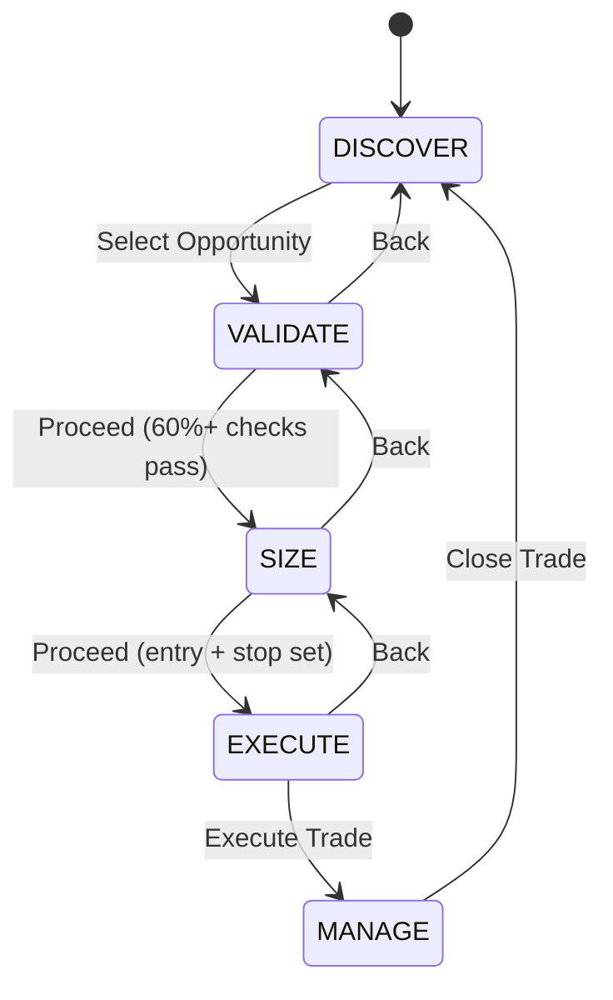

### Phase Definitions

| Phase | Description | Entry Condition | Exit Condition |
|-------|-------------|-----------------|----------------|
| **DISCOVER** | Scan all timeframes for opportunities | Initial state | User selects opportunity |
| **VALIDATE** | Check trade criteria (7 checks) | Opportunity selected | 60%+ checks pass (5+ of 7) |
| **SIZE** | Calculate position size and R:R | Validation passed | Entry & stop set |
| **EXECUTE** | Confirm and execute trade | Sizing valid | Trade executed |
| **MANAGE** | Track P&L, manage stops/targets | Trade active | Trade closed |

### Phase Transition Flow

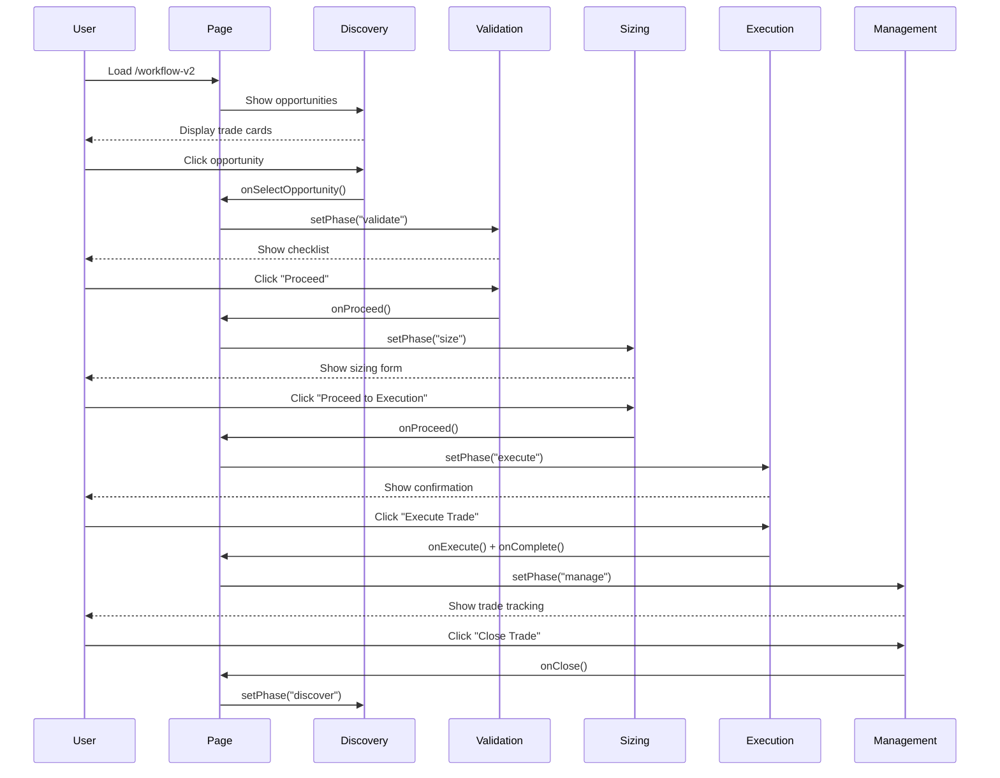

---

## Component Hierarchy

### Component Tree

```mermaid
graph TD
    subgraph PageLevel["Page Level"]
        WP[WorkflowV2Page]
    end

    subgraph LayoutLevel["Layout Level"]
        WL[WorkflowV2Layout]
    end

    subgraph ChartArea["Chart Area"]
        CS[Chart Container]
        CC[CandlestickChart]
        RSI[RSIPane]
        MACD[MACDChart]
        LT[LevelTooltip]
        PE[PivotPointsEditor]
        LTB[LevelsTable]
        TA[TrendAlignmentPanel]
        SSP[SwingSettingsPanel]
    end

    subgraph SidePanel["Side Panel - Dynamic"]
        DP[DiscoveryPanel]
        VP[ValidationPanel]
        SP[SizingPanel]
        EP[ExecutionPanel]
        MP[ManagePanel]
    end

    subgraph DiscoveryChildren["DiscoveryPanel Children"]
        OC[OpportunityCard]
        TB[Test Buttons]
    end

    subgraph ValidationChildren["ValidationPanel Children"]
        CI[CheckItem]
        SL[SuggestedLevels]
    end

    subgraph SizingChildren["SizingPanel Children"]
        AS[Account Settings]
        TP[Trade Parameters]
        CV[Calculated Values]
    end

    subgraph ManageChildren["ManagePanel Children"]
        PL[P&L Display]
        AB[Action Buttons]
        TL[Trade Log]
    end

    WP --> WL
    WP --> DP
    WP --> VP
    WP --> SP
    WP --> EP
    WP --> MP

    WL --> CS
    CS --> CC
    CS --> RSI
    CS --> MACD
    CS --> LT
    CS --> PE
    CS --> LTB
    CS --> TA
    CS --> SSP

    DP --> OC
    DP --> TB

    VP --> CI
    VP --> SL

    SP --> AS
    SP --> TP
    SP --> CV

    MP --> PL
    MP --> AB
    MP --> TL
```

### Component Responsibilities

| Component | Lines | Responsibility |
|-----------|-------|----------------|
| `page.tsx` | ~150 | Phase state management, hook coordination |
| `WorkflowV2Layout` | ~800 | Chart rendering, toolbar, feature toggles |
| `DiscoveryPanel` | ~290 | Display opportunities, test trade buttons |
| `ValidationPanel` | ~185 | Show 7 validation checks, suggested levels |
| `SizingPanel` | ~400 | Account settings, trade params, calculations |
| `ExecutionPanel` | ~210 | Trade summary, execute button |
| `ManagePanel` | ~330 | P&L tracking, breakeven, trailing stop |
| `LevelTooltip` | ~350 | Fib level hover details, confluence zones |

---

## Hook Dependencies

### Hook Dependency Graph

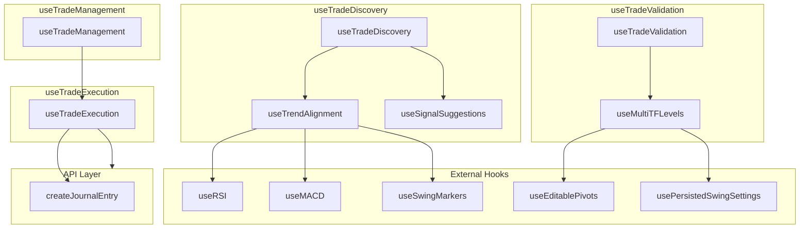

### Hook Data Flow

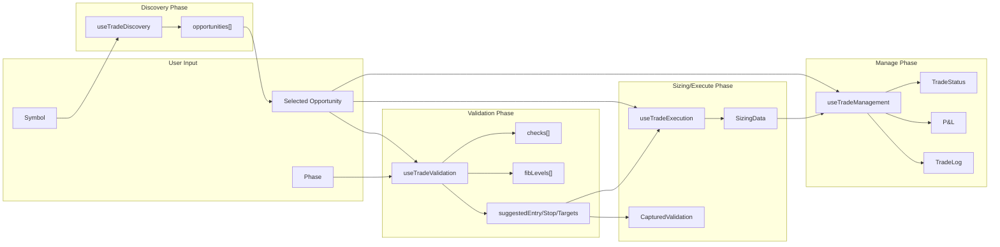

---

## Data Flow

### Data Dependencies Between Phases

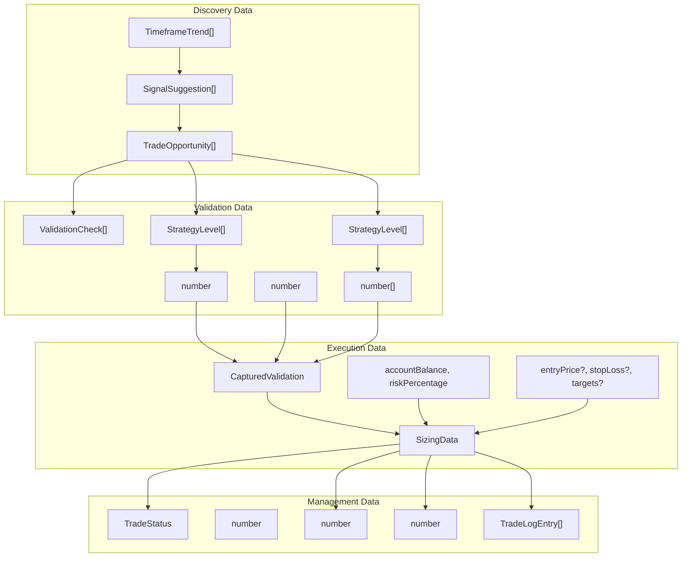

### State Persistence

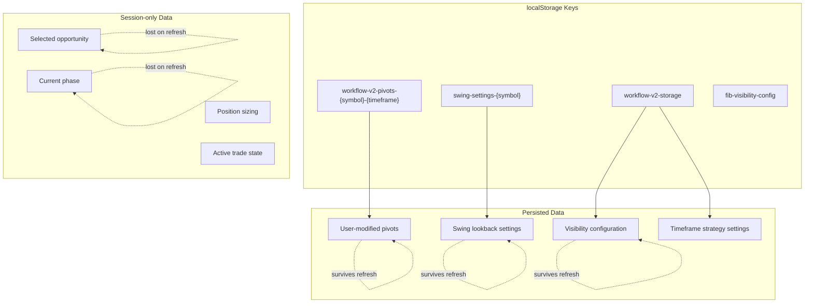

---

## Business Logic

### Validation Rules

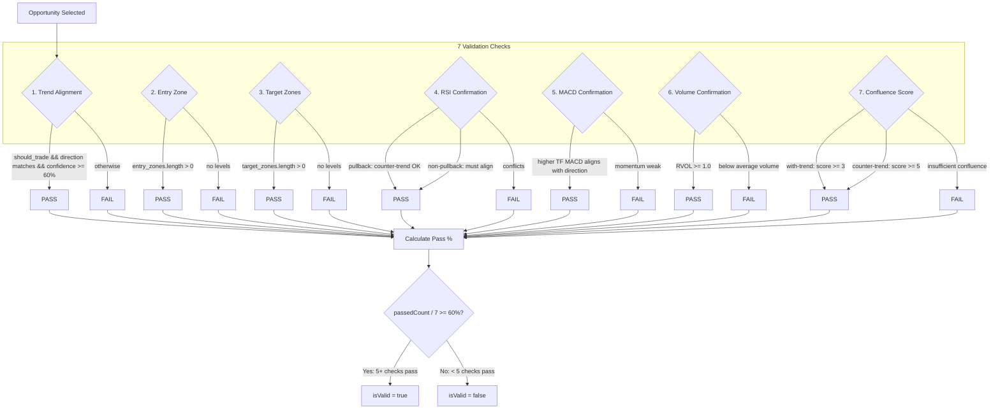

### RSI Confirmation Logic (Pullback vs Non-Pullback)

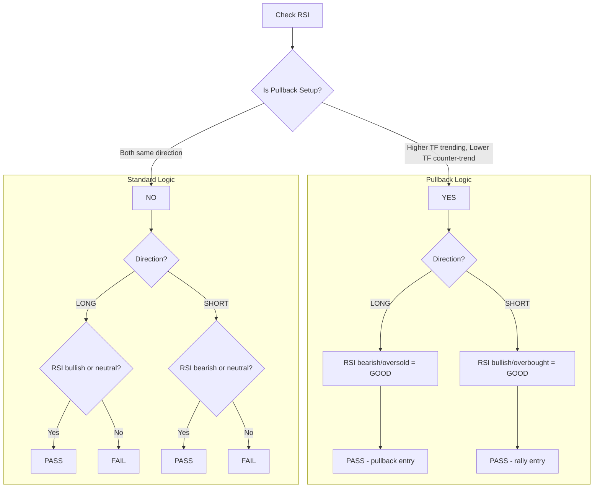

### Position Sizing Calculation

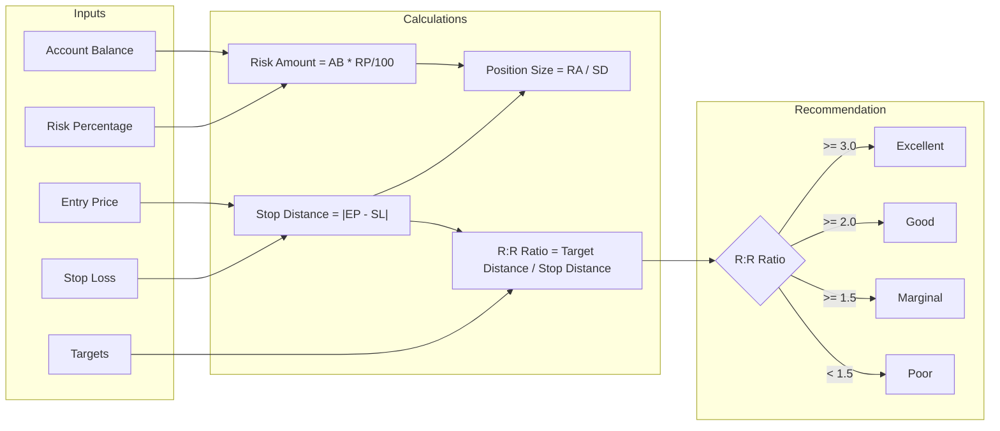

### Trade Management State Machine

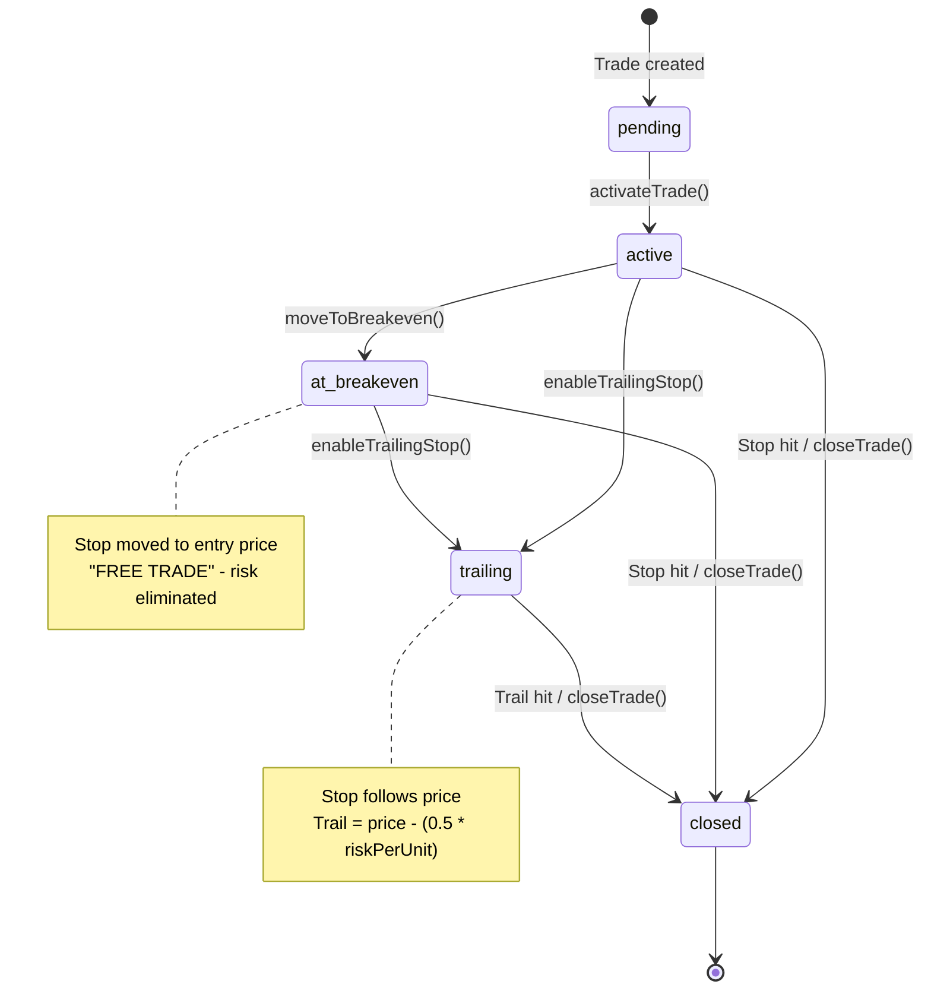

### Fibonacci Strategy Selection

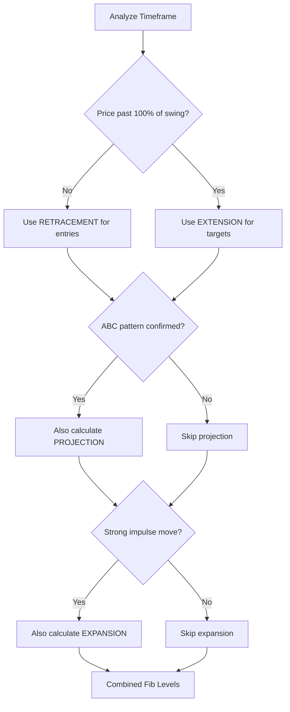

### Direction-Based Level Calculation

| Trend | Direction | Retracement | Extension | Expansion | Projection |
|-------|-----------|-------------|-----------|-----------|------------|
| Bullish | LONG | Calculate | Calculate | Calculate | Calculate |
| Bullish | SHORT | Skip | Skip | Skip | Skip |
| Bearish | SHORT | Calculate | Calculate | Calculate | Calculate |
| Bearish | LONG | Skip | Skip | Skip | Skip |
| Ranging | Both | Warning | Warning | Skip | Skip |

---

## State Management

### Component State Overview

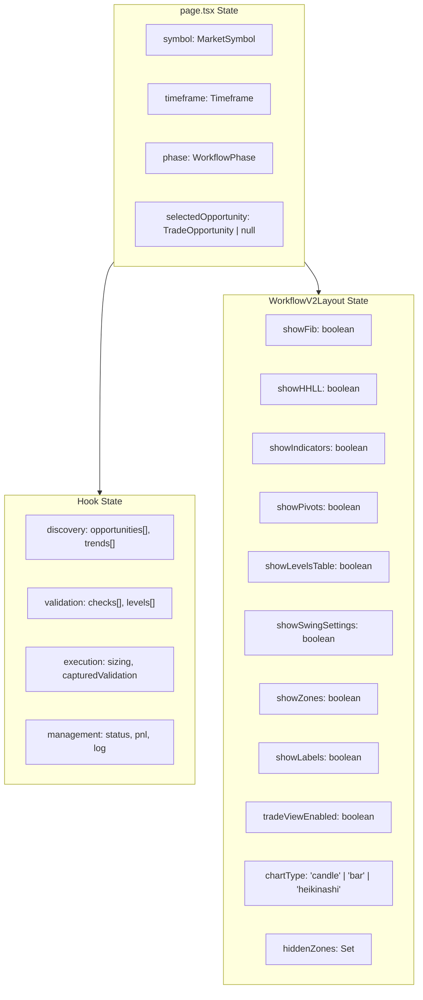

### State Update Flow

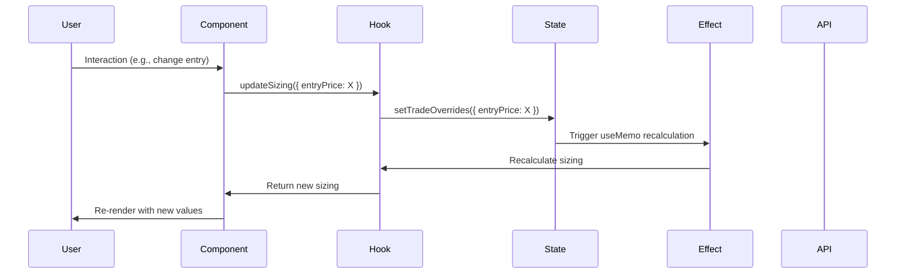

---

## Type Definitions

### Core Types

```typescript
// Workflow Phase
type WorkflowPhase = "discover" | "validate" | "size" | "execute" | "manage";

// Trade Opportunity (from discovery)
type TradeOpportunity = {
  id: string;
  symbol: MarketSymbol;
  higherTimeframe: Timeframe;
  lowerTimeframe: Timeframe;
  direction: "long" | "short";
  confidence: number;           // 0-100
  tradingStyle: "position" | "swing" | "intraday";
  description: string;
  reasoning: string;
  isActive: boolean;
  entryZone: "support" | "resistance" | "range";
  signal: SignalSuggestion;
  higherTrend?: TimeframeTrend;
  lowerTrend?: TimeframeTrend;
};

// Validation Result
type ValidationResult = {
  checks: ValidationCheck[];     // 7 checks: Trend, Entry, Target, RSI, MACD, Volume, Confluence
  passedCount: number;
  totalCount: number;            // Always 7 in current implementation
  isValid: boolean;              // passedCount/totalCount >= 60% (5+ of 7 must pass)
  passPercentage: number;
  entryLevels: StrategyLevel[];  // Lower TF retracement
  targetLevels: StrategyLevel[]; // Higher TF extension
  suggestedEntry: number | null;
  suggestedStop: number | null;
  suggestedTargets: number[];
};

// Sizing Data
type SizingData = {
  accountBalance: number;
  riskPercentage: number;        // 1-5% typically
  entryPrice: number;
  stopLoss: number;
  targets: number[];
  positionSize: number;          // Calculated
  riskAmount: number;            // Calculated
  riskRewardRatio: number;       // Calculated
  stopDistance: number;          // Calculated
  recommendation: "excellent" | "good" | "marginal" | "poor";
  isValid: boolean;
};

// Trade Status (management phase)
type TradeStatus = "pending" | "active" | "at_breakeven" | "trailing" | "closed";

// Trade Log Entry
type TradeLogEntry = {
  action: "entry" | "exit" | "stop_moved" | "target_hit" | "note";
  price: number;
  note: string;
  timestamp: string;
};
```

### Storage Types

```typescript
// Complete localStorage schema
type WorkflowV2Storage = {
  version: number;
  pivots: PivotStorage;
  visibility: VisibilitySettings;
  alerts: AlertSettings;
  validation: ValidationSettings;
  watchlist: MarketSymbol[];
  autoRefresh: AutoRefreshSettings;
  theme: "dark" | "light";
};

// Auto-refresh intervals (seconds)
const AUTO_REFRESH_INTERVALS: Record<Timeframe, number> = {
  "1M": 14400,  // 4 hours
  "1W": 14400,  // 4 hours
  "1D": 300,    // 5 minutes
  "4H": 60,     // 1 minute
  "1H": 60,     // 1 minute
  "15m": 10,    // 10 seconds
  "1m": 10,     // 10 seconds
};
```

---

## API Integration

### Endpoints Used

| Endpoint | Method | Purpose | Phase |
|----------|--------|---------|-------|
| `/workflow/assess` | GET | Trend assessment | Discovery |
| `/workflow/align` | GET | Multi-TF alignment | Discovery |
| `/workflow/levels` | GET | Fibonacci levels | Validation |
| `/workflow/confirm` | GET | Indicator confirmation | Validation |
| `/workflow/validate` | GET | 7-check validation (Trend, Entry, Target, RSI, MACD, Volume, Confluence) | Validation |
| `/position/size` | POST | Position sizing | Sizing |
| `/position/risk-reward` | POST | R:R calculation | Sizing |
| `/journal/entries` | POST | Create journal entry | Execution |

### Journal Auto-Logging

When a trade is executed, the system automatically creates a journal entry:

```typescript
const entry: JournalEntryRequest = {
  symbol: opportunity.symbol,
  direction: opportunity.direction,
  entry_price: sizing.entryPrice,
  exit_price: 0,                    // Set when closed
  stop_loss: sizing.stopLoss,
  targets: sizing.targets,
  position_size: sizing.positionSize,
  entry_time: new Date().toISOString(),
  exit_time: "",                    // Set when closed
  timeframe: opportunity.lowerTimeframe,
  notes: `${opportunity.description}\n\nReasoning: ${opportunity.reasoning}`,
};
```

---

## Feature Toggles

### Chart Control Buttons

| Button | State | Description |
|--------|-------|-------------|
| **HH/LL** | `showHHLL` | Show swing markers (HH, HL, LH, LL) |
| **Fib** | `showFib` | Show Fibonacci levels on chart |
| **Ind** | `showIndicators` | Show RSI and MACD panels |
| **Pivot** | `showPivots` | Show editable pivot points editor |
| **Trade** | `tradeViewEnabled` | Filter to trade-relevant levels only |
| **Zones** | `showZones` | Show confluence zone indicators |
| **Lbl** | `showLabels` | Show Fib level labels on chart |
| **Lvl** | `showLevelsTable` | Show Fib levels table with calculations |
| **Swing** | `showSwingSettings` | Show per-TF swing lookback settings |
| **Trend** | `showTrendPanel` | Show trend alignment panel |

### Timeframe Visibility Toggles

Each timeframe (1M, 1W, 1D, 4H, 1H, 15m, 1m) can be individually toggled to show/hide its Fibonacci levels on the chart.

---

## Confluence Zone Algorithm

```typescript
function calculateConfluenceZones(
  levels: StrategyLevel[],
  tolerancePercent: number = 0.5  // 0.02% to 0.5%
): ConfluenceZone[] {
  // 1. Sort levels by price
  const sorted = [...levels].sort((a, b) => a.price - b.price);

  // 2. Group adjacent levels within tolerance
  // tolerance = price * (tolerancePercent / 100)

  // 3. Create zone for groups with 2+ levels
  // - lowPrice: min price in group
  // - highPrice: max price in group
  // - centerPrice: average
  // - direction: majority vote (long/short/neutral)
  // - strength: levelCount * 20 (capped at 100)

  return zones;
}
```

---

## Testing Coverage

### Unit Tests

| File | Tests | Coverage |
|------|-------|----------|
| `LevelTooltip.test.ts` | 17 | Confluence zones |
| `SizingPanel.test.tsx` | 28 | Position sizing UI |

### Test Categories

1. **Confluence Zone Tests**
   - Basic functionality (empty, single, cluster)
   - Tight tolerance (0.02%)
   - Medium tolerance (0.2%)
   - Maximum tolerance (0.5%)
   - Zone properties (bounds, direction, strength)
   - Real-world scenarios (DJI, crypto)

2. **Sizing Panel Tests**
   - Header/navigation
   - Opportunity summary display
   - Account settings inputs
   - Trade parameter inputs
   - Calculated values display
   - Recommendation badges
   - Proceed button states
   - Input validation
   - Accessibility

---

## Development Guidelines

1. **File Size Limits**
   - Page: <100 lines
   - Component: <100 lines (extract to smaller components)
   - Hook: <150 lines (extract helper hooks)

2. **State Management**
   - Use hooks for business logic
   - Components are display-only
   - localStorage for persistence
   - Session state for workflow progress

3. **TDD Workflow**
   - Write failing test first
   - Implement minimal code to pass
   - Refactor with quality checks
   - Commit deployable checkpoint
