# Trading Workflow Stepper - Implementation Plan

## Overview

Create a stepper-style workflow that guides traders through the complete trading process before placing a trade, based on the SignalPro methodology from the reference docs.

## User Requirements (Confirmed)

- **Standalone Tools**: Each step is a reusable component that can be accessed independently AND within the workflow
- **State Persistence**: Save workflow progress to localStorage so user can leave and resume later
- **Full Trade Tracking**: Step 8 includes P&L monitoring, breakeven alerts, trailing stop controls, trade log

## Workflow Steps (Based on Reference Material)

The complete trading workflow follows these phases:

```
Phase 1: MARKET ANALYSIS
  Step 1: Market & Timeframe Selection
  Step 2: Trend Alignment Check (GO_LONG / GO_SHORT / STAND_ASIDE)

Phase 2: FIBONACCI SETUP
  Step 3: Pivot Identification & Fibonacci Levels
  Step 4: Pattern/Signal Scan (Harmonic + Signal Bar Scanner)

Phase 3: ENTRY VALIDATION
  Step 5: Entry Signal Confirmation (Signal Bar at Fib Level)

Phase 4: POSITION SIZING
  Step 6: Position Size & Risk Calculation

Phase 5: EXECUTION
  Step 7: Pre-Trade Checklist & Go/No-Go Decision
  Step 8: Trade Management Dashboard (post-entry)
```

## Complete Workflow Diagram

```mermaid
flowchart TB
    subgraph PHASE1["📊 PHASE 1: MARKET ANALYSIS"]
        direction TB
        START([🚀 Start Workflow]) --> S1

        subgraph S1["Step 1: Market Selection"]
            S1_1[Select Market Symbol] --> S1_2[Select Timeframe Pair]
            S1_2 --> S1_3[Choose Trading Style]
            S1_3 --> S1_4{Valid Selection?}
        end

        S1_4 -->|Yes| S2
        S1_4 -->|No| S1_1

        subgraph S2["Step 2: Trend Alignment"]
            S2_1[Fetch Higher TF Data] --> S2_2[Detect Higher TF Trend]
            S2_3[Fetch Lower TF Data] --> S2_4[Detect Lower TF Trend]
            S2_2 --> S2_5{Alignment Check}
            S2_4 --> S2_5
            S2_5 -->|"UP + DOWN"| S2_GO_LONG["🟢 GO_LONG"]
            S2_5 -->|"DOWN + UP"| S2_GO_SHORT["🔴 GO_SHORT"]
            S2_5 -->|"UP + UP"| S2_STAND["🟡 STAND_ASIDE"]
            S2_5 -->|"DOWN + DOWN"| S2_STAND
            S2_5 -->|"NEUTRAL"| S2_STAND
        end

        S2_GO_LONG --> S2_PASS{Can Proceed?}
        S2_GO_SHORT --> S2_PASS
        S2_STAND --> S2_BLOCK["❌ BLOCKED<br/>Wait for counter-trend"]
        S2_BLOCK -.->|"Wait & Refresh"| S2_1
    end

    S2_PASS -->|"GO_LONG or GO_SHORT"| PHASE2

    subgraph PHASE2["📐 PHASE 2: FIBONACCI SETUP"]
        direction TB

        subgraph S3["Step 3: Pivot & Fibonacci"]
            S3_1[Load Chart Data] --> S3_2[Auto-Detect Pivots]
            S3_2 --> S3_3{≥2 Pivots?}
            S3_3 -->|No| S3_4[Manual Pivot Selection]
            S3_4 --> S3_3
            S3_3 -->|Yes| S3_5[Select Fib Tool Type]
            S3_5 --> S3_6{How Many Pivots?}
            S3_6 -->|"2 Pivots"| S3_7A{Price Location?}
            S3_6 -->|"3+ Pivots"| S3_7B[Use Projection]
            S3_7A -->|"Within Range"| S3_8A[Use Retracement]
            S3_7A -->|"Beyond Origin"| S3_8B[Use Extension]
            S3_7A -->|"Range Expanding"| S3_8C[Use Expansion]
            S3_8A --> S3_9[Calculate Levels]
            S3_8B --> S3_9
            S3_8C --> S3_9
            S3_7B --> S3_9
            S3_9 --> S3_10[Display Levels on Chart]
            S3_10 --> S3_11[Highlight Confluence Zones]
        end

        S3_11 --> S4

        subgraph S4["Step 4: Pattern Scanner"]
            S4_1[Run Signal Scanner] --> S4_2[Detect Type 1/2 Signals]
            S4_3[Run Harmonic Scanner] --> S4_4[Detect Gartley/Butterfly/Bat/Crab]
            S4_2 --> S4_5[Combine Results]
            S4_4 --> S4_5
            S4_5 --> S4_6{Patterns Found?}
            S4_6 -->|Yes| S4_7[Display Pattern List]
            S4_6 -->|No| S4_8[Continue with Fib Levels Only]
            S4_7 --> S4_9[Mark Scan Complete]
            S4_8 --> S4_9
        end
    end

    S4_9 --> PHASE3

    subgraph PHASE3["🎯 PHASE 3: ENTRY VALIDATION"]
        direction TB

        subgraph S5["Step 5: Entry Confirmation"]
            S5_1[Select Entry Level] --> S5_2[Monitor Current Price]
            S5_2 --> S5_3{Price at Level?}
            S5_3 -->|No| S5_2
            S5_3 -->|Yes| S5_4{Bar Closed?}
            S5_4 -->|No| S5_2
            S5_4 -->|Yes| S5_5{Signal Bar Valid?}

            S5_5 --> S5_6{Direction Match?}
            S5_6 -->|"BUY: Close > Open & Close > Level"| S5_7A["✅ Type 1: Tested & Rejected"]
            S5_6 -->|"BUY: Close > Level (no deep test)"| S5_7B["✅ Type 2: Near Level"]
            S5_6 -->|"SELL: Close < Open & Close < Level"| S5_7A
            S5_6 -->|"SELL: Close < Level (no deep test)"| S5_7B
            S5_6 -->|"No Match"| S5_WAIT["⏳ Wait for Signal"]

            S5_7A --> S5_8["🎯 Entry Confirmed!"]
            S5_7B --> S5_8
            S5_WAIT -.-> S5_2
        end
    end

    S5_8 --> PHASE4

    subgraph PHASE4["💰 PHASE 4: POSITION SIZING"]
        direction TB

        subgraph S6["Step 6: Position Calculator"]
            S6_1[Set Entry Price] --> S6_2[Set Stop Loss<br/>Beyond Swing High/Low]
            S6_2 --> S6_3[Set Target Prices<br/>Fib Extension Levels]
            S6_3 --> S6_4[Calculate Distance to Stop]
            S6_4 --> S6_5["Position Size = Risk / Distance"]
            S6_5 --> S6_6[Calculate R:R Ratio]
            S6_6 --> S6_7{R:R ≥ 1:1?}
            S6_7 -->|No| S6_FAIL["❌ BLOCKED<br/>Adjust Stop/Target"]
            S6_FAIL -.-> S6_2
            S6_7 -->|Yes| S6_8{R:R ≥ 2:1?}
            S6_8 -->|Yes| S6_GOOD["✅ Good Setup"]
            S6_8 -->|No| S6_WARN["⚠️ Marginal R:R"]
            S6_GOOD --> S6_9[Display Position Summary]
            S6_WARN --> S6_9
        end
    end

    S6_9 --> PHASE5

    subgraph PHASE5["🚀 PHASE 5: EXECUTION"]
        direction TB

        subgraph S7["Step 7: Pre-Trade Checklist"]
            S7_1[Load Checklist Items] --> S7_2{Auto-Validate Items}
            S7_2 --> S7_3[Trend Aligned? ✓/✗]
            S7_2 --> S7_4[Trade Direction Valid? ✓/✗]
            S7_2 --> S7_5[Fib Levels Set? ✓/✗]
            S7_2 --> S7_6[Signal Bar Confirmed? ✓/✗]
            S7_2 --> S7_7[R:R ≥ 2:1? ✓/✗]

            S7_3 --> S7_8{All Required<br/>Items Checked?}
            S7_4 --> S7_8
            S7_5 --> S7_8
            S7_6 --> S7_8
            S7_7 --> S7_8

            S7_8 -->|No| S7_NOGO["🔴 NO GO<br/>Fix failed items"]
            S7_8 -->|Yes| S7_GO["🟢 GO!<br/>Trade Approved"]
            S7_NOGO -.-> S7_FIX[Review & Fix]
            S7_FIX -.-> S7_2
        end

        S7_GO --> S8

        subgraph S8["Step 8: Trade Management"]
            S8_1["📝 Log Entry"] --> S8_2[Monitor Position]
            S8_2 --> S8_3{Price Direction?}

            S8_3 -->|Against| S8_4{Stop Hit?}
            S8_4 -->|Yes| S8_LOSS["❌ Exit with Loss"]
            S8_4 -->|No| S8_5{Taking Too Long?}
            S8_5 -->|Yes| S8_EARLY["⚠️ Consider Early Exit"]
            S8_5 -->|No| S8_2

            S8_3 -->|In Favor| S8_6{Moved = Risk?}
            S8_6 -->|No| S8_2
            S8_6 -->|Yes| S8_7["🆓 MOVE STOP TO BREAKEVEN<br/>= FREE TRADE"]
            S8_7 --> S8_8{Target Hit?}
            S8_8 -->|Yes| S8_WIN["✅ Exit with Profit"]
            S8_8 -->|No| S8_9[Trail Stop]
            S8_9 --> S8_10{Trail Stop Hit?}
            S8_10 -->|Yes| S8_WIN
            S8_10 -->|No| S8_8

            S8_LOSS --> S8_END["📊 Log Result & Review"]
            S8_EARLY --> S8_END
            S8_WIN --> S8_END
        end
    end

    S8_END --> DONE([🏁 Workflow Complete])
    DONE -.->|"New Trade"| START

    %% Styling
    style START fill:#4CAF50,color:#fff
    style DONE fill:#2196F3,color:#fff
    style S2_GO_LONG fill:#22c55e,color:#fff
    style S2_GO_SHORT fill:#ef4444,color:#fff
    style S2_STAND fill:#f59e0b,color:#000
    style S2_BLOCK fill:#dc2626,color:#fff
    style S5_8 fill:#22c55e,color:#fff
    style S6_FAIL fill:#dc2626,color:#fff
    style S6_GOOD fill:#22c55e,color:#fff
    style S6_WARN fill:#f59e0b,color:#000
    style S7_GO fill:#22c55e,color:#fff
    style S7_NOGO fill:#dc2626,color:#fff
    style S8_WIN fill:#22c55e,color:#fff
    style S8_LOSS fill:#dc2626,color:#fff
    style S8_7 fill:#3b82f6,color:#fff
```



## Validation Rules Summary

| Step | Validation Rule | Blocking Behavior |
|------|-----------------|-------------------|
| **Step 1** | Symbol + Timeframe selected | Always passes (defaults exist) |
| **Step 2** | Trend alignment = GO_LONG or GO_SHORT | **BLOCKS** if STAND_ASIDE |
| **Step 3** | ≥2 pivots detected, Fib levels calculated | Blocks until pivots identified |
| **Step 4** | Scan completed (patterns optional) | Blocks until scan runs |
| **Step 5** | Signal bar confirmed at Fib level | **BLOCKS** until valid signal |
| **Step 6** | R:R ratio ≥ 1:1 | **BLOCKS** if R:R < 1:1 |
| **Step 7** | All required checklist items checked | **BLOCKS** if any required item fails |
| **Step 8** | Trade management (always valid) | Cannot exit until trade resolved |

## Decision Trees

### Trend Alignment Decision

```mermaid
flowchart LR
    subgraph Higher["Higher TF"]
        H_UP[UP]
        H_DOWN[DOWN]
        H_NEUTRAL[NEUTRAL]
    end

    subgraph Lower["Lower TF"]
        L_UP[UP]
        L_DOWN[DOWN]
        L_NEUTRAL[NEUTRAL]
    end

    subgraph Action
        GO_LONG["🟢 GO LONG<br/>Buy the dip"]
        GO_SHORT["🔴 GO SHORT<br/>Sell the rally"]
        STAND["🟡 STAND ASIDE<br/>Wait"]
    end

    H_UP --> L_DOWN --> GO_LONG
    H_DOWN --> L_UP --> GO_SHORT
    H_UP --> L_UP --> STAND
    H_DOWN --> L_DOWN --> STAND
    H_NEUTRAL --> STAND
    L_NEUTRAL --> STAND

    style GO_LONG fill:#22c55e,color:#fff
    style GO_SHORT fill:#ef4444,color:#fff
    style STAND fill:#f59e0b,color:#000
```



### Fibonacci Tool Selection


### Signal Bar Validation


## Individual Tools Needed

### Existing Tools (to be integrated):
- `TrendAlignmentPanel` - Multi-timeframe trend detection
- `SignalScanner` - Scans for Type 1/2 signals at Fib levels
- `HarmonicScanner` - Detects Gartley, Butterfly, Bat, Crab patterns
- `PositionSizingCalculator` - Risk and position calculation
- `FibonacciCalculationPanel` - Fibonacci level calculations

### New Tools to Create:

1. **MarketTimeframeSelector** - Step 1
   - Market dropdown (existing symbols)
   - Timeframe pair selection (higher/lower)
   - Trading style preset (Position/Swing/Day/Scalp)

2. **TrendDecisionPanel** - Step 2
   - Shows higher TF trend direction
   - Shows lower TF trend direction
   - Clear GO_LONG / GO_SHORT / STAND_ASIDE verdict
   - Blocks progression if STAND_ASIDE

3. **FibonacciSetupTool** - Step 3
   - Auto-detect pivots with mini chart
   - Show calculated Fib levels
   - Tool type selection (Retracement/Extension/Projection/Expansion)
   - Level confluence highlighting

4. **EntrySignalPanel** - Step 5
   - Current price vs Fib levels
   - Signal bar detection status
   - Type 1/Type 2 classification
   - Entry conditions checklist

5. **PreTradeChecklist** - Step 7
   - All conditions verification
   - Risk assessment (R:R ratio)
   - Go/No-Go decision engine
   - Trade summary display

6. **TradeManagementPanel** - Step 8
   - Entry confirmation
   - Stop loss tracking
   - Breakeven alert (move to free trade)
   - Target progress
   - Trail stop controls

## Architecture

### Design Principle: Standalone + Composable

Each tool is a **standalone component** that:
1. Works independently with its own props/state
2. Can be composed into the workflow via WorkflowContext
3. Exposes `onComplete` callback for workflow integration
4. Has its own route for independent access

### New Components:

```
frontend/src/components/trading/tools/
├── MarketTimeframeSelector.tsx  # Step 1 - Standalone tool
├── TrendDecisionPanel.tsx       # Step 2 - Standalone tool
├── FibonacciSetupTool.tsx       # Step 3 - Standalone tool (wraps existing)
├── PatternScannerTool.tsx       # Step 4 - Standalone tool (wraps existing)
├── EntrySignalTool.tsx          # Step 5 - Standalone tool
├── PositionSizingTool.tsx       # Step 6 - Standalone tool (wraps existing)
├── PreTradeChecklist.tsx        # Step 7 - Standalone tool
└── TradeManagementPanel.tsx     # Step 8 - Standalone tool

frontend/src/components/workflow/
├── WorkflowStepper.tsx          # Main stepper orchestrator
├── StepIndicator.tsx            # Step progress indicator
├── StepNavigation.tsx           # Next/Back buttons with validation
└── useWorkflowState.ts          # Hook for localStorage-persisted state

frontend/src/hooks/
└── use-workflow-state.ts        # Workflow state persistence hook
```

### New Pages (Independent Access):

```
frontend/src/app/workflow/page.tsx           # Main stepper workflow
frontend/src/app/tools/market-select/page.tsx   # Step 1 standalone
frontend/src/app/tools/trend-check/page.tsx     # Step 2 standalone
frontend/src/app/tools/fib-setup/page.tsx       # Step 3 standalone
frontend/src/app/tools/pattern-scan/page.tsx    # Step 4 standalone
frontend/src/app/tools/entry-signal/page.tsx    # Step 5 standalone
frontend/src/app/tools/trade-manage/page.tsx    # Step 8 standalone
```

Note: Steps 6 (Position Sizing) and 7 (Checklist) already exist or are workflow-specific.

### State Management (localStorage Persisted):

```typescript
type WorkflowState = {
  currentStep: number;

  // Step 1: Market Selection
  symbol: MarketSymbol;
  higherTimeframe: Timeframe;
  lowerTimeframe: Timeframe;
  tradingStyle: 'position' | 'swing' | 'day' | 'scalp';

  // Step 2: Trend Alignment
  higherTrend: 'UP' | 'DOWN' | 'NEUTRAL';
  lowerTrend: 'UP' | 'DOWN' | 'NEUTRAL';
  tradeDirection: 'GO_LONG' | 'GO_SHORT' | 'STAND_ASIDE';

  // Step 3: Fibonacci Setup
  pivots: PivotPoint[];
  fibTool: 'retracement' | 'extension' | 'projection' | 'expansion';
  fibLevels: FibonacciLevel[];

  // Step 4: Pattern Scan
  detectedPatterns: HarmonicPattern[];
  detectedSignals: Signal[];

  // Step 5: Entry Confirmation
  selectedLevel: number;
  signalBar: SignalBar | null;
  entryConfirmed: boolean;

  // Step 6: Position Sizing
  entryPrice: number;
  stopLoss: number;
  targets: number[];
  positionSize: number;
  riskRewardRatio: number;

  // Step 7: Checklist
  checklistItems: ChecklistItem[];
  goNoGo: 'GO' | 'NO_GO' | 'PENDING';

  // Step 8: Trade Management (Full Tracking)
  tradeStatus: 'pending' | 'active' | 'at_breakeven' | 'trailing' | 'closed';
  currentPnL: number;
  breakEvenPrice: number;
  trailingStopPrice: number | null;
  tradeLog: TradeLogEntry[];
};

// Persistence Hook Pattern (similar to use-position-sizing.ts)
const STORAGE_KEY = 'trader-workflow-state';

function useWorkflowState() {
  return useSyncExternalStore(
    subscribe,        // Listen for storage events
    getSnapshot,      // Get current localStorage value
    getServerSnapshot // SSR fallback
  );
}
```

### Trade Management Features (Step 8):

```typescript
type TradeManagementFeatures = {
  // Real-time P&L
  entryPrice: number;
  currentPrice: number;  // from market data
  unrealizedPnL: number;
  pnlPercent: number;

  // Breakeven Alert
  breakEvenTriggered: boolean;  // price moved equal to risk
  breakEvenPrice: number;
  freeTradeActive: boolean;     // stop moved to breakeven

  // Trailing Stop
  trailingEnabled: boolean;
  trailingMode: 'manual' | 'swing' | 'percentage';
  trailingStopPrice: number;
  trailDistance: number;

  // Target Progress
  targets: { price: number; hit: boolean }[];
  currentTargetIndex: number;

  // Trade Log
  tradeLog: {
    timestamp: Date;
    action: 'entry' | 'stop_moved' | 'partial_close' | 'target_hit' | 'exit';
    price: number;
    note: string;
  }[];
};
```

## Implementation Order

1. **Phase 1: Foundation**
   - Create workflow context and types
   - Create StepIndicator component
   - Create WorkflowStepper shell
   - Create workflow page

2. **Phase 2: Core Steps**
   - Step 1: MarketSelection (simple, start here)
   - Step 2: TrendAlignment (leverage existing TrendAlignmentPanel)
   - Step 6: PositionSizing (leverage existing calculator)

3. **Phase 3: Analysis Steps**
   - Step 3: FibonacciSetup (leverage existing panels)
   - Step 4: PatternScanner (integrate SignalScanner + HarmonicScanner)
   - Step 5: EntryConfirmation

4. **Phase 4: Decision & Management**
   - Step 7: PreTradeChecklist
   - Step 8: TradeManagement

## Key Files to Modify

1. `frontend/src/app/layout.tsx` - Add workflow nav link
2. `frontend/src/components/chart/UnifiedHeader.tsx` - Add workflow nav link
3. `frontend/src/app/dashboard/page.tsx` - Add workflow quick action

## Key Files to Create

1. `frontend/src/components/workflow/WorkflowStepper.tsx`
2. `frontend/src/components/workflow/context/WorkflowContext.tsx`
3. `frontend/src/components/workflow/steps/*.tsx` (8 step components)
4. `frontend/src/app/workflow/page.tsx`

## UI Design

### Stepper Layout:
```
┌─────────────────────────────────────────────────────────────────┐
│  [Step 1] ─ [Step 2] ─ [Step 3] ─ [Step 4] ─ [Step 5] ...      │
│     ●         ○         ○         ○         ○                   │
│  Market    Trend    Fibonacci  Patterns   Entry                 │
└─────────────────────────────────────────────────────────────────┘

┌─────────────────────────────────────────────────────────────────┐
│                                                                  │
│                     Step Content Area                            │
│                                                                  │
│                                                                  │
└─────────────────────────────────────────────────────────────────┘

┌─────────────────────────────────────────────────────────────────┐
│  [← Back]                                              [Next →] │
│                     Step 1 of 8: Market Selection               │
└─────────────────────────────────────────────────────────────────┘
```

### Step Validation Rules:
- Step 2 blocks if trend = STAND_ASIDE
- Step 5 blocks until signal bar confirmed
- Step 6 blocks if R:R < 1:1
- Step 7 blocks if any critical checklist item fails

## Estimated Effort

- Foundation (Context, Stepper, Page): Small
- Step 1-2 (Market, Trend): Small (mostly reusing)
- Step 3-4 (Fibonacci, Patterns): Medium (integration work)
- Step 5-6 (Entry, Position): Medium
- Step 7-8 (Checklist, Management): Medium

Total: 8 step components + 1 orchestrator + 1 context + 1 page
