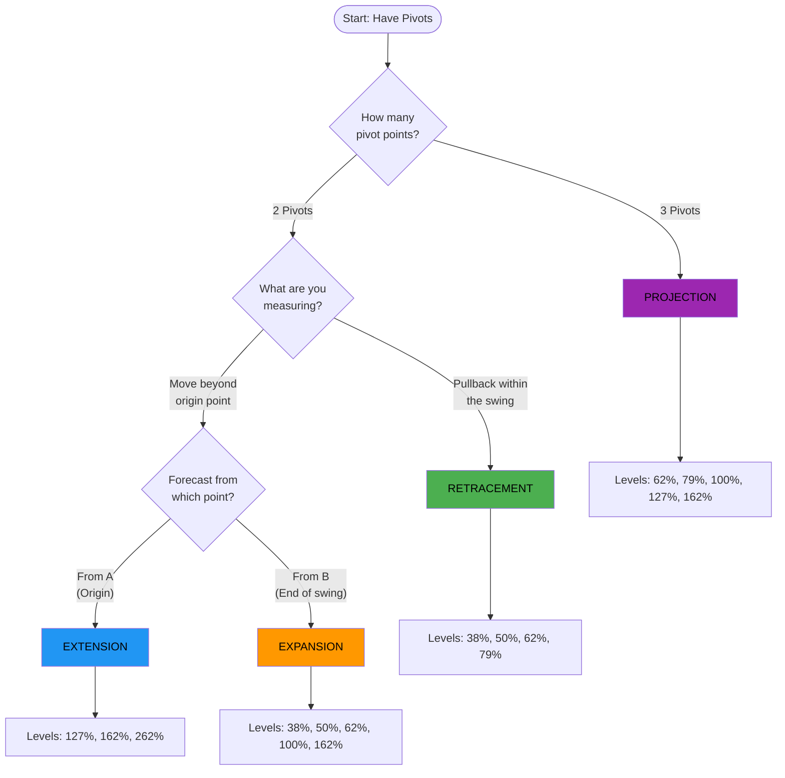

# Professional Fibonacci Workshop

**Author:** Sandy Jadeja (Chief Market Strategist, SignalPro)  
**Published:** 2017  
**Extracted:** December 2025  
**Book type:** Technical Trading / Financial Markets

## Summary Tags

`#fibonacci` `#technical-analysis` `#trading` `#retracements` `#extensions` `#projections` `#expansions` `#harmonic-patterns` `#gartley-222` `#butterfly` `#price-forecasting` `#signal-bars`

## TL;DR

This professional workshop manual teaches traders to use Fibonacci ratios for price forecasting across multiple timeframes. The four core Fibonacci price tools (Retracements, Extensions, Projections, and Expansions) are explained with precise calculation methods and real chart examples. The book culminates in advanced harmonic patterns (Gartley 222 and Butterfly) that combine multiple Fibonacci relationships for high-probability trade setups.

## Quick Navigation

- [Chapter 1: Planning Considerations](#chapter-1-planning-considerations)
- [Chapter 2: Fibonacci Fundamentals](#chapter-2-fibonacci-fundamentals)
- [Chapter 3: Pivot Points](#chapter-3-pivot-points)
- [Chapter 4: Retracements](#chapter-4-retracements)
- [Chapter 5: Extensions](#chapter-5-extensions)
- [Chapter 6: Projections](#chapter-6-projections)
- [Chapter 7: Expansions](#chapter-7-expansions)
- [Chapter 8: Signal Bars and Entry](#chapter-8-signal-bars-and-entry)
- [Chapter 9: Position Sizing](#chapter-9-position-sizing)
- [Chapter 10: Trade Management](#chapter-10-trade-management)
- [Chapter 11: Advanced Patterns - Gartley 222](#chapter-11-advanced-patterns---gartley-222)
- [Chapter 12: Advanced Patterns - Butterfly](#chapter-12-advanced-patterns---butterfly)
- [Master Trading Workflow](#master-trading-workflow)
- [Cheat Sheets](#cheat-sheets)
- [Skills From This Book](#skills-from-this-book)

---

## Master Trading Workflow

This comprehensive flowchart shows the complete Fibonacci trading process from market analysis to trade exit.

### Complete Trading Process


### Trend Alignment Decision

```mermaid
flowchart LR
    subgraph Weekly["Weekly Trend"]
        W1[UP]
        W2[DOWN]
    end
    
    subgraph Daily["Daily Trend"]
        D1[UP]
        D2[DOWN]
    end
    
    subgraph Action["Action"]
        A1["🟡 STAND ASIDE<br/>(Wait for pullback)"]
        A2["🟢 GO LONG<br/>(Buy the dip)"]
        A3["🟡 STAND ASIDE<br/>(Wait for bounce)"]
        A4["🔴 GO SHORT<br/>(Sell the rally)"]
    end
    
    W1 --> D1 --> A1
    W1 --> D2 --> A2
    W2 --> D2 --> A3
    W2 --> D1 --> A4
```



### Fibonacci Tool Selection



---

## Chapter 1: Planning Considerations

<details>
<summary><strong>TL;DR</strong></summary>

Before trading, establish your personal trading framework including timeframe preference, market selection, psychological profile, and equipment setup. Match your strategy to your personality and available time.

**Key concepts:** Trading style selection, Market selection, Trading plan  
**Actionable items:** 3 planning checklists  
**Prerequisites:** Basic market understanding

</details>

### Overview

Successful Fibonacci trading begins with proper planning and self-assessment. This chapter establishes the foundation for developing a personalised trading approach.

### Core Concepts

#### Trading Style Selection

Choose a strategy that suits your personality and lifestyle:

| Style | Timeframe | Typical Hold Period | Characteristics |
|-------|-----------|---------------------|-----------------|
| Day Trading | Minutes to hours | Same day | Requires constant monitoring, quick decisions |
| Short Term | Hours to days | 1-5 days | Moderate monitoring, swing-based |
| Intermediate | Days to weeks | 1-4 weeks | Less screen time, larger moves |
| Long Term | Weeks to months | 4+ weeks | Position trading, major trends |

**Why it matters:** Mismatched trading style leads to emotional decisions and poor execution.

#### Market Categories

Markets are classified by volatility and growth potential:


#### Income Target Planning

Break down annual targets into manageable daily goals:

**Example calculation:**
- Annual target: $100,000
- Monthly target: $8,333
- Weekly target: $1,923
- Daily target: $385

**Point-based approach:** At $10/point, you need 38 points daily.

**Optimisation factors:**
- Low margins
- Tight spreads
- Markets that provide the points you need

#### Multi-Timeframe Trend Alignment

| Weekly Trend | Daily Trend | Action |
|--------------|-------------|--------|
| UP | UP | Stand aside (wait for pullback) |
| UP | DOWN | **Go Long** (buy the dip) |
| DOWN | DOWN | Stand aside (wait for bounce) |
| DOWN | UP | **Go Short** (sell the rally) |

**Key principle:** Trade the daily retracement in the direction of the weekly trend. When both timeframes align, wait for a counter-move to enter.

---

## Chapter 2: Fibonacci Fundamentals

<details>
<summary><strong>TL;DR</strong></summary>

The Fibonacci sequence creates mathematical ratios that appear throughout nature and financial markets. The key ratios (38.2%, 50%, 61.8%, 78.6%, 127%, 162%, 262%) are derived from dividing numbers in the sequence and form the basis of all Fibonacci trading tools.

**Key concepts:** Golden Ratio, Fibonacci sequence, Trading ratios  
**Actionable items:** Ratio calculation practice  
**Prerequisites:** None

</details>

### Overview

Leonardo Fibonacci (1170-1250) discovered a mathematical sequence that reveals patterns found throughout nature—and financial markets.

### The Fibonacci Sequence

> "The sequence of the Fibonacci numbers is zero, 1, 1, 2, 3, 5, 8, 13, 21, 34, 55, 89, 144, 233, 377... to infinity."

**Calculation method:** Each number is the sum of the two preceding numbers.

```
0, 1, 1, 2, 3, 5, 8, 13, 21, 34, 55, 89, 144, 233, 377...
        1+1=2
           2+3=5
              5+8=13
                  ...and so on
```

### Key Fibonacci Ratios

#### Adjacent Number Ratios

| Division | Result | Usage |
|----------|--------|-------|
| 89 ÷ 144 | 0.618 | Primary retracement level (Golden Ratio) |
| 144 ÷ 89 | 1.618 | Primary extension level (Phi) |

**Note:** The book contains a typographical error showing "0.518" — the correct value is **0.618**.

#### Alternate Number Ratios

| Division | Result | Usage |
|----------|--------|-------|
| 89 ÷ 233 | 0.382 | Secondary retracement level |
| 233 ÷ 89 | 2.618 | Major extension level |

#### Square Root Ratios

| Calculation | Result | Usage |
|-------------|--------|-------|
| √0.618 | 0.786 | Deep retracement level |
| √1.618 | 1.272 | Initial extension level |

### Complete Ratio Reference


**Primary levels:** 38.2%, 61.8% (retracements) and 127%, 162% (extensions)  
**Note:** 50% is not technically a Fibonacci ratio but is commonly used.

### The Four Fibonacci Price Tools

As a Fibonacci trader, you have four essential price tools:

1. **Retracements** — Pullback levels within a trend
2. **Extensions** — Levels beyond the starting point
3. **Projections** — Forecasts from current pivots
4. **Expansions** — Range expansions from swings

> "You don't need to know all of them. Master just one and it will change your life."

---

## Chapter 3: Pivot Points

<details>
<summary><strong>TL;DR</strong></summary>

Pivot points are swing highs and lows that form the anchor points for all Fibonacci measurements. A valid pivot requires confirmation from surrounding price action—typically one point higher or lower on each side.

**Key concepts:** Pivot High, Pivot Low, Swing confirmation  
**Actionable items:** Pivot identification checklist  
**Prerequisites:** Chart reading basics

</details>

### Overview

All Fibonacci tools require accurate pivot point identification. Pivots are the foundation upon which every Fibonacci calculation is built.

### Pivot Definitions

#### Pivot High

A bar with a higher high than the bars immediately before and after it.

```
        ╱╲
       ╱  ╲
      ╱    ╲
     ╱      ╲
    ╱        ╲
```

**Rule:** One point lower on each side confirms the pivot high.

#### Pivot Low

A bar with a lower low than the bars immediately before and after it.

```
    ╲        ╱
     ╲      ╱
      ╲    ╱
       ╲  ╱
        ╲╱
```

**Rule:** One point higher on each side confirms the pivot low.

### Multi-Timeframe Pivot Analysis

| Timeframe | Application |
|-----------|-------------|
| Monthly | Major trend identification |
| Weekly | Primary swing structure |
| Daily | Trading timeframe signals |
| 4-Hour | Fine-tuning entries |
| 1-Hour/15-Min | Precise entry timing |

**Key insight:** Pivots from higher timeframes carry more significance than those from lower timeframes.

---

## Chapter 4: Retracements

<details>
<summary><strong>TL;DR</strong></summary>

A retracement measures how far price pulls back toward its origin after a swing. Calculated from High minus Low, multiplied by the Fibonacci ratio, then subtracted from the High (for buys) or added to the Low (for sells). Key levels are 38%, 50%, 62%, and 79%.

**Key concepts:** Pullback measurement, Entry level calculation  
**Actionable items:** 2 calculation formulas  
**Prerequisites:** Pivot point identification

</details>

### Overview

A retracement occurs when a market moves back toward where it originally came from. This is the most fundamental Fibonacci tool.

### Definition

> "A Retracement is simply when a market moves its way back towards where it was originally coming from."

**Requirements:** Two pivot points (High and Low)

### BUY Setup (Uptrend Pullback)


**Formula:**
1. Calculate range: High - Low
2. Multiply by ratio
3. Subtract from High

**Example Calculation:**

```
A (High) = 100
X (Low) = 50
Range = 100 - 50 = 50

61.8% Retracement:
50 × 0.618 = 31
100 - 31 = 69

BUY at 69
```

| Retracement Level | Calculation | Result |
|-------------------|-------------|--------|
| 38% | 100 - (50 × 0.38) | 81.0 |
| 50% | 100 - (50 × 0.50) | 75.0 |
| 62% | 100 - (50 × 0.62) | 69.0 |
| 79% | 100 - (50 × 0.79) | 60.5 |

### SELL Setup (Downtrend Pullback)

**Formula:**
1. Calculate range: High - Low
2. Multiply by ratio
3. Add to Low

**Example Calculation:**

```
X (High) = 100
A (Low) = 50
Range = 100 - 50 = 50

61.8% Retracement:
50 × 0.618 = 31
50 + 31 = 81

SELL at 81
```

### Retracement Levels Summary

**BUY Levels (from support):** 38%, 50%, 62%, 79%  
**SELL Levels (from resistance):** 38%, 50%, 62%, 79%

### Retracement Calculation Flowchart


---

## Chapter 5: Extensions

<details>
<summary><strong>TL;DR</strong></summary>

An extension measures when price moves beyond its original starting point. Calculated similarly to retracements but the result is subtracted from (for buys) or added to (for sells) the starting point. Key levels are 127%, 162%, and 262%.

**Key concepts:** Trend continuation, Target levels  
**Actionable items:** 2 calculation formulas  
**Prerequisites:** Retracement understanding

</details>

### Overview

An extension occurs when a market extends past its original starting point—useful for identifying continuation targets.

### Definition

> "An Extension is simply when a market extends past its original starting point."

**Requirements:** Two pivot points

### BUY Setup (Target Below Origin)

**Formula:**
1. High - Low
2. Multiply by extension ratio
3. Subtract from High (A)

**Example Calculation:**

```
A (High) = 100
X (Low) = 50
Range = 50

127% Extension:
50 × 1.27 = 63
100 - 63 = 37

BUY at 37
```

| Extension Level | Calculation | Result |
|-----------------|-------------|--------|
| 127% | 100 - (50 × 1.27) | 36.5 |
| 162% | 100 - (50 × 1.62) | 19.0 |
| 262% | 100 - (50 × 2.62) | -31.0 |

### SELL Setup (Target Above Origin)

**Formula:**
1. High - Low
2. Multiply by extension ratio
3. Add to Low (A)

**Example Calculation:**

```
X (High) = 100
A (Low) = 50
Range = 50

162% Extension:
50 × 1.62 = 81
50 + 81 = 131

SELL at 131
```

### Extension vs Retracement

| Aspect | Retracement | Extension |
|--------|-------------|-----------|
| Direction | Back toward origin | Beyond origin |
| Ratios | Below 100% | Above 100% |
| Purpose | Entry levels | Target levels |

### Extension Calculation Flowchart

```mermaid
flowchart TD
    subgraph INPUT["📥 INPUT"]
        I1[Identify Origin Point - A]
        I2[Identify End Point - X]
        I1 --> I3[Calculate Range = High - Low]
        I2 --> I3
    end
    
    subgraph CALCULATE["🔢 CALCULATE EXTENSIONS"]
        I3 --> C1["127% = Range × 1.27"]
        I3 --> C2["162% = Range × 1.62"]
        I3 --> C3["262% = Range × 2.62"]
    end
    
    subgraph BUY["🟢 BUY SETUP<br/>(Bearish Extension)"]
        C1 --> B1["127% = A - (Range × 1.27)"]
        C2 --> B2["162% = A - (Range × 1.62)"]
        C3 --> B3["262% = A - (Range × 2.62)"]
        B1 --> B4[Targets BELOW origin]
    end
    
    subgraph SELL["🔴 SELL SETUP<br/>(Bullish Extension)"]
        C1 --> S1["127% = A + (Range × 1.27)"]
        C2 --> S2["162% = A + (Range × 1.62)"]
        C3 --> S3["262% = A + (Range × 2.62)"]
        S1 --> S4[Targets ABOVE origin]
    end
    
    B4 --> OUT[Mark extension targets on chart]
    S4 --> OUT
```



---

## Chapter 6: Projections

<details>
<summary><strong>TL;DR</strong></summary>

A projection measures a previous swing and forecasts from the current pivot in the same direction. It requires three pivot points (A, B, C) and projects from C. Key levels are 62%, 100%, 127%, and 162%.

**Key concepts:** Swing projection, Three-point measurement  
**Actionable items:** 2 calculation formulas  
**Prerequisites:** Retracements and Extensions

</details>

### Overview

A projection takes a previous swing measurement and projects it from the current pivot point in the same direction as that swing.

### Definition

> "A Projection is a measurement of a previous swing, and then projected from the current pivot point in the same direction as the previous swing."

**Requirements:** Three pivot points (A, B, C)


### BUY Setup (Bearish Projection)

**Formula:**
1. Measure swing: A - B
2. Multiply by projection ratio
3. Subtract from C

**Example Calculation:**

```
A = 100, B = 50, C = 75
Swing = 100 - 50 = 50

100% Projection:
50 × 1.00 = 50
75 - 50 = 25

BUY at 25
```

### SELL Setup (Bullish Projection)

**Formula:**
1. Measure swing: B - A
2. Multiply by projection ratio
3. Add to C

**Example Calculation:**

```
A = 50, B = 100, C = 75
Swing = 100 - 50 = 50

100% Projection:
50 × 1.00 = 50
75 + 50 = 125

SELL at 125
```

### Projection Levels

| Level | Common Use |
|-------|------------|
| 62% | Conservative target (main) |
| 79% | Intermediate target |
| 100% | Standard AB=CD pattern (main) |
| 127% | Extended target |
| 162% | Maximum extension (main) |

**3 Main Targets (circled in original):** 62%, 100%, 162%

### Projection Calculation Flowchart


---

## Chapter 7: Expansions

<details>
<summary><strong>TL;DR</strong></summary>

An expansion measures when the price range of a swing expands. It requires two pivot points and calculates from pivot B. Key difference from Extensions: Expansions need pivot B to forecast from, while Extensions need pivot B to calculate but forecast from A.

**Key concepts:** Range expansion, Swing-based targeting  
**Actionable items:** 2 calculation formulas  
**Prerequisites:** Extensions understanding

</details>

### Overview

An expansion occurs when a market expands the price range of a swing. It is calculated from pivot B rather than pivot A.

### Definition

> "An Expansion is simply when a market expands the price range of a swing."

**Requirements:** Two pivot points (A, B)

### BUY Setup

**Formula:**
1. A - B
2. Multiply by expansion ratio
3. Subtract from B

**Example Calculation:**

```
A = 500, B = 400
Range = 500 - 400 = 100

62% Expansion:
100 × 0.62 = 62
400 - 62 = 338

BUY at 338
```

### SELL Setup

**Formula:**
1. B - A
2. Multiply by expansion ratio
3. Add to B

**Example Calculation:**

```
A = 50, B = 100
Range = 100 - 50 = 50

100% Expansion:
50 × 1.00 = 50
100 + 50 = 150

SELL at 150
```

### Expansion vs Extension

| Feature | Expansion | Extension |
|---------|-----------|-----------|
| Pivot for calculation | A and B | A and B |
| Pivot to forecast from | **B** | **A** |
| Key difference | Forecasts from B | Forecasts from A |

### Expansion Calculation Flowchart


### Key Difference: Extension vs Expansion


---

## Chapter 8: Signal Bars and Entry

<details>
<summary><strong>TL;DR</strong></summary>

A valid signal bar confirms the Fibonacci level before entry. For BUY signals, the close must be above both the opening price and the Fibonacci level. For SELL signals, the close must be below both. Type 1 signals (where the level is tested and rejected) are stronger than Type 2.

**Key concepts:** Signal confirmation, Entry triggers  
**Actionable items:** 2 entry checklists  
**Prerequisites:** Fibonacci level calculation

</details>

### Overview

Fibonacci levels alone are not sufficient for entry. A reversal signal bar must confirm the level.

### BUY Signal Requirements

1. Price reaches Fibonacci level
2. Close is **above** opening price
3. Close is **above** Fibonacci level


**Type 1 (Stronger):** Price tests level, gets rejected, closes above  
**Type 2:** Price closes above level without deep test

### SELL Signal Requirements

1. Price reaches Fibonacci level
2. Close is **below** opening price
3. Close is **below** Fibonacci level

### Entry Timing

| Signal Type | Reliability | Notes |
|-------------|-------------|-------|
| Type 1 | Higher | Level tested and rejected |
| Type 2 | Moderate | Must be above/below level |

**Best practice:** Wait for the close before entering on the signal bar.

### Signal Bar Identification Flowchart

```mermaid
flowchart TD
    Start([Price reaches Fib Level]) --> Q1{Bar closes?}
    Q1 -->|No| W1[Wait for bar to close]
    W1 --> Q1
    
    Q1 -->|Yes| Q2{What type<br/>of trade?}
    
    Q2 -->|BUY Setup| B1{Close > Open?}
    B1 -->|No| R1[❌ NO SIGNAL<br/>Wait for next bar]
    B1 -->|Yes| B2{Close > Fib Level?}
    B2 -->|No| R1
    B2 -->|Yes| B3{Price tested<br/>& rejected level?}
    B3 -->|Yes| B4["✅ TYPE 1 SIGNAL<br/>(Stronger)"]
    B3 -->|No| B5["✅ TYPE 2 SIGNAL<br/>(Moderate)"]
    
    Q2 -->|SELL Setup| S1{Close < Open?}
    S1 -->|No| R1
    S1 -->|Yes| S2{Close < Fib Level?}
    S2 -->|No| R1
    S2 -->|Yes| S3{Price tested<br/>& rejected level?}
    S3 -->|Yes| S4["✅ TYPE 1 SIGNAL<br/>(Stronger)"]
    S3 -->|No| S5["✅ TYPE 2 SIGNAL<br/>(Moderate)"]
    
    B4 --> NEXT[Proceed to Position Sizing]
    B5 --> NEXT
    S4 --> NEXT
    S5 --> NEXT
    R1 --> Start
    
    style B4 fill:#4CAF50,color:#000000
    style B5 fill:#8BC34A,color:#000000
    style S4 fill:#f44336,color:#000000
    style S5 fill:#E57373,color:#000000
    style R1 fill:#9E9E9E,color:#000000
```



---

## Chapter 9: Position Sizing

<details>
<summary><strong>TL;DR</strong></summary>

Position size is calculated by dividing risk capital by the distance from entry to stop loss. This ensures consistent risk regardless of market volatility or price level. The stop loss is typically placed beyond the swing high/low.

**Key concepts:** Risk management, Stake calculation  
**Actionable items:** Position sizing formula  
**Prerequisites:** Entry and stop placement

</details>

### Overview

Proper position sizing is critical for survival. The method ensures you risk a consistent amount regardless of the trade setup.

### Position Sizing Formula

```
Position Size = Risk Capital ÷ (Entry - Stop)
```

### BUY Example

```
Close (Entry) = 7950
Stop Low = 7900
Distance = 7950 - 7900 = 50 points

Risk Capital = £500
Position Size = £500 ÷ 50 = £10 per point
```

### SELL Example

```
Close (Entry) = 4430
Stop High = 4550
Distance = 4550 - 4430 = 120 points

Risk Capital = £500
Position Size = £500 ÷ 120 = £4.16 per point
```

### Risk Assessment Decision Tree


---

## Chapter 10: Trade Management

<details>
<summary><strong>TL;DR</strong></summary>

Trade management involves moving stops to breakeven (creating a "free trade"), trailing stops, and exiting at Fibonacci targets. The first loss is the best loss—if a trade doesn't work quickly, exit fast. Use GTD (Good Till Date) stop orders for protection.

**Key concepts:** Free trade, Stop management, Exit strategy  
**Actionable items:** 7-step trading workflow  
**Prerequisites:** Position sizing

</details>

### Overview

Managing a trade is as important as finding the setup. This chapter covers the complete trade lifecycle.

### The 7-Step Trading Process


### Creating a Free Trade

Once price moves in your favour by an amount equal to your risk, move stop to breakeven.

**Example:**
- Entry: 3930
- Initial stop: 3880 (50 points risk)
- Price moves to 3980 (+50 points)
- Move stop to 3930 (breakeven = FREE TRADE)

### Exit Strategy

| Exit Method | When to Use |
|-------------|-------------|
| Target (127%, 162%) | Price reaches Fibonacci extension |
| Trailing stop | Strong momentum continuation |
| Manual exit | Trade not working quickly |

### Trade Lifecycle Management Flowchart


### Key Wisdom

> "If a trade does not work out fast, it is better to exit fast."

> "The first loss is the best and cheapest loss—it allows you to examine the market from the sidelines."

> "A trader's best defensive tool is a Stop Loss."

---

## Chapter 11: Advanced Patterns - Gartley 222

<details>
<summary><strong>TL;DR</strong></summary>

The Gartley 222 is a five-point harmonic pattern (X, A, B, C, D) where D is the entry point. D equals 62% or 79% of XA, and the pattern features an internal AB=CD structure. In strong markets, B retracement can be 38% or 50%. Point C must remain within the first pivot's range.

**Key concepts:** Harmonic pattern, XABCD structure, AB=CD  
**Actionable items:** Pattern identification checklist  
**Prerequisites:** All Fibonacci tools

</details>

### Overview

The Gartley 222 pattern, named after H.M. Gartley who first described it in 1935 in "Profits in the Stock Market" on page 222, is a retracement pattern with specific Fibonacci relationships.

### Pattern Structure


### BUY Setup (Bullish Gartley)

**Rules:**
- D = 62% or 79% retracement of XA
- C = 62% or 79% retracement of AB
- In strong markets: B can be 38% or 50%
- **Key:** AB = CD pattern must be present
- **Critical:** Point C must remain below the first pivot (A)

```
        A
       /\
      /  \
     /    \    C
    /      \  /\
   /        \/  \
  /          B   \
 /                \
X                  D (BUY HERE)
```

**Pattern description:** Starting from low X, price rallies to peak A, retraces to B, rallies again to C (but C stays below A), then drops to D where you BUY.

### SELL Setup (Bearish Gartley)

**Rules:**
- D = 62% or 79% retracement of XA
- C = 62% or 79% retracement of AB
- In strong markets: B can be 38% or 50%
- **Key:** AB = CD pattern must be present
- **Critical:** Point C must remain above the first pivot (A)

```
X                  D (SELL HERE)
 \                /
  \          B   /
   \        /\  /
    \      /  \/
     \    /    C
      \  /
       \/
        A
```

**Pattern description:** Starting from high X, price falls to trough A, retraces up to B, falls again to C (but C stays above A), then rallies to D where you SELL.

### Gartley 222 Checklist

- [ ] Identify X and A pivots
- [ ] B retraces 38-62% of XA
- [ ] C retraces 62-79% of AB
- [ ] Verify AB = CD structure
- [ ] D reaches 62-79% of XA
- [ ] C remains within A's range
- [ ] Wait for signal bar at D

### Gartley 222 Pattern Identification Flowchart


### Gartley vs Butterfly Decision


---

## Chapter 12: Advanced Patterns - Butterfly

<details>
<summary><strong>TL;DR</strong></summary>

The Butterfly pattern is an extension pattern where D extends beyond X to 127% or 162% of XA. It features the same internal structure as Gartley but with D breaking new ground. In strong markets, B and C can retrace only 38% or 50%. Very good for risk/reward as stops can be tight.

**Key concepts:** Extension pattern, Beyond-origin targeting  
**Actionable items:** Pattern identification checklist  
**Prerequisites:** Gartley 222 understanding

</details>

### Overview

The Butterfly pattern is similar to the Gartley 222 but D extends beyond the X point rather than retracing within it. This creates excellent risk/reward opportunities.

### Pattern Structure

```mermaid
graph LR
    X["X"] --> A["A"]
    A --> B["B (38-79% of XA)"]
    B --> C["C (62-79% of AB)"]
    C --> D["D (127-162% of XA)"]
    
    style X fill:#9C27B0,color:#000000
    style D fill:#4CAF50,color:#000000
```

### BUY Setup (Bullish Butterfly)

**Rules:**
- D = 127% or 162% **extension** of XA
- C = 62% or 79% retracement of AB
- BD = 127% or 162%
- In strong markets: B and C can be 38% or 50%

```
        A
       /\
      /  \    C
     /    \  /\
    /      \/  \
   X........B   \
    \            \
     \............D (BUY HERE - below X)
```

**Pattern description:** From X, price rallies to A, then retraces past X down to B. Price bounces to C (below A), then drops to D (127-162% extension of XA).

**Key difference from Gartley:** B extends beyond X, and D is an extension (not retracement) of XA.

> "Very good for risk/reward"

### SELL Setup (Bearish Butterfly)

**Rules:**
- D = 127% or 162% **extension** of XA
- C = 62% or 79% retracement of AB
- BD = 127% or 162%
- In strong markets: B and C can be 38% or 50%

```
     /............D (SELL HERE - above X)
    /            /
   X........B   /
    \      /\  /
     \    /  \/
      \  /    C
       \/
        A
```

**Pattern description:** From X, price falls to A, then retraces past X up to B. Price drops to C (above A), then rallies to D (127-162% extension of XA).

**Key difference from Gartley:** B extends beyond X, and D is an extension (not retracement) of XA.

> "Actually an extension"

### Butterfly Advantage

> "Very good for risk/reward."

The stop can be placed just beyond D, making the risk small relative to the potential reward back to C or beyond.

### Butterfly Checklist

- [ ] Identify X and A pivots
- [ ] B retraces 38-79% of XA
- [ ] C retraces 62-79% of AB
- [ ] D extends to 127-162% of XA
- [ ] BD equals 127-162%
- [ ] Wait for signal bar at D
- [ ] Note: Stop is tight beyond D

### Butterfly Pattern Identification Flowchart

```mermaid
flowchart TD
    Start([Start: Potential Pattern]) --> Q1{Identify X<br/>Starting Point}
    Q1 --> Q2{Identify A<br/>First Reversal}
    
    Q2 --> Q3{Find B:<br/>Does B retrace<br/>past X?}
    Q3 -->|"No - stays<br/>within X-A"| R1[Check for Gartley]
    Q3 -->|Yes| Q4{B at 38-79%<br/>of XA?}
    
    Q4 -->|No| R2[❌ Not Butterfly]
    Q4 -->|Yes| Q5{Find C:<br/>Does C retrace<br/>62-79% of AB?}
    
    Q5 -->|No| R2
    Q5 -->|Yes| Q6{D extends to<br/>127-162% of XA?}
    
    Q6 -->|No| R2
    Q6 -->|Yes| Q7{BD = 127-162%?}
    
    Q7 -->|No| R2
    Q7 -->|Yes| Q8{Wait for<br/>Signal Bar at D}
    
    Q8 --> Q9{Signal<br/>Confirmed?}
    Q9 -->|Yes| SUCCESS["✅ VALID BUTTERFLY<br/>Enter Trade<br/>Tight Stop Beyond D"]
    Q9 -->|No| WAIT[Wait for Signal]
    WAIT --> Q8
    
    style SUCCESS fill:#4CAF50,color:#000000
    style R1 fill:#FF9800,color:#000000
    style R2 fill:#f44336,color:#000000
```

### Complete Harmonic Pattern Decision Tree

```mermaid
flowchart TD
    Start([XABCD Structure Found]) --> Q1{B relative to X?}
    
    Q1 -->|"B stays between<br/>X and A"| G1[Potential GARTLEY]
    Q1 -->|"B extends<br/>beyond X"| B1[Potential BUTTERFLY]
    
    G1 --> G2{D at 62-79%<br/>of XA?}
    G2 -->|Yes| G3["✅ GARTLEY 222<br/>Stop: Beyond X"]
    G2 -->|No| G4[Invalid Pattern]
    
    B1 --> B2{D at 127-162%<br/>of XA?}
    B2 -->|Yes| B3["✅ BUTTERFLY<br/>Stop: Just Beyond D<br/>Better Risk/Reward"]
    B2 -->|No| B4[Invalid Pattern]
    
    style G3 fill:#4CAF50,color:#000000
    style B3 fill:#2196F3,color:#000000
    style G4 fill:#9E9E9E,color:#000000
    style B4 fill:#9E9E9E,color:#000000
```

---

## Cheat Sheets

### Visual Comparison: All Four Fibonacci Tools

```mermaid
flowchart TB
    subgraph RETRACEMENT["🔵 RETRACEMENT<br/>Pullback Within Range"]
        R1["A (High)"]
        R2["X (Low)"]
        R3["Entry at 38-79%<br/>between A and X"]
        R1 -.->|"Price pulls back"| R3
        R3 -.->|"toward"| R2
    end
    
    subgraph EXTENSION["🟢 EXTENSION<br/>Beyond Origin"]
        E1["A (Origin)"]
        E2["X (End)"]
        E3["Target at 127-262%<br/>beyond A"]
        E1 -.->|"Price extends"| E3
        E2 -.->|"past origin"| E3
    end
    
    subgraph PROJECTION["🟣 PROJECTION<br/>From Current Pivot"]
        P1["A → B<br/>(Previous Swing)"]
        P2["C<br/>(Current Pivot)"]
        P3["D at 62-162%<br/>projected from C"]
        P1 -.->|"Measure swing"| P2
        P2 -.->|"Project"| P3
    end
    
    subgraph EXPANSION["🟠 EXPANSION<br/>Range Expansion"]
        X1["A (Start)"]
        X2["B (End)"]
        X3["D at 38-162%<br/>expanded from B"]
        X1 -.->|"Calculate range"| X2
        X2 -.->|"Expand"| X3
    end
```

### When to Use Each Tool

```mermaid
flowchart TD
    Q1([What are you trying to find?])
    
    Q1 --> A1{Entry level<br/>on pullback?}
    A1 -->|Yes| R["Use RETRACEMENT<br/>38%, 50%, 62%, 79%"]
    
    Q1 --> A2{Target beyond<br/>starting point?}
    A2 -->|Yes| E["Use EXTENSION<br/>127%, 162%, 262%"]
    
    Q1 --> A3{Project a swing<br/>from new pivot?}
    A3 -->|Yes| P["Use PROJECTION<br/>62%, 79%, 100%, 127%, 162%"]
    
    Q1 --> A4{Expand range<br/>from swing end?}
    A4 -->|Yes| X["Use EXPANSION<br/>38%, 50%, 62%, 100%, 162%"]
    
    style R fill:#2196F3,color:#000000
    style E fill:#4CAF50,color:#000000
    style P fill:#9C27B0,color:#000000
    style X fill:#FF9800,color:#000000
```

### Fibonacci Ratio Quick Reference

| Ratio | Decimal | Derivation | Retracement | Extension | Projection | Expansion | Gartley | Butterfly |
|-------|---------|------------|:-----------:|:---------:|:----------:|:---------:|:-------:|:---------:|
| 38% | 0.382 | 89÷233 | ✓ | | | ✓ | B (strong) | B,C (strong) |
| 50% | 0.500 | (not a Fib ratio) | ✓ | | | ✓ | B (strong) | B,C (strong) |
| 62% | 0.618 | 89÷144 | ✓ | | ✓ | ✓ | D, C | C |
| 79% | 0.786 | √0.618 | ✓ | | ✓ | | D, C | C |
| 100% | 1.000 | — | | | ✓ | ✓ | | |
| 127% | 1.272 | √1.618 | | ✓ | ✓ | | | D, BD |
| 162% | 1.618 | 144÷89 | | ✓ | ✓ | ✓ | | D, BD |
| 262% | 2.618 | 233÷89 | | ✓ | | | | |

**Note:** 50% is not technically a Fibonacci ratio but is commonly used in trading.

### Tool Requirements Summary

| Tool | Pivot Points Required | Forecast From |
|------|----------------------|---------------|
| Retracement | 2 (A, X) | Level within range |
| Extension | 2 (A, X) | A (origin) |
| Projection | 3 (A, B, C) | C (current pivot) |
| Expansion | 2 (A, B) | B (end of swing) |

### BUY Level Summary

| Tool | Levels |
|------|--------|
| Retracement | 38%, 50%, 62%, 79% |
| Extension | 127%, 162%, 262% |
| Projection | 62%, 79%, 100%, 127%, 162% |
| Expansion | 38%, 50%, 62%, 100%, 162% |

### SELL Level Summary

| Tool | Levels |
|------|--------|
| Retracement | 38%, 50%, 62%, 79% |
| Extension | 127%, 162%, 262% |
| Projection | 62%, 79%, 100%, 127%, 162% |
| Expansion | 38%, 50%, 62%, 100%, 162% |

**Note:** The same ratio levels apply for both BUY and SELL setups—the difference is in the calculation formula (subtract vs add) and the direction of the trade.

### Calculation Formulas

**Retracement (BUY):**
```
Level = High - (Range × Ratio)
```

**Retracement (SELL):**
```
Level = Low + (Range × Ratio)
```

**Extension (BUY):**
```
Level = High - (Range × Ratio)
```

**Extension (SELL):**
```
Level = Low + (Range × Ratio)
```

**Projection (BUY):**
```
Level = C - (Swing × Ratio)
```

**Projection (SELL):**
```
Level = C + (Swing × Ratio)
```

**Expansion (BUY):**
```
Level = B - (Range × Ratio)
```

**Expansion (SELL):**
```
Level = B + (Range × Ratio)
```

### Pattern Comparison

| Pattern | D Location | B Retracement | Key Feature |
|---------|------------|---------------|-------------|
| Gartley 222 | 62-79% of XA | 38-62% | Retracement with AB=CD |
| Butterfly | 127-162% of XA | 38-79% | Extension beyond X |

### Entry Signal Checklist

**For BUY:**
- [ ] Price at Fibonacci level
- [ ] Bar closes above opening
- [ ] Close above Fibonacci level
- [ ] Calculate risk to stop
- [ ] Position size acceptable
- [ ] Enter on close of signal bar

**For SELL:**
- [ ] Price at Fibonacci level
- [ ] Bar closes below opening
- [ ] Close below Fibonacci level
- [ ] Calculate risk to stop
- [ ] Position size acceptable
- [ ] Enter on close of signal bar

### Position Sizing Quick Formula

```
Size = Risk Capital ÷ Points to Stop
```

---

## Skills From This Book

This section identifies discrete skills taught in this book that can be extracted into dedicated skill files for practical application.

### Overview

**Skill categories in this book:**
- Analysis Skills: 3 skills
- Calculation Skills: 4 skills
- Execution Skills: 3 skills
- Pattern Recognition: 2 skills

### Skill Progression Map

```mermaid
graph LR
    subgraph Foundation["Foundation"]
        A["Pivot Identification"]
        B["Fibonacci Calculation"]
    end
    
    subgraph Intermediate["Intermediate"]
        C["Retracements & Extensions"]
        D["Projections & Expansions"]
    end
    
    subgraph Advanced["Advanced"]
        E["Harmonic Patterns"]
        F["Multi-Timeframe Analysis"]
    end
    
    A --> C
    B --> C
    C --> D
    D --> E
    C --> F
    
    style E fill:#4CAF50,color:#000000
    style F fill:#4CAF50,color:#000000
```

---

### Skill 1: Pivot Point Identification

**What it is:** The ability to accurately identify swing highs and swing lows on any timeframe.

**Book coverage:** Chapter 3, Pages 10-13

**Prerequisites:**
- Basic chart reading
- Understanding of price action

**Learning outcomes:**
- [ ] Identify valid pivot highs with confirmation
- [ ] Identify valid pivot lows with confirmation
- [ ] Apply pivots across multiple timeframes
- [ ] Connect pivots to form swing structure

**Practical applications:**
- Drawing Fibonacci retracements
- Identifying trend structure
- Locating support and resistance

---

### Skill 2: Fibonacci Retracement Calculation

**What it is:** Calculating pullback levels using the Fibonacci sequence ratios.

**Book coverage:** Chapter 4, Pages 19-28

**Prerequisites:**
- Pivot Point Identification
- Basic arithmetic

**Learning outcomes:**
- [ ] Calculate 38%, 50%, 62%, 79% levels
- [ ] Apply correct formula for BUY and SELL setups
- [ ] Identify which level price is likely to reach
- [ ] Combine with signal bar confirmation

**Practical applications:**
- Entry level identification
- Pull-back trading
- Counter-trend entries

---

### Skill 3: Fibonacci Extension Calculation

**What it is:** Calculating continuation targets beyond the origin point.

**Book coverage:** Chapter 5, Pages 29-37

**Prerequisites:**
- Fibonacci Retracement Calculation

**Learning outcomes:**
- [ ] Calculate 127%, 162%, 262% levels
- [ ] Distinguish from retracements
- [ ] Apply to trend continuation trades
- [ ] Set profit targets

**Practical applications:**
- Take-profit placement
- Trend continuation trading
- Target identification

---

### Skill 4: Fibonacci Projection Calculation

**What it is:** Projecting previous swing measurements from current pivots.

**Book coverage:** Chapter 6, Pages 39-50

**Prerequisites:**
- Fibonacci Extension Calculation

**Learning outcomes:**
- [ ] Measure previous swings accurately
- [ ] Project from pivot C in correct direction
- [ ] Calculate 62%, 100%, 127%, 162% projections
- [ ] Identify AB=CD patterns

**Practical applications:**
- Swing trading targets
- Pattern completion levels
- Harmonic pattern identification

---

### Skill 5: Fibonacci Expansion Calculation

**What it is:** Calculating range expansion levels from swing endpoints.

**Book coverage:** Chapter 7, Pages 51-58

**Prerequisites:**
- All previous Fibonacci skills

**Learning outcomes:**
- [ ] Understand difference from Extensions
- [ ] Calculate from correct pivot point (B)
- [ ] Apply 38%, 50%, 62%, 100%, 162% levels
- [ ] Combine with other tools

**Practical applications:**
- Volatility-based targeting
- Breakout trading
- Momentum continuation

---

### Skill 6: Signal Bar Recognition

**What it is:** Identifying valid reversal confirmation at Fibonacci levels.

**Book coverage:** Chapter 8, Pages 64-71

**Prerequisites:**
- All Fibonacci calculation skills

**Learning outcomes:**
- [ ] Identify Type 1 (stronger) signals
- [ ] Identify Type 2 signals
- [ ] Distinguish BUY from SELL signals
- [ ] Time entries correctly

**Practical applications:**
- Trade entry timing
- False signal avoidance
- Confirmation-based trading

---

### Skill 7: Position Sizing Calculation

**What it is:** Calculating appropriate trade size based on risk parameters.

**Book coverage:** Chapter 9, Pages 77-79

**Prerequisites:**
- Signal Bar Recognition
- Stop loss placement

**Learning outcomes:**
- [ ] Calculate points to stop
- [ ] Apply position sizing formula
- [ ] Adjust stake for acceptable risk
- [ ] Make go/no-go decisions

**Practical applications:**
- Risk management
- Account preservation
- Consistent position sizing

---

### Skill 8: Gartley 222 Pattern Trading

**What it is:** Identifying and trading the Gartley harmonic pattern.

**Book coverage:** Chapter 11, Pages 100-107

**Prerequisites:**
- All Fibonacci skills
- Signal Bar Recognition

**Learning outcomes:**
- [ ] Identify XABCD structure
- [ ] Verify AB=CD internal pattern
- [ ] Confirm D at 62-79% of XA
- [ ] Execute with proper risk management

**Practical applications:**
- High-probability reversal trading
- Harmonic pattern trading
- Multi-confluence setups

---

### Skill 9: Butterfly Pattern Trading

**What it is:** Identifying and trading the Butterfly harmonic extension pattern.

**Book coverage:** Chapter 12, Pages 108-113

**Prerequisites:**
- Gartley 222 Pattern Trading

**Learning outcomes:**
- [ ] Distinguish from Gartley (extension vs retracement)
- [ ] Identify D at 127-162% of XA
- [ ] Exploit superior risk/reward
- [ ] Place tight stops beyond D

**Practical applications:**
- Extension pattern trading
- Excellent risk/reward setups
- Deep pullback entries

---

## Appendix: Verification Notes

### Corrections to Original Material

1. **Page 17 Typo:** The golden ratio is stated as "0.518" — the correct value is **0.618**.

2. **Verified Calculations:**
   - 89 ÷ 144 = 0.6181 ✓
   - 144 ÷ 89 = 1.6180 ✓
   - 89 ÷ 233 = 0.3820 ✓
   - 233 ÷ 89 = 2.6180 ✓
   - √0.618 = 0.7861 ✓
   - √1.618 = 1.2720 ✓

### Learning Style Recommendations

**Visual learners:**
- Study the Mermaid diagrams showing pattern structures
- Trace Fibonacci levels on actual charts
- Create colour-coded level templates

**Auditory learners:**
- Explain the 7-step process aloud
- Verbalise calculations while practicing
- Discuss patterns with other traders

**Written learners:**
- Work through all calculation examples
- Write out formulas from memory
- Document trades in a journal

**Kinaesthetic learners:**
- Practice drawing Fibonacci tools on charts
- Calculate levels manually before using software
- Paper trade setups before risking capital

---

*Document extracted and structured using Book Knowledge Extractor methodology*
