# SignalPro Fibonacci Trading System
## Complete Strategy & Workflow Documentation

> **Version:** 2.0
> **Status:** Comprehensive Master Document
> **Purpose:** Single authoritative source for the Fibonacci trading methodology

---

## Table of Contents

1. [Executive Summary](#1-executive-summary)
2. [Core Philosophy](#2-core-philosophy)
3. [Market Structure Analysis](#3-market-structure-analysis)
4. [Fibonacci Tools](#4-fibonacci-tools)
5. [Signal Bar Confirmation](#5-signal-bar-confirmation)
6. [Multi-Timeframe Analysis](#6-multi-timeframe-analysis)
7. [Trade Categories & Position Sizing](#7-trade-categories--position-sizing)
8. [The Complete Workflow](#8-the-complete-workflow)
9. [Trade Management](#9-trade-management)
10. [Confluence & Probability Stacking](#10-confluence--probability-stacking)
11. [Enhancements & Roadmap](#11-enhancements--roadmap)
12. [Quick Reference](#12-quick-reference)

---

# 1. Executive Summary

## What is the SignalPro System?

The SignalPro Fibonacci Trading System is a **rules-based, multi-timeframe, bi-directional trading methodology** that uses Fibonacci ratios to identify high-probability trade setups across any market.

```
┌─────────────────────────────────────────────────────────────────────────┐
│                    THE SIGNALPRO SYSTEM AT A GLANCE                      │
├─────────────────────────────────────────────────────────────────────────┤
│                                                                          │
│   FOUNDATION:          Fibonacci ratios appear throughout markets        │
│   CORE TOOLS:          Retracement, Extension, Projection, Expansion    │
│   APPROACH:            Bi-directional (trade both market legs)          │
│   TIMEFRAMES:          Multi-timeframe (Monthly → 1-minute)             │
│   CONFIRMATION:        Signal bars at Fibonacci levels                  │
│   RISK MANAGEMENT:     Category-based position sizing                   │
│                                                                          │
│   GOAL: Remove emotion, trade systematically, manage risk               │
│                                                                          │
└─────────────────────────────────────────────────────────────────────────┘
```

```mermaid
flowchart TB
    subgraph SYSTEM["SignalPro Fibonacci Trading System"]
        direction TB
        A[Multi-Timeframe Analysis] --> B[Identify Pivots A, B, C]
        B --> C[Calculate Fibonacci Levels]
        C --> D[Find Confluence Zones]
        D --> E{Price Reaches Zone?}
        E -->|Yes| F[Wait for Signal Bar]
        F --> G{Valid Signal?}
        G -->|Yes| H[Categorize Trade]
        H --> I[Calculate Position Size]
        I --> J[Execute Trade]
        J --> K[Manage Position]
        G -->|No| L[Wait/Next Level]
        E -->|No| M[Set Alerts & Wait]
    end

    style SYSTEM fill:#1a1a2e,stroke:#16213e
    style H fill:#e94560,stroke:#0f3460,color:#000
    style J fill:#00ff88,stroke:#0f3460,color:#000
```

## Core Principles

```
1. FIBONACCI LEVELS ARE DECISION POINTS
   ├── At every significant level, price will either HOLD or BREAK
   ├── We prepare for BOTH outcomes
   └── No prediction - only preparation

2. BI-DIRECTIONAL TRADING
   ├── Markets move in swings: up, down, up, down
   ├── Trade BOTH legs of the swing
   └── Missing one direction = missing half the opportunities

3. MULTI-TIMEFRAME CONFLUENCE
   ├── Higher timeframe levels are more significant
   ├── Confluence = multiple factors pointing to same level
   └── More confluence = higher probability

4. TREND-ALIGNED RISK MANAGEMENT
   ├── WITH-TREND trades: Full risk (highest probability)
   ├── COUNTER-TREND trades: Reduced risk (at major levels only)
   └── REVERSAL attempts: Smallest risk (speculative)

5. SIGNAL BAR CONFIRMATION
   ├── No signal bar = No trade
   ├── Signal bar = pivot point forming
   └── Wait for CLOSE before entry
```

---

# 2. Core Philosophy

## 2.1 Bi-Directional Trading

Markets move in alternating swings. A methodology that only trades one direction misses half of all opportunities.

```
MARKET MOVEMENT VISUALIZATION:

Price
  │
  │         /\         /\         /\
  │        /  \       /  \       /  \
  │       /    \     /    \     /    \
  │      /      \   /      \   /      \
  │     /        \ /        \ /        \
  │    /          V          V          \
  │   /                                  \
  └──────────────────────────────────────────▶ Time

TREND-ONLY APPROACH:
  Trades:  ↗️         ↗️         ↗️         = 3 trades

BI-DIRECTIONAL APPROACH:
  Trades:  ↗️ ↘️       ↗️ ↘️       ↗️ ↘️       = 6 trades
```

## 2.2 The Original SignalPro Alignment Matrix

| Higher TF | Lower TF | Original Action |
|-----------|----------|-----------------|
| UP | UP | Stand aside (wait for pullback) |
| UP | DOWN | **GO LONG** (buy the dip) |
| DOWN | DOWN | Stand aside (wait for rally) |
| DOWN | UP | **GO SHORT** (sell the rally) |

## 2.3 Extended Interpretation (Bi-Directional)

| Higher TF | Lower TF | With-Trend Action | Counter-Trend Opportunity |
|-----------|----------|-------------------|---------------------------|
| UP | UP | Wait for pullback | SHORT at major resistance |
| UP | DOWN | **LONG** at Fib support | — |
| DOWN | DOWN | Wait for rally | LONG at major support |
| DOWN | UP | **SHORT** at Fib resistance | — |

**Key Insight:** "Stand aside" means no WITH-TREND signal exists - but a counter-trend trade at major levels may still be valid.

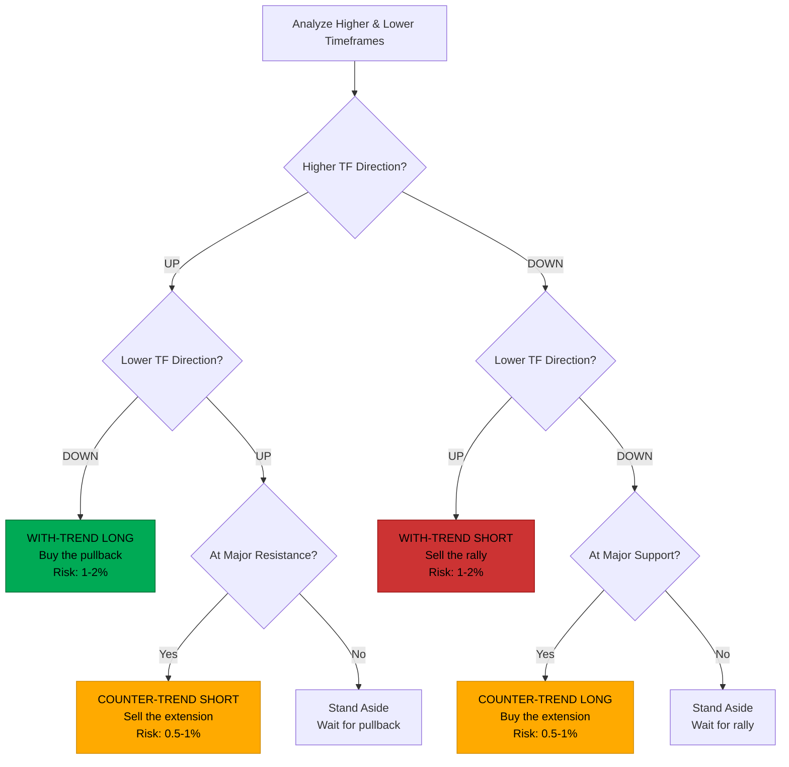

## 2.4 Three Trade Categories

```
┌─────────────────────────────────────────────────────────────────────────┐
│                         TRADE CATEGORIES                                 │
├─────────────────────────────────────────────────────────────────────────┤
│                                                                          │
│  ╔═══════════════════════════════════════════════════════════════════╗  │
│  ║  CATEGORY 1: WITH-TREND (Highest Probability)                     ║  │
│  ╠═══════════════════════════════════════════════════════════════════╣  │
│  ║  • Trading in direction of higher timeframe trend                 ║  │
│  ║  • Entry on lower timeframe pullback                              ║  │
│  ║  • Risk: 1-2% of account (full standard risk)                     ║  │
│  ║  • Example: Weekly UP, Daily DOWN → LONG the pullback             ║  │
│  ╚═══════════════════════════════════════════════════════════════════╝  │
│                                                                          │
│  ╔═══════════════════════════════════════════════════════════════════╗  │
│  ║  CATEGORY 2: COUNTER-TREND (Lower Probability, Higher Reward)     ║  │
│  ╠═══════════════════════════════════════════════════════════════════╣  │
│  ║  • Trading against higher timeframe at MAJOR levels               ║  │
│  ║  • Only at high-confluence zones (score 5+)                       ║  │
│  ║  • Risk: 0.5-1% of account (reduced)                              ║  │
│  ║  • Example: Weekly UP at 161.8% extension → potential SHORT       ║  │
│  ║  • Note: Trend still intact - trading a BOUNCE, not reversal      ║  │
│  ╚═══════════════════════════════════════════════════════════════════╝  │
│                                                                          │
│  ╔═══════════════════════════════════════════════════════════════════╗  │
│  ║  CATEGORY 3: REVERSAL ATTEMPT (Speculative)                       ║  │
│  ╠═══════════════════════════════════════════════════════════════════╣  │
│  ║  • Betting the trend is CHANGING (not just bouncing)              ║  │
│  ║  • Lower TFs have turned, higher TFs haven't confirmed            ║  │
│  ║  • Risk: 0.25-0.5% of account (smallest)                          ║  │
│  ║  • Example: 1H & 4H turned bearish while Daily still bullish      ║  │
│  ║  • The "Cascade Effect" in progress                               ║  │
│  ╚═══════════════════════════════════════════════════════════════════╝  │
│                                                                          │
└─────────────────────────────────────────────────────────────────────────┘
```

## 2.5 The Cascade Effect: How Trends Reverse

Trends don't reverse instantly on higher timeframes. The reversal **bubbles up** from lower timeframes.

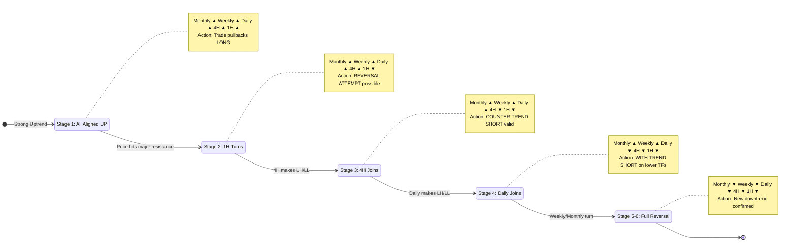

```
THE CASCADE EFFECT (Uptrend Reversing to Downtrend)
───────────────────────────────────────────────────

STAGE 1: ALL ALIGNED UP
┌──────────────────────────────────────────────┐
│ Monthly: ▲ UP                                │
│ Weekly:  ▲ UP                                │
│ Daily:   ▲ UP                                │
│ 4H:      ▲ UP                                │
│ 1H:      ▲ UP                                │
├──────────────────────────────────────────────┤
│ Status: Strong uptrend                       │
│ Action: Trade pullbacks LONG                 │
└──────────────────────────────────────────────┘
                    │
                    ▼ Price hits MAJOR Fibonacci resistance

STAGE 2: FIRST TURN (1H)
┌──────────────────────────────────────────────┐
│ Monthly: ▲ UP                                │
│ Weekly:  ▲ UP                                │
│ Daily:   ▲ UP                                │
│ 4H:      ▲ UP                                │
│ 1H:      ▼ DOWN ←── First to turn            │
├──────────────────────────────────────────────┤
│ Status: Minor pullback                       │
│ Action: REVERSAL ATTEMPT possible            │
└──────────────────────────────────────────────┘
                    │
                    ▼

STAGE 3: MOMENTUM BUILDS (4H joins)
┌──────────────────────────────────────────────┐
│ Monthly: ▲ UP                                │
│ Weekly:  ▲ UP                                │
│ Daily:   ▲ UP                                │
│ 4H:      ▼ DOWN ←── Now turning              │
│ 1H:      ▼ DOWN                              │
├──────────────────────────────────────────────┤
│ Status: Deeper pullback                      │
│ Action: COUNTER-TREND SHORT valid            │
└──────────────────────────────────────────────┘
                    │
                    ▼

STAGE 4: SIGNIFICANT (Daily joins)
┌──────────────────────────────────────────────┐
│ Monthly: ▲ UP                                │
│ Weekly:  ▲ UP                                │
│ Daily:   ▼ DOWN ←── Now turning              │
│ 4H:      ▼ DOWN                              │
│ 1H:      ▼ DOWN                              │
├──────────────────────────────────────────────┤
│ Status: Significant correction               │
│ Action: WITH-TREND SHORT on lower TFs        │
└──────────────────────────────────────────────┘
                    │
                    ▼

STAGE 5-6: FULL REVERSAL (Weekly → Monthly)
┌──────────────────────────────────────────────┐
│ Monthly: ▼ DOWN ←── Finally turns            │
│ Weekly:  ▼ DOWN                              │
│ Daily:   ▼ DOWN                              │
│ 4H:      ▼ DOWN                              │
│ 1H:      ▼ DOWN                              │
├──────────────────────────────────────────────┤
│ Status: New downtrend confirmed              │
│ Action: Trend-only traders finally enter     │
└──────────────────────────────────────────────┘

KEY INSIGHT: Bi-directional traders caught the move 3-4 stages earlier!
```

---

# 3. Market Structure Analysis

## 3.1 Identifying Trend Direction

The first step in any analysis is determining the trend direction on each timeframe.

```
UPTREND STRUCTURE (Higher Highs + Higher Lows)
──────────────────────────────────────────────

                            HH₃
                           /
                          /
                     HH₂ /
                    /   \
                   /     \
              HH₁ /       HL₃
             /   \       /
            /     \     /
           /       HL₂ /
          /       /
         /       /
        HL₁─────/

  Pattern: Each high exceeds previous high
           Each low exceeds previous low
  Signal:  BULLISH - look for LONG opportunities


DOWNTREND STRUCTURE (Lower Highs + Lower Lows)
──────────────────────────────────────────────

        LH₁─────\
         \       \
          \       \
           \       LH₂
            \     /   \
             \   /     \
              \ /       LH₃
               LL₁       \
                  \       \
                   \       \
                    \       LL₂
                     \     /
                      \   /
                       \ /
                        LL₃

  Pattern: Each high lower than previous
           Each low lower than previous
  Signal:  BEARISH - look for SHORT opportunities


RANGING STRUCTURE (Equal Highs + Equal Lows)
────────────────────────────────────────────

    ────────────────────────────── Resistance


    ────────────────────────────── Support

  Pattern: Price contained between levels
           No clear HH/HL or LH/LL pattern
  Signal:  ⚠️ AVOID - Fibonacci less reliable
           Wait for breakout before trading
```

## 3.2 Swing Classification (HH/HL/LH/LL)

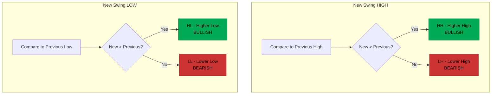

```
SWING CLASSIFICATION DECISION TREE
──────────────────────────────────

For each NEW SWING HIGH:
                    │
        Compare to PREVIOUS swing high
                    │
        ┌───────────┴───────────┐
        │                       │
    New > Previous         New < Previous
        │                       │
        ▼                       ▼
   ╔═════════╗             ╔═════════╗
   ║   HH    ║             ║   LH    ║
   ║ Higher  ║             ║ Lower   ║
   ║  High   ║             ║  High   ║
   ╚═════════╝             ╚═════════╝
    (Bullish)              (Bearish)


For each NEW SWING LOW:
                    │
        Compare to PREVIOUS swing low
                    │
        ┌───────────┴───────────┐
        │                       │
    New > Previous         New < Previous
        │                       │
        ▼                       ▼
   ╔═════════╗             ╔═════════╗
   ║   HL    ║             ║   LL    ║
   ║ Higher  ║             ║ Lower   ║
   ║   Low   ║             ║   Low   ║
   ╚═════════╝             ╚═════════╝
    (Bullish)              (Bearish)
```

## 3.3 Trend Phases

```
THE FOUR TREND PHASES
─────────────────────

┌─────────────┬────────────────────────────────────────────────────┐
│   PHASE     │   DESCRIPTION & TRADING APPROACH                   │
├─────────────┼────────────────────────────────────────────────────┤
│             │                                                    │
│  IMPULSE    │  • Strong directional move                         │
│    ↗️        │  • Breaking through levels                         │
│             │  • Use EXTENSIONS for targets                      │
│             │  • Trade: Continuation in trend direction          │
│             │                                                    │
├─────────────┼────────────────────────────────────────────────────┤
│             │                                                    │
│ CORRECTION  │  • Counter-trend pullback                          │
│    ↘️        │  • Testing Fibonacci levels                        │
│             │  • Use RETRACEMENTS for entries                    │
│             │  • Trade: Wait for signal bar at Fib level         │
│             │                                                    │
├─────────────┼────────────────────────────────────────────────────┤
│             │                                                    │
│CONTINUATION │  • Trend resumes after pullback                    │
│    ↗️        │  • New impulse wave begins                         │
│             │  • Use PROJECTIONS for targets                     │
│             │  • Trade: Re-entry with trend                      │
│             │                                                    │
├─────────────┼────────────────────────────────────────────────────┤
│             │                                                    │
│ EXHAUSTION  │  • Trend losing momentum                           │
│    ⚠️        │  • Multiple TF confluence reached                  │
│             │  • Watch for REVERSAL signals                      │
│             │  • Trade: Prepare counter-trend setup              │
│             │                                                    │
└─────────────┴────────────────────────────────────────────────────┘
```

---

# 4. Fibonacci Tools

## 4.1 The Four Core Tools

The Fibonacci sequence (0, 1, 1, 2, 3, 5, 8, 13, 21, 34, 55, 89, 144...) generates mathematical ratios that appear throughout financial markets.

```
KEY FIBONACCI RATIOS
────────────────────

RETRACEMENT RATIOS (< 100%):
├── 38.2%  │ 89 ÷ 233 = 0.382  │ Shallow pullback
├── 50.0%  │ Not a Fib ratio   │ Standard pullback
├── 61.8%  │ 89 ÷ 144 = 0.618  │ Golden Ratio - deep pullback
└── 78.6%  │ √0.618 = 0.786    │ Very deep pullback

EXTENSION RATIOS (> 100%):
├── 127.2% │ √1.618 = 1.272    │ First extension target
├── 161.8% │ 144 ÷ 89 = 1.618  │ Golden Ratio extension
└── 261.8% │ 233 ÷ 89 = 2.618  │ Maximum extension


THE FOUR FIBONACCI TOOLS
────────────────────────

┌─────────────────────────────────────────────────────────────────────────┐
│                         FIBONACCI TOOLS OVERVIEW                         │
├───────────────┬─────────────────────────────────────────────────────────┤
│               │                                                         │
│  RETRACEMENT  │  Measures pullback within a swing                       │
│  (B, C)       │  Ratios: 38.2%, 50%, 61.8%, 78.6%                       │
│               │  Use: ENTRY zones during corrections                    │
│               │  Formula: Level = C - (Range × Ratio) [for buy]         │
│               │                                                         │
├───────────────┼─────────────────────────────────────────────────────────┤
│               │                                                         │
│  EXTENSION    │  Projects targets beyond the swing                      │
│  (B, C)       │  Ratios: 127.2%, 161.8%, 200%, 261.8%                   │
│               │  Use: TARGET zones & reversal zones                     │
│               │  Formula: Level = C - (Range × Ratio) [for buy]         │
│               │                                                         │
├───────────────┼─────────────────────────────────────────────────────────┤
│               │                                                         │
│  PROJECTION   │  Projects A-B swing from point C                        │
│  (A, B, C)    │  Ratios: 61.8%, 78.6%, 100%, 127.2%, 161.8%             │
│               │  Use: Pattern completion targets (AB=CD)                │
│               │  Formula: Level = C - (|A-B| × Ratio) [for buy]         │
│               │                                                         │
├───────────────┼─────────────────────────────────────────────────────────┤
│               │                                                         │
│  EXPANSION    │  Expands the B-C range from C                           │
│  (B, C)       │  Ratios: 38.2%, 50%, 61.8%, 100%, 161.8%                │
│               │  Use: Aggressive targets from current pivot             │
│               │  Formula: Level = C - (Range × Ratio) [for buy]         │
│               │                                                         │
└───────────────┴─────────────────────────────────────────────────────────┘
```

## 4.2 When to Use Each Tool

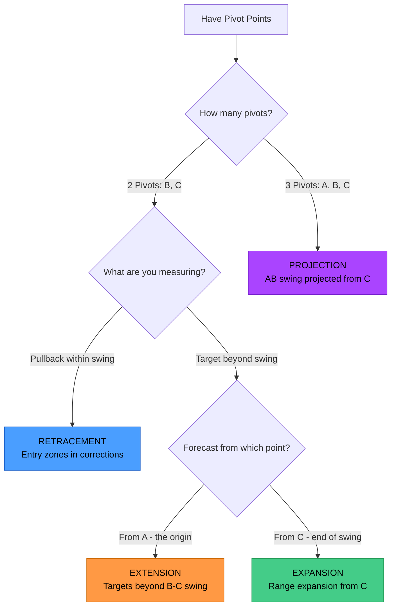

```
FIBONACCI TOOL SELECTION FLOWCHART
──────────────────────────────────

                    START: Have Pivot Points
                              │
                              ▼
                    How many pivot points?
                              │
              ┌───────────────┴───────────────┐
              │                               │
         2 PIVOTS (B, C)               3 PIVOTS (A, B, C)
              │                               │
              ▼                               ▼
     What are you measuring?           ╔═══════════════╗
              │                        ║  PROJECTION   ║
    ┌─────────┴─────────┐              ║ (AB projected ║
    │                   │              ║   from C)     ║
    ▼                   ▼              ╚═══════════════╝
 Pullback         Target beyond
 within swing       the swing
    │                   │
    ▼                   ▼
╔════════════╗   Forecast from?
║RETRACEMENT ║         │
║ (entries)  ║    ┌────┴────┐
╚════════════╝    │         │
              From A      From B
            (origin)   (end of swing)
                │         │
                ▼         ▼
          ╔═══════════╗ ╔═══════════╗
          ║ EXTENSION ║ ║ EXPANSION ║
          ╚═══════════╝ ╚═══════════╝
```

### 4.2.2 Tool Selection by Market Phase

Different market phases call for different Fibonacci tools. Match the tool to what the market is doing:

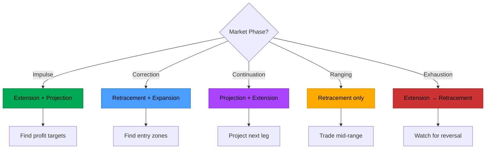

```
TOOL SELECTION BY MARKET PHASE
──────────────────────────────

┌──────────────┬───────────────┬────────────────┬─────────────────────────────────┐
│ Market Phase │ Primary Tool  │ Secondary Tool │ Rationale                       │
├──────────────┼───────────────┼────────────────┼─────────────────────────────────┤
│ IMPULSE      │ Extension     │ Projection     │ Trend strong, find targets      │
│ CORRECTION   │ Retracement   │ Expansion      │ Look for pullback entry zones   │
│ CONTINUATION │ Projection    │ Extension      │ ABC pattern, measure next leg   │
│ RANGING      │ Retracement   │ (none)         │ Trade 50-61.8% of range only    │
│ EXHAUSTION   │ Extension     │ Retracement    │ 161.8%+ signals reversal zone   │
└──────────────┴───────────────┴────────────────┴─────────────────────────────────┘
```

### 4.2.3 Tool Selection by Purpose

Each tool has a primary purpose. Choose based on what you need:

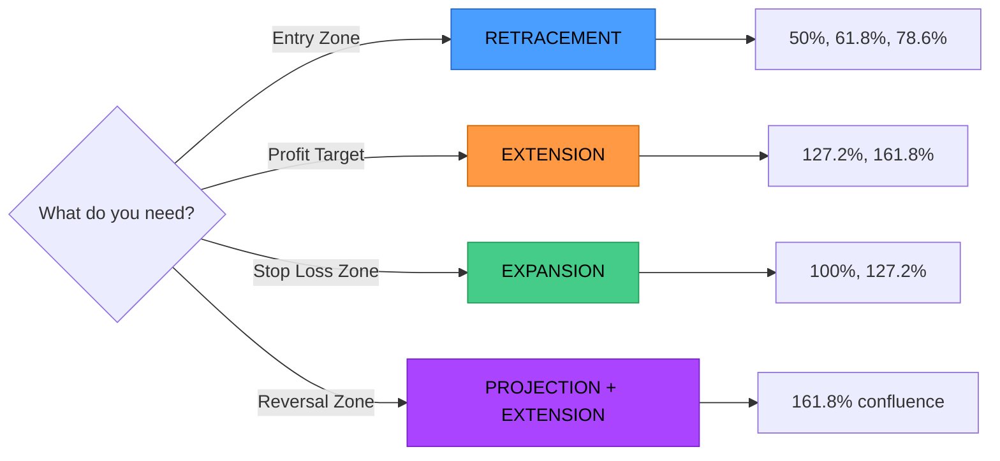

```
TOOL SELECTION BY PURPOSE
─────────────────────────

┌─────────────────┬──────────────────┬───────────────────────────────┬──────────────────────────────┐
│ Purpose         │ Primary Tool     │ Key Levels                    │ Notes                        │
├─────────────────┼──────────────────┼───────────────────────────────┼──────────────────────────────┤
│ ENTRY ZONE      │ Retracement      │ 38.2%, 50%, 61.8%, 78.6%      │ Wait for signal bar          │
│ PROFIT TARGET   │ Extension        │ 127.2%, 161.8%, 200%, 261.8%  │ Scale out at multiple        │
│ PATTERN TARGET  │ Projection       │ 61.8%, 78.6%, 100%, 127.2%,   │ AB=CD at 100%, extended at   │
│                 │                  │ 161.8%                        │ higher ratios                │
│ STOP LOSS       │ Expansion        │ 38.2%, 50%, 61.8%, 100%       │ Place stop beyond expansion  │
│ REVERSAL ZONE   │ Projection + Ext │ Where 161.8% levels align     │ Multiple tools = higher prob │
└─────────────────┴──────────────────┴───────────────────────────────┴──────────────────────────────┘


COMPLETE RATIO REFERENCE BY TOOL:
┌─────────────────┬───────────────────────────────────────────────────────────────────────┐
│ Tool            │ All Available Ratios                                                  │
├─────────────────┼───────────────────────────────────────────────────────────────────────┤
│ RETRACEMENT     │ 23.6%, 38.2%, 50%, 61.8%, 78.6%, 100%                                 │
│ EXTENSION       │ 127.2%, 141.4%, 161.8%, 200%, 261.8%                                  │
│ PROJECTION      │ 61.8%, 78.6%, 100% (AB=CD), 127.2%, 161.8%                            │
│ EXPANSION       │ 38.2%, 50%, 61.8%, 100%, 161.8%                                       │
└─────────────────┴───────────────────────────────────────────────────────────────────────┘
```

### 4.2.4 Cross-Tool Relationships

The four Fibonacci tools work together in a complete trade setup:

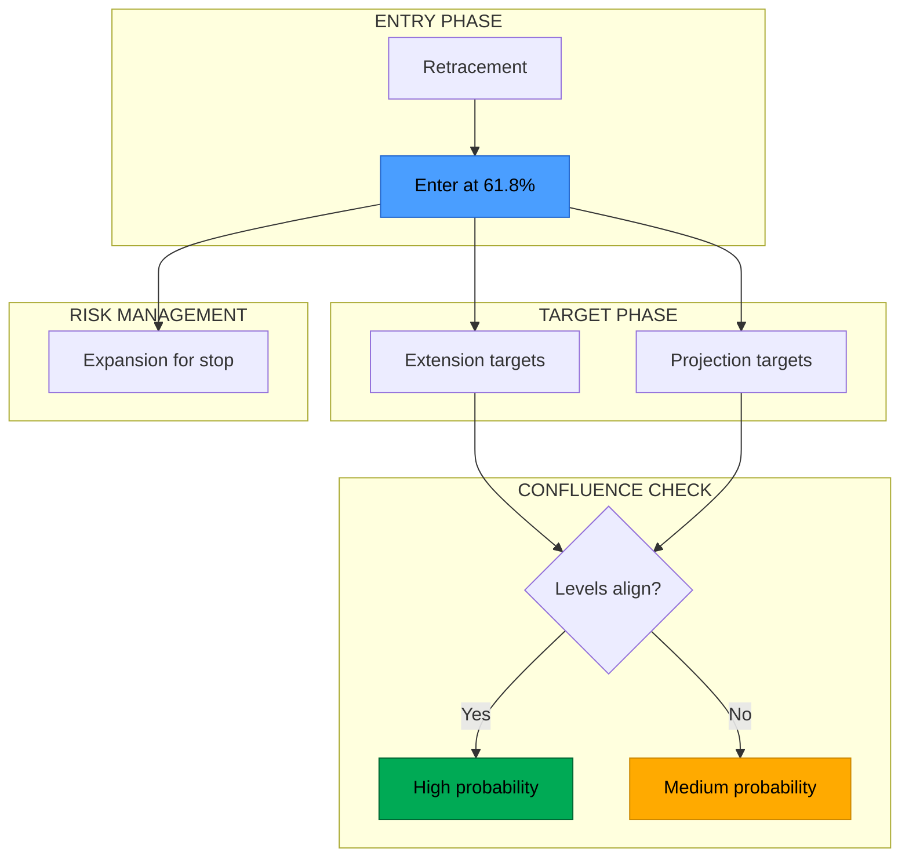

```
CROSS-TOOL RELATIONSHIPS
────────────────────────

RETRACEMENT → EXTENSION FLOW:
1. Price retraces to 61.8% (entry zone)
2. Signal bar forms
3. Extension levels become targets (127.2%, 161.8%)

Example:
  Swing High: 150, Swing Low: 100, Range: 50
  Entry: 61.8% retracement = 150 - (50 × 0.618) = 119.10
  Target 1: 127.2% extension = 100 + (50 × 1.272) = 163.60
  Target 2: 161.8% extension = 100 + (50 × 1.618) = 180.90


PROJECTION → EXTENSION VALIDATION:
1. ABC pattern forms (A high, B low, C higher low)
2. Projection calculates target from C
3. If Extension 161.8% ≈ Projection 100% → Strong confluence

Example:
  A = 120, B = 80, C = 100, Range A-B = 40
  Projection 100% from C = 100 + 40 = 140
  If extension 161.8% also = ~140 → CONFLUENCE ZONE


EXPANSION → STOP PLACEMENT:
1. Entry at Retracement level
2. Stop beyond Expansion 100% of the correction range
3. Ensures stop is beyond "natural" support/resistance

Example:
  Entry at 61.8% retracement (119.10)
  Expansion 100% below = provides stop zone
  Stop placed just beyond expansion level
```

### 4.2.5 Confluence Scenarios

When multiple tools point to the same price, probability increases:

```
CONFLUENCE SCENARIO 1: DOUBLE CONFLUENCE
────────────────────────────────────────

Swing High: 100
Swing Low: 80
Range: 20

Retracement 61.8% = 100 - (20 × 0.618) = 87.64
Extension 127.2% (from previous swing) = 87.80

RESULT: Two independent calculations → same price zone
ACTION: High probability entry zone at 87.64-87.80


CONFLUENCE SCENARIO 2: TRIPLE CONFLUENCE (REVERSAL ZONE)
────────────────────────────────────────────────────────

Daily Extension 161.8%   = 110.00
4H Projection 127.2%     = 110.20
1H Extension 200%        = 109.80

RESULT: Three timeframes, multiple tools → Zone 109.80 - 110.20
ACTION: Watch for reversal signals in this zone
RISK: Counter-trend only (reduced position size)


CONFLUENCE SCENARIO 3: CROSS-TIMEFRAME + CROSS-TOOL
───────────────────────────────────────────────────

Weekly Retracement 50%      = 44,200
Daily Extension 127.2%      = 44,180
4H Projection 100%          = 44,250

RESULT: Three different tools across timeframes
ACTION: Major support zone, high conviction entry
SCORE: 5+ confluence points
```

### 4.2.6 Invalidation Rules

When Fibonacci setups become invalid:

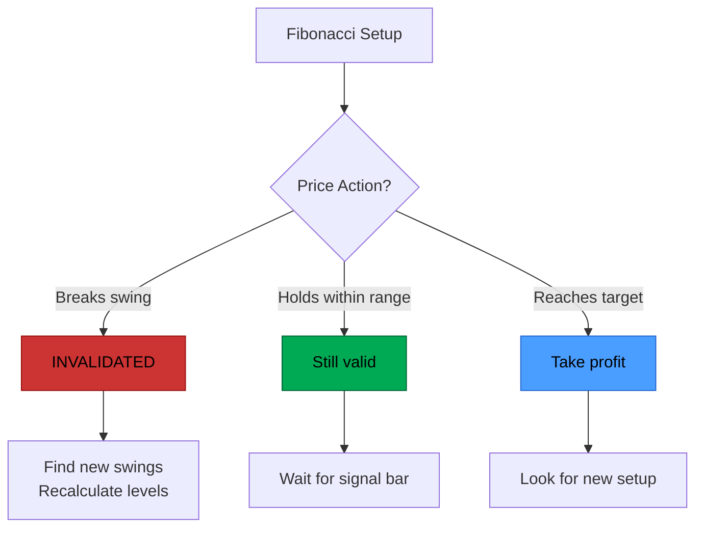

```
INVALIDATION RULES BY TOOL
──────────────────────────

┌─────────────────┬────────────────────────────────────────────────────────────┐
│ Tool            │ Setup Invalidated When                                     │
├─────────────────┼────────────────────────────────────────────────────────────┤
│ RETRACEMENT     │ Price CLOSES beyond 100% (breaks the swing low/high)       │
│                 │ The swing that created the levels is broken                │
├─────────────────┼────────────────────────────────────────────────────────────┤
│ EXTENSION       │ New swing forms in OPPOSITE direction before target hit    │
│                 │ Price structure changes, original swing no longer relevant │
├─────────────────┼────────────────────────────────────────────────────────────┤
│ PROJECTION      │ Point C is VIOLATED (price retraces beyond C)              │
│                 │ The ABC pattern is broken, projection no longer valid      │
├─────────────────┼────────────────────────────────────────────────────────────┤
│ EXPANSION       │ Price reverses BEFORE reaching expansion zone              │
│                 │ New structure forms, making original expansion irrelevant  │
└─────────────────┴────────────────────────────────────────────────────────────┘

KEY PRINCIPLE: If price breaks the swing that created the Fibonacci,
               the levels are NO LONGER VALID. Find new swings.
```

### 4.2.7 Ranging Market Considerations

Fibonacci tools work best in trending markets. Special rules apply to ranging/sideways markets:

```
RANGING MARKET GUIDELINES
─────────────────────────

WHEN MARKET IS RANGING:
┌───────────────────────────────────────────────────────────────────────────────┐
│                                                                               │
│  1. USE RETRACEMENT ONLY                                                      │
│     • Extension and Projection assume trend continuation                      │
│     • In a range, there is no continuation to project                         │
│                                                                               │
│  2. RANGE HIGH/LOW BECOME A-B PIVOTS                                          │
│     • No C point needed                                                       │
│     • Draw Fib from range high to range low                                   │
│                                                                               │
│  3. TRADE THE 50% LEVEL                                                       │
│     • Center of range is equilibrium                                          │
│     • Expect bounces toward range boundaries                                  │
│                                                                               │
│  4. REDUCE POSITION SIZE                                                      │
│     • Lower probability setups in ranges                                      │
│     • Chop can trigger multiple stops                                         │
│                                                                               │
│  5. WATCH FOR BREAKOUT                                                        │
│     • Range will eventually resolve                                           │
│     • Breakout direction = new trend direction                                │
│     • Use tools normally after breakout confirmed                             │
│                                                                               │
└───────────────────────────────────────────────────────────────────────────────┘


WHEN TO AVOID FIBONACCI ENTIRELY:
┌───────────────────────────────────────────────────────────────────────────────┐
│ • Range < 2 × ATR (too tight, noise dominates)                                │
│ • No clear swing structure (choppy, indecisive)                               │
│ • Major news/event pending (volatility will override levels)                  │
│ • Multiple failed signals at same level (market not respecting Fibs)          │
└───────────────────────────────────────────────────────────────────────────────┘
```

### 4.2.8 Practical Scenario Examples

Complete examples showing tool selection in real trading scenarios:

```
SCENARIO 1: TREND PULLBACK ENTRY (Most Common)
──────────────────────────────────────────────

SETUP:
  • Daily trend: UP (HH/HL pattern confirmed)
  • 4H shows: Pullback starting (making lower lows)
  • Price approaching: 61.8% retracement of last daily swing

TOOL SELECTION:
  • RETRACEMENT: Find entry zone (61.8% level)
  • EXTENSION: Set profit targets (127.2%, 161.8%)
  • EXPANSION: Determine stop zone (beyond 78.6% or expansion 100%)

ACTION:
  1. Wait for price to reach 61.8% retracement
  2. Drop to 1H timeframe
  3. Wait for bullish signal bar
  4. Enter long, stop below expansion
  5. Target 1: Extension 127.2%
  6. Target 2: Extension 161.8%

CATEGORY: WITH_TREND (1-2% risk)


SCENARIO 2: ABC PROJECTION TRADE
────────────────────────────────

SETUP:
  • Point A: Swing low at 100 (previous low)
  • Point B: Swing high at 120 (rally)
  • Point C: Higher low at 110 (pullback complete)

TOOL SELECTION:
  • PROJECTION: Calculate targets from C using A-B range
  • EXTENSION: Validate projection targets
  • RETRACEMENT: Already used to find C (61.8% of A-B)

CALCULATIONS:
  A-B Range = 20
  Direction: BUY (C is a low, looking for move UP)

  Projection 100% = 110 + 20 = 130 (AB = CD pattern)
  Projection 127.2% = 110 + (20 × 1.272) = 135.44
  Projection 161.8% = 110 + (20 × 1.618) = 142.36

ACTION:
  1. Enter long at C (110) on signal bar
  2. Stop below C (e.g., 107)
  3. Target 1: Projection 100% (130)
  4. Target 2: Projection 127.2% (135.44)


SCENARIO 3: MULTI-TIMEFRAME CONFLUENCE
──────────────────────────────────────

SETUP:
  • Weekly: Extension 127.2% at 150
  • Daily: Projection 100% at 149.50
  • 4H: Retracement 61.8% at 150.20

ANALYSIS:
  Three independent calculations point to 149.50 - 150.20
  This is a HIGH CONFLUENCE zone (score 5+)

TOOL SELECTION:
  • All tools already calculated across timeframes
  • Zone identified: 149.50 - 150.20
  • Purpose: REVERSAL ZONE (counter-trend potential)

ACTION:
  1. Set alert at 150
  2. When price enters zone, watch for reversal signals
  3. If bearish signal bar forms: SHORT entry
  4. Category: COUNTER_TREND (0.5-1% risk)
  5. Targets: Back toward lower timeframe Fib levels
```

## 4.3 Visual: Retracement Levels

```
RETRACEMENT: Finding Entry Zones During Pullback
────────────────────────────────────────────────

BUY SETUP (Uptrend pulling back):

   Price
     │
     │    C (Swing High) ─────────────────  0%
     │    │
     │    │              ─────────────────  23.6%
     │    │
     │    │              ─────────────────  38.2%  ← Shallow entry
     │    │
     │    │              ─────────────────  50.0%  ← Standard entry
     │    │
     │    │              ─────────────────  61.8%  ← "Golden" entry
     │    │
     │    │              ─────────────────  78.6%  ← Deep entry
     │    │
     │    B (Swing Low)  ─────────────────  100%
     │
     └────────────────────────────────────────────▶ Time

     Calculation: Level = C - ((C - B) × Ratio)

     Example: B = 100, C = 150, Range = 50
     ├── 38.2% = 150 - (50 × 0.382) = 130.9
     ├── 50.0% = 150 - (50 × 0.500) = 125.0
     ├── 61.8% = 150 - (50 × 0.618) = 119.1
     └── 78.6% = 150 - (50 × 0.786) = 110.7


SELL SETUP (Downtrend rallying):

   Price
     │
     │    B (Swing High) ─────────────────  100%
     │    │
     │    │              ─────────────────  78.6%  ← Deep entry
     │    │
     │    │              ─────────────────  61.8%  ← "Golden" entry
     │    │
     │    │              ─────────────────  50.0%  ← Standard entry
     │    │
     │    │              ─────────────────  38.2%  ← Shallow entry
     │    │
     │    │              ─────────────────  23.6%
     │    │
     │    C (Swing Low)  ─────────────────  0%
     │
     └────────────────────────────────────────────▶ Time

     Calculation: Level = C + ((B - C) × Ratio)
```

## 4.4 Visual: Extension Levels

```
EXTENSION: Finding Target Zones Beyond the Swing
─────────────────────────────────────────────────

BUY SETUP (Targets for long position):

   Price
     │
     │                   ─────────────────  261.8%  ← Extended target
     │
     │                   ─────────────────  200.0%
     │
     │                   ─────────────────  161.8%  ← Common target
     │
     │                   ─────────────────  127.2%  ← First target
     │
     │    C (High)       ─────────────────  100%
     │    │
     │    │
     │    │
     │    B (Low)        ─────────────────  0%
     │
     └────────────────────────────────────────────▶ Time

     Targets are ABOVE the swing for longs


SELL SETUP (Targets for short position):

   Price
     │
     │    B (High)       ─────────────────  0%
     │    │
     │    │
     │    │
     │    C (Low)        ─────────────────  100%
     │
     │                   ─────────────────  127.2%  ← First target
     │
     │                   ─────────────────  161.8%  ← Common target
     │
     │                   ─────────────────  200.0%
     │
     │                   ─────────────────  261.8%  ← Extended target
     │
     └────────────────────────────────────────────▶ Time

     Targets are BELOW the swing for shorts
```

## 4.5 Visual: Projection Levels (ABC Pattern)

```
PROJECTION: Using A-B Swing Projected from C
────────────────────────────────────────────

BUY SETUP (ABC Bullish Pattern):

   Price
     │
     │      A (Previous High)
     │      ╱╲
     │     ╱  ╲
     │    ╱    ╲         C (Current High)
     │   ╱      ╲        ╱
     │  ╱        ╲      ╱
     │ ╱          ╲    ╱
     │╱            ╲  ╱
     │              ╲╱
     │              B (Low)
     │              │
     │              │         ─────────────  61.8%  projection
     │              │
     │              │         ─────────────  100.0% (AB = CD)
     │              │
     │              │         ─────────────  127.2% projection
     │
     └────────────────────────────────────────────▶ Time

     A-B Range is PROJECTED from C in the same direction

     Calculation: Level = C - (|A - B| × Ratio)

     Example: A = 120, B = 80, C = 100
     A-B Range = 40
     ├── 61.8% = 100 - (40 × 0.618) = 75.28
     ├── 100%  = 100 - (40 × 1.000) = 60.00  ← AB = CD
     └── 161.8%= 100 - (40 × 1.618) = 35.28


SELL SETUP (ABC Bearish Pattern):

   Price
     │
     │              A (Previous Low)
     │              ╱
     │             ╱
     │            ╱    B (High)
     │           ╱    ╱╲
     │          ╱    ╱  ╲
     │         ╱    ╱    ╲
     │        ╱    ╱      ╲
     │       ╱    ╱        ╲
     │      ╱╲  ╱          ╲
     │        ╲╱            C (Current Low - Higher than A)
     │                      │
     │                      │   ─────────────  61.8%  projection
     │                      │
     │                      │   ─────────────  100.0% (AB = CD)
     │                      │
     │                      │   ─────────────  127.2% projection
     │
     └────────────────────────────────────────────▶ Time

     A-B Range is PROJECTED from C UPWARD for SELL targets

     Calculation: Level = C + (|A - B| × Ratio)

     Example: A = 80, B = 120, C = 90
     A-B Range = 40
     ├── 61.8%  = 90 + (40 × 0.618) = 114.72
     ├── 100%   = 90 + (40 × 1.000) = 130.00  ← AB = CD
     └── 127.2% = 90 + (40 × 1.272) = 140.88

     Note: In SELL setup, C is a LOW (higher low than A)
           Direction is SELL because we expect price to rally to targets
           These become resistance zones for SHORT entries
```

## 4.6 Visual: Expansion Levels

Expansion projects the B-C range beyond C to find aggressive targets:

```
EXPANSION: Projecting Range Beyond Current Pivot
────────────────────────────────────────────────

BUY SETUP (Finding Support Below the Low):

   Price
     │
     │    B (Swing High)    ─────────────────  0%
     │    │
     │    │
     │    │
     │    │
     │    C (Swing Low)     ─────────────────  100% (range end)
     │    │
     │    │                 ─────────────────  138.2%
     │    │
     │    │                 ─────────────────  161.8%  ← Common expansion
     │    │
     │    │                 ─────────────────  200.0%  ← Full expansion
     │
     └────────────────────────────────────────────▶ Time

     Expansion levels are BELOW C for BUY setups
     Use for: Stop loss placement, extended support zones

     Calculation: Level = C - ((B - C) × (Ratio - 1))
     OR simply:   Level = C - (Range × Expansion%)

     Example: B = 120, C = 100, Range = 20
     ├── 138.2% = 100 - (20 × 0.382) = 92.36
     ├── 161.8% = 100 - (20 × 0.618) = 87.64
     └── 200.0% = 100 - (20 × 1.000) = 80.00


SELL SETUP (Finding Resistance Above the High):

   Price
     │
     │                      ─────────────────  200.0%  ← Full expansion
     │
     │                      ─────────────────  161.8%  ← Common expansion
     │
     │                      ─────────────────  138.2%
     │
     │    C (Swing High)    ─────────────────  100% (range end)
     │    │
     │    │
     │    │
     │    │
     │    B (Swing Low)     ─────────────────  0%
     │
     └────────────────────────────────────────────▶ Time

     Expansion levels are ABOVE C for SELL setups
     Use for: Stop loss placement, extended resistance zones

     Calculation: Level = C + ((C - B) × (Ratio - 1))
     OR simply:   Level = C + (Range × Expansion%)

     Example: B = 100, C = 120, Range = 20
     ├── 138.2% = 120 + (20 × 0.382) = 127.64
     ├── 161.8% = 120 + (20 × 0.618) = 132.36
     └── 200.0% = 120 + (20 × 1.000) = 140.00


EXPANSION USE CASES:
┌─────────────────────────────────────────────────────────────────────────┐
│                                                                         │
│  1. STOP LOSS PLACEMENT                                                 │
│     • Place stop beyond Expansion 161.8%                                │
│     • Ensures stop is beyond "natural" support/resistance               │
│                                                                         │
│  2. EXTENDED TARGETS                                                    │
│     • When price breaks through Extension levels                        │
│     • Expansion provides next potential target zones                    │
│                                                                         │
│  3. REVERSAL ZONES                                                      │
│     • Expansion 200% often acts as major reversal point                 │
│     • Look for signal bars at these extended levels                     │
│                                                                         │
└─────────────────────────────────────────────────────────────────────────┘
```

## 4.7 All Tools Serve Multiple Purposes

```
┌─────────────────────────────────────────────────────────────────────────┐
│         FIBONACCI TOOLS CAN ALL SHOW ENTRY AND EXIT POINTS              │
├─────────────────────────────────────────────────────────────────────────┤
│                                                                          │
│  RETRACEMENT:                                                           │
│  • Entry zones (where pullback may hold)                                │
│  • Stop loss zones (if level breaks, thesis wrong)                      │
│                                                                          │
│  EXTENSION:                                                             │
│  • Target zones (where move may complete)                               │
│  • Reversal entry zones (counter-trend at major extension)              │
│                                                                          │
│  PROJECTION:                                                            │
│  • Pattern completion targets (AB=CD)                                   │
│  • Entry zones where patterns complete                                  │
│                                                                          │
│  EXPANSION:                                                             │
│  • Aggressive targets (range expansion from C)                          │
│  • Entry zones on range expansion trades                                │
│                                                                          │
│  ═══════════════════════════════════════════════════════════════════    │
│                                                                          │
│  USE ALL TOOLS TOGETHER TO FIND CONFLUENCE!                             │
│                                                                          │
│  Example: Higher TF EXPANSION = Lower TF EXTENSION at same price        │
│           → Strong confluence zone                                      │
│                                                                          │
└─────────────────────────────────────────────────────────────────────────┘
```

---

# 5. Signal Bar Confirmation

## 5.1 What is a Signal Bar?

A signal bar is a **confirmation candle** that indicates price is likely to reverse from a Fibonacci level. It serves TWO purposes:

1. **Confirms the level is being respected** (price reaction)
2. **Marks the beginning of a new pivot point** (new swing starting)

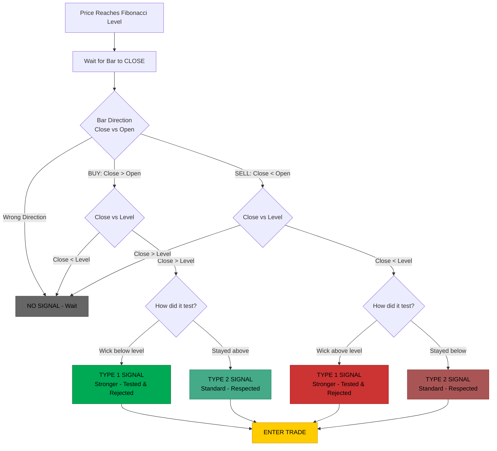

```
SIGNAL BAR = PIVOT POINT FORMATION
──────────────────────────────────

BUY SIGNAL (Pivot Low Forming):

   Price
     │
     │    ╲
     │     ╲     Bars moving    ┌───┐
     │      ╲    DOWN toward    │   │ ← Signal bar = start of pivot low
     │       ╲   the level      │   │   (bars before were declining)
     │────────╲─────────────────└───┘── Fibonacci Level
     │

   The signal bar is the FIRST bar of the new upswing


SELL SIGNAL (Pivot High Forming):

   Price
     │────────╱─────────────────┌───┐── Fibonacci Level
     │       ╱   the level      │   │   (bars before were rising)
     │      ╱    UP toward      │   │ ← Signal bar = start of pivot high
     │     ╱     Bars moving    └───┘
     │    ╱
     │

   The signal bar is the FIRST bar of the new downswing
```

## 5.2 Signal Bar Requirements

```
┌─────────────────────────────────────────────────────────────────────────┐
│                    SIGNAL BAR REQUIREMENTS                               │
├─────────────────────────────────────────────────────────────────────────┤
│                                                                          │
│  FOR A BUY SIGNAL (at support level):                                   │
│  ─────────────────────────────────────                                  │
│  ✓ Close > Open (bullish/green candle)                                  │
│  ✓ Close > Fibonacci Level (price accepted above support)               │
│  ✓ Previous bars were declining (forming a potential pivot low)         │
│  ✓ Ideal: Wick tested below level (Type 1 - stronger)                   │
│                                                                          │
│  FOR A SELL SIGNAL (at resistance level):                               │
│  ─────────────────────────────────────                                  │
│  ✓ Close < Open (bearish/red candle)                                    │
│  ✓ Close < Fibonacci Level (price rejected below resistance)            │
│  ✓ Previous bars were rising (forming a potential pivot high)           │
│  ✓ Ideal: Wick tested above level (Type 1 - stronger)                   │
│                                                                          │
│  IF CRITERIA NOT MET: No trade - wait for next bar or next level        │
│                                                                          │
└─────────────────────────────────────────────────────────────────────────┘
```

## 5.3 Type 1 vs Type 2 Signals

```
TYPE 1 SIGNAL (STRONGER) - Level Tested and Rejected
────────────────────────────────────────────────────

BUY Signal:

     │     ┌───┐
     │     │   │ ← Close (above level)
     │─────│───│──────── 61.8% Level
     │     │   │
     │     │ W │ ← Wick went BELOW level
     │     └───┘
     │

   • Price penetrated THROUGH the level
   • Then REVERSED and closed back above
   • Shows buyers stepped in and rejected lower prices
   • Base strength score: 0.7


TYPE 2 SIGNAL (STANDARD) - Level Respected Without Penetration
──────────────────────────────────────────────────────────────

BUY Signal:

     │     ┌───┐
     │     │   │ ← Close (above level)
     │     │   │
     │     │ W │ ← Wick approached but stayed ABOVE
     │─────└───┴──────── 61.8% Level
     │

   • Price approached the level
   • Respected it without deep penetration
   • Less dramatic but still valid
   • Base strength score: 0.5


═══════════════════════════════════════════════════════════════
SELL SIGNAL EXAMPLES
═══════════════════════════════════════════════════════════════

TYPE 1 SELL SIGNAL (STRONGER) - Level Tested and Rejected
─────────────────────────────────────────────────────────

SELL Signal:

     │
     │     ┌───┐
     │     │ W │ ← Wick went ABOVE level (tested resistance)
     │─────│───│──────── 61.8% Level (resistance)
     │     │   │
     │     │   │ ← Close (below level)
     │     └───┘
     │

   • Price penetrated THROUGH the resistance level
   • Then REVERSED and closed back below
   • Shows sellers stepped in and rejected higher prices
   • Base strength score: 0.7


TYPE 2 SELL SIGNAL (STANDARD) - Level Respected Without Penetration
───────────────────────────────────────────────────────────────────

SELL Signal:

     │
     │─────┌───┬──────── 61.8% Level (resistance)
     │     │ W │ ← Wick approached but stayed BELOW
     │     │   │
     │     │   │ ← Close (below level)
     │     └───┘
     │

   • Price approached the resistance level
   • Respected it without deep penetration (wick did not pierce)
   • Less dramatic rejection but still valid sell signal
   • Base strength score: 0.5


COMPARISON SUMMARY:
┌────────────┬─────────────────────────────────────────────────────────────┐
│ Signal     │ Key Characteristics                                         │
├────────────┼─────────────────────────────────────────────────────────────┤
│ TYPE 1 BUY │ Wick below support, Close above support (rejection)         │
│ TYPE 2 BUY │ Bar stays at/above support, Close above support             │
│ TYPE 1 SELL│ Wick above resistance, Close below resistance (rejection)   │
│ TYPE 2 SELL│ Bar stays at/below resistance, Close below resistance       │
├────────────┼─────────────────────────────────────────────────────────────┤
│ TYPE 1     │ Strength: 0.7 (stronger - level was tested and rejected)    │
│ TYPE 2     │ Strength: 0.5 (standard - level was respected)              │
└────────────┴─────────────────────────────────────────────────────────────┘
```

## 5.4 Signal Bar Decision Flow

```
SIGNAL BAR CONFIRMATION FLOWCHART
─────────────────────────────────

         Price reaches Fibonacci level
                     │
                     ▼
         ┌───────────────────────┐
         │ Wait for bar to CLOSE │
         └───────────┬───────────┘
                     │
                     ▼
         ┌───────────────────────┐
         │ Check bar direction   │
         │ (Close vs Open)       │
         └───────────┬───────────┘
                     │
         ┌───────────┴───────────┐
         │                       │
    CORRECT                   WRONG
   Direction                Direction
         │                       │
         ▼                       ▼
         │                 ╔══════════╗
         │                 ║ NO SIGNAL║
         │                 ║  (Wait)  ║
         │                 ╚══════════╝
         ▼
┌───────────────────────┐
│ Check Close vs Level  │
└───────────┬───────────┘
            │
    ┌───────┴───────┐
    │               │
  BEYOND          NOT
   Level         Beyond
    │               │
    ▼               ▼
    │         ╔══════════╗
    │         ║ NO SIGNAL║
    │         ║  (Wait)  ║
    │         ╚══════════╝
    ▼
┌───────────────────────┐
│ Check rejection type  │
└───────────┬───────────┘
            │
    ┌───────┴───────┐
    │               │
 Tested           Touched
   &               Only
Rejected             │
    │               │
    ▼               ▼
╔═══════════╗  ╔═══════════╗
║  TYPE 1   ║  ║  TYPE 2   ║
║ (Stronger)║  ║(Standard) ║
╚═════╤═════╝  ╚═════╤═════╝
      │              │
      └──────┬───────┘
             │
             ▼
    ╔═══════════════════╗
    ║   ENTER TRADE     ║
    ║ Stop beyond signal║
    ╚═══════════════════╝
```

---

# 6. Multi-Timeframe Analysis

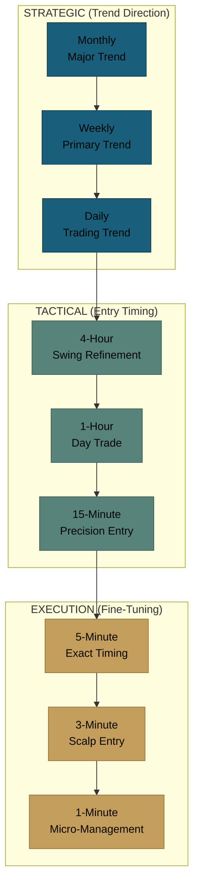

## 6.1 The Timeframe Hierarchy

```
TIMEFRAME CATEGORIES
────────────────────

┌─────────────────────────────────────────────────────────────────────────┐
│  STRATEGIC TIMEFRAMES (Trend Direction)                                  │
│  ─────────────────────────────────────                                  │
│  • Monthly (1M)  → Major trend, macro levels                            │
│  • Weekly (1W)   → Primary trend, key structure                         │
│  • Daily (1D)    → Trading trend, entry zones                           │
│                                                                          │
├─────────────────────────────────────────────────────────────────────────┤
│  TACTICAL TIMEFRAMES (Entry Timing)                                      │
│  ──────────────────────────────────                                     │
│  • 4-Hour (4H)   → Swing entry refinement                               │
│  • 1-Hour (1H)   → Day trade timing                                     │
│  • 15-Minute     → Precision entry                                      │
│                                                                          │
├─────────────────────────────────────────────────────────────────────────┤
│  EXECUTION TIMEFRAMES (Fine-Tuning)                                      │
│  ──────────────────────────────────                                     │
│  • 5-Minute      → Exact entry timing                                   │
│  • 3-Minute      → Scalp entries                                        │
│  • 1-Minute      → Micro-management                                     │
│                                                                          │
└─────────────────────────────────────────────────────────────────────────┘
```

## 6.2 How Timeframes Interact

```
NESTED TRENDS VISUALIZATION
───────────────────────────

MONTHLY:  ════════════════════════════════════════▶  UP (major trend)

WEEKLY:   ════════▶ UP ◀════ DN ════════▶ UP        (corrections)

DAILY:    ═▶↙═▶↙═▶   ═▶↙═▶↙═▶↙   ═▶↙═▶↙═▶          (swings)

4H:       Multiple smaller swings within each daily swing


Each timeframe contains:
├── Its own trend direction
├── Its own pivot points
├── Its own Fibonacci levels
└── Its own signal bars

Lower TF trends exist WITHIN higher TF trends
```

## 6.3 Trading Style by Timeframe

```
TRADING STYLE SPECTRUM
──────────────────────

┌────────────┬─────────────┬─────────────┬────────────┬────────────────┐
│   STYLE    │ PRIMARY TF  │  ENTRY TF   │ HOLD TIME  │ TYPICAL STOP   │
├────────────┼─────────────┼─────────────┼────────────┼────────────────┤
│ Position   │ Weekly/     │ Daily       │ Weeks to   │ 300-1000+ pts  │
│            │ Monthly     │             │ Months     │                │
├────────────┼─────────────┼─────────────┼────────────┼────────────────┤
│ Swing      │ Daily       │ 4H          │ Days to    │ 100-300 pts    │
│            │             │             │ Weeks      │                │
├────────────┼─────────────┼─────────────┼────────────┼────────────────┤
│ Day Trade  │ 4H          │ 1H/15min    │ Hours      │ 30-100 pts     │
│            │             │             │            │                │
├────────────┼─────────────┼─────────────┼────────────┼────────────────┤
│ Scalp/     │ 1H/15min    │ 5m/1m       │ Minutes    │ 10-30 pts      │
│ Sniper     │             │             │            │                │
└────────────┴─────────────┴─────────────┴────────────┴────────────────┘

KEY: Analysis TF sets the levels, Entry TF sets the stop distance
     → Lower entry TF = smaller stop = more attempts possible
```

---

# 7. Trade Categories & Position Sizing

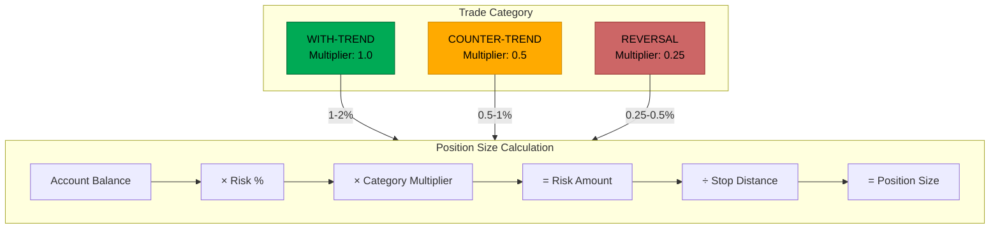

## 7.1 Position Sizing Formula

```
THE CORE FORMULA
────────────────

Position Size = Risk Amount ÷ Stop Distance

Where:
  Risk Amount  = Account Balance × Risk % × Category Multiplier
  Stop Distance = |Entry Price - Stop Loss Price|
```

## 7.2 Risk by Trade Category

```
┌─────────────────────────────────────────────────────────────────────────┐
│                    POSITION SIZING BY CATEGORY                           │
├─────────────────────────────────────────────────────────────────────────┤
│                                                                          │
│  CATEGORY           MULTIPLIER    RISK %      POSITION SIZE             │
│  ────────           ──────────    ──────      ─────────────             │
│                                                                          │
│  WITH_TREND         1.0 (100%)    1-2%        Standard (full)           │
│  ├── Highest probability                                                │
│  └── Trading with higher TF trend                                       │
│                                                                          │
│  COUNTER_TREND      0.5 (50%)     0.5-1%      Reduced (half)            │
│  ├── Lower probability but at major levels                              │
│  └── Trend intact, trading a bounce                                     │
│                                                                          │
│  REVERSAL_ATTEMPT   0.25 (25%)    0.25-0.5%   Small (quarter)           │
│  ├── Speculative - trend may be changing                                │
│  └── Cascade effect in progress                                         │
│                                                                          │
└─────────────────────────────────────────────────────────────────────────┘
```

## 7.3 Position Sizing Example

```
EXAMPLE CALCULATION
───────────────────

Account Balance:    $50,000
Base Risk:          2%
Trade Category:     WITH_TREND (multiplier: 1.0)

STEP 1: Calculate Risk Amount
  Risk Amount = $50,000 × 2% × 1.0 = $1,000

STEP 2: Determine Stop Distance
  Entry Price:  $100.00
  Stop Loss:    $98.00
  Stop Distance = $100.00 - $98.00 = $2.00

STEP 3: Calculate Position Size
  Position Size = $1,000 / $2.00 = 500 shares

STEP 4: Verify R:R (Reward-to-Risk Ratio)
  Risk per share = $2.00 (entry $100 - stop $98)

  Target 1: $104.00 → Reward = $4.00 → R:R = 2:1 (gain $2 for every $1 risked) ✓
  Target 2: $106.00 → Reward = $6.00 → R:R = 3:1 (gain $3 for every $1 risked) ✓

  Formula: R:R = Reward ÷ Risk = (Target - Entry) ÷ (Entry - Stop)
```

## 7.4 Multi-Attempt Entry Strategy

```
MULTI-ATTEMPT STRATEGY
──────────────────────

Instead of one large entry, use smaller position sizes for multiple attempts
at the same level. This is especially useful when dropping to lower TFs.

SCENARIO: $1,000 total risk budget

OPTION A: Single Entry (Higher TF)
┌─────────────────────────────────┐
│ Entry: Signal bar on Daily      │
│ Stop: 180 points                │
│ Risk: $1,000 (full budget)      │
│ Attempts: 1                     │
│                                 │
│ If stopped: Done, full loss     │
└─────────────────────────────────┘

OPTION B: 4 Attempts × $250 (Lower TF)
┌─────────────────────────────────┐
│ Entry: Signal bar on 15min      │
│ Stop: 45 points                 │
│ Risk: $250 per attempt          │
│ Attempts: 4                     │
│                                 │
│ If stopped: Try again           │
│ Max attempts to catch the move  │
└─────────────────────────────────┘

OPTION C: 2 Attempts × $500 (Balanced)
┌─────────────────────────────────┐
│ Entry: Signal bar on 1H         │
│ Stop: 90 points                 │
│ Risk: $500 per attempt          │
│ Attempts: 2                     │
│                                 │
│ Good balance of risk/reward     │
│ Larger position if successful   │
└─────────────────────────────────┘

FLEXIBLE: Choose based on conviction and monitoring ability
```

---

# 8. The Complete Workflow

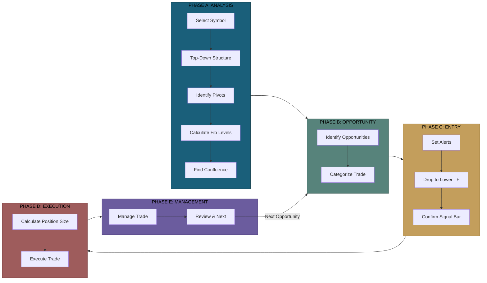

## 8.1 Master Workflow Overview

```
┌─────────────────────────────────────────────────────────────────────────┐
│                    COMPLETE TRADING WORKFLOW                             │
├─────────────────────────────────────────────────────────────────────────┤
│                                                                          │
│  PHASE A: ANALYSIS (Steps 1-5)                                          │
│  ─────────────────────────────                                          │
│  1. Select symbol                                                       │
│  2. Top-down market structure (Monthly → 1m)                            │
│  3. Identify pivots (A, B, C) for each timeframe                        │
│  4. Calculate Fibonacci levels (all four tools)                         │
│  5. Find confluence zones across timeframes                             │
│                                                                          │
│  PHASE B: OPPORTUNITY (Steps 6-7)                                       │
│  ────────────────────────────────                                       │
│  6. Identify trade opportunities (WITH/COUNTER/REVERSAL)                │
│  7. Select the opportunity and assign category                          │
│                                                                          │
│  PHASE C: ENTRY (Steps 8-10)                                            │
│  ──────────────────────────                                             │
│  8. Set alerts at key levels                                            │
│  9. Drop to lower TF for precision entry                                │
│  10. Wait for and confirm signal bar                                    │
│                                                                          │
│  PHASE D: EXECUTION (Steps 11-12)                                       │
│  ──────────────────────────────                                         │
│  11. Calculate position size                                            │
│  12. Execute the trade                                                  │
│                                                                          │
│  PHASE E: MANAGEMENT (Steps 13-14)                                      │
│  ──────────────────────────────                                         │
│  13. Manage the trade (breakeven, trail, scale)                         │
│  14. Review and prepare for next opportunity                            │
│                                                                          │
└─────────────────────────────────────────────────────────────────────────┘
```

## 8.2 Detailed Step-by-Step

```
══════════════════════════════════════════════════════════════════════════
PHASE A: ANALYSIS
══════════════════════════════════════════════════════════════════════════

□ STEP 1: SELECT SYMBOL
  • Choose the instrument to analyze
  • Open blank chart
  • Start with MONTHLY timeframe

□ STEP 2: TOP-DOWN MARKET STRUCTURE
  For EACH timeframe (Monthly → Weekly → Daily → 4H → 1H → 15m → 1m):

  ┌─────────────────────────────────────────────────────────┐
  │ • Identify swing highs and lows                         │
  │ • Label: HH, HL, LH, LL                                 │
  │ • Determine trend: UPTREND, DOWNTREND, or RANGING ⚠️     │
  │ • Note trend phase: IMPULSE, CORRECTION, CONTINUATION   │
  │                                                         │
  │ ⚠️ If timeframe is RANGING: Skip trading that TF        │
  │    Fibonacci works best in TRENDING markets             │
  └─────────────────────────────────────────────────────────┘

□ STEP 3: IDENTIFY PIVOTS FOR EACH TIMEFRAME
  • A = Oldest alternating pivot
  • B = Middle alternating pivot
  • C = Most recent pivot
  • These are your Fibonacci anchor points

□ STEP 4: CALCULATE FIBONACCI LEVELS (ALL FOUR TOOLS)
  For each timeframe with clear pivots:

  ┌─────────────────────────────────────────────────────────┐
  │ • RETRACEMENT: B→C (entry zones in corrections)         │
  │ • EXTENSION: B→C (target zones, reversal zones)         │
  │ • PROJECTION: A,B,C (pattern completion targets)        │
  │ • EXPANSION: B→C (range expansion targets)              │
  │                                                         │
  │ Each level can be: ENTRY / TARGET / STOP                │
  └─────────────────────────────────────────────────────────┘

□ STEP 5: FIND CONFLUENCE ZONES
  • Compare levels ACROSS timeframes
  • Mark clusters where levels align (within tolerance)

  ┌─────────────────────────────────────────────────────────┐
  │ CROSS-TOOL CONFLUENCE (Powerful):                       │
  │ • Higher TF EXPANSION = Lower TF EXTENSION              │
  │ • Weekly RETRACEMENT = Daily PROJECTION                 │
  │ • Multiple tools pointing to same price = strong level  │
  │                                                         │
  │ ADDITIONAL FACTORS:                                     │
  │ • Psychological levels (round numbers)                  │
  │ • Previous structure (S/R)                              │
  │ • RSI (momentum), MACD (trend)                          │
  │ • Volume (buyer/seller presence)                        │
  │                                                         │
  │ Score each zone: 1-2 (standard), 5+ (significant)       │
  └─────────────────────────────────────────────────────────┘

══════════════════════════════════════════════════════════════════════════
PHASE B: OPPORTUNITY IDENTIFICATION
══════════════════════════════════════════════════════════════════════════

□ STEP 6: IDENTIFY TRADE OPPORTUNITIES
  Compare higher TF vs lower TF direction:

  ┌─────────────────────────────────────────────────────────┐
  │ LONG OPPORTUNITIES:                                     │
  │ • Higher TF UP + Lower TF DOWN = WITH_TREND LONG        │
  │ • Higher TF DN at major support = COUNTER_TREND LONG    │
  │ • Lower TFs turning UP first = REVERSAL LONG            │
  │                                                         │
  │ SHORT OPPORTUNITIES:                                    │
  │ • Higher TF DN + Lower TF UP = WITH_TREND SHORT         │
  │ • Higher TF UP at major resist = COUNTER_TREND SHORT    │
  │ • Lower TFs turning DN first = REVERSAL SHORT           │
  └─────────────────────────────────────────────────────────┘

□ STEP 7: SELECT AND CATEGORIZE
  • Choose based on confluence score and probability
  • Assign trade category and risk multiplier:
    ○ WITH_TREND: 1-2% risk
    ○ COUNTER_TREND: 0.5-1% risk
    ○ REVERSAL_ATTEMPT: 0.25-0.5% risk

══════════════════════════════════════════════════════════════════════════
PHASE C: ENTRY PREPARATION
══════════════════════════════════════════════════════════════════════════

□ STEP 8: SET ALERTS AT KEY LEVELS
  • Alert when price approaches confluence zone
  • Prepare mentally for entry

□ STEP 9: DROP TO LOWER TIMEFRAME
  When price reaches the zone:
  • Switch to lower TF (1H, 15m) for precision entry
  • Decide on attempt allocation:
    ○ More attempts, smaller size (4 × 25%)
    ○ Fewer attempts, larger size (2 × 50%)

□ STEP 10: CONFIRM SIGNAL BAR
  Wait for bar to CLOSE, then verify:

  ┌─────────────────────────────────────────────────────────┐
  │ FOR LONG:                      FOR SHORT:               │
  │ • Close > Open (bullish)       • Close < Open (bearish) │
  │ • Close > Fibonacci level      • Close < Fibonacci level│
  │ • Forms pivot low              • Forms pivot high       │
  │ • Type 1 = wick below (best)   • Type 1 = wick above    │
  │ • Type 2 = respected (valid)   • Type 2 = respected     │
  │                                                         │
  │ IF NO SIGNAL: Wait for next bar or next level           │
  └─────────────────────────────────────────────────────────┘

══════════════════════════════════════════════════════════════════════════
PHASE D: EXECUTION
══════════════════════════════════════════════════════════════════════════

□ STEP 11: CALCULATE POSITION SIZE
  Position = Risk Amount ÷ Stop Distance

  • Risk Amount = Account × Risk% × Category Multiplier
  • Verify minimum trade size constraints
  • Calculate R:R ratio (target ≥ 2:1)

□ STEP 12: EXECUTE THE TRADE
  • Entry: Signal bar close price
  • Stop: Beyond signal bar structure
  • Target 1: Next Fibonacci level
  • Target 2: Extension level
  • Create journal entry

══════════════════════════════════════════════════════════════════════════
PHASE E: MANAGEMENT
══════════════════════════════════════════════════════════════════════════

□ STEP 13: MANAGE THE TRADE

  AT +1R (risk amount in profit):
  └── Move stop to BREAKEVEN (stop = entry price)
  └── This creates a FREE TRADE:
      • If stopped out → exit at entry price → no loss, no gain
      • If trade continues → still have full profit potential
      • You can no longer lose money on this trade
      • Your RISK BUDGET is now free → look for new opportunities

  ┌─────────────────────────────────────────────────────────────────────────┐
  │ IMPORTANT: UNREALIZED vs REALIZED PROFIT                                │
  ├─────────────────────────────────────────────────────────────────────────┤
  │                                                                         │
  │ Moving stop to profit does NOT increase your available trading capital. │
  │                                                                         │
  │ • Stop in profit = UNREALIZED profit (trade still open)                 │
  │ • Only guarantees minimum outcome IF stopped out                        │
  │ • Profit is not in your account until position closes                   │
  │ • Stops can be gapped through (not 100% guaranteed)                     │
  │                                                                         │
  │ TO ACTUALLY INCREASE ACCOUNT SIZE:                                      │
  │ • Scale out (close partial position) → realizes that portion's profit   │
  │ • Close entire position → realizes full profit                          │
  │ • Only REALIZED profit increases your buying power for larger trades    │
  │                                                                         │
  │ See Section 9.3 for detailed scaling out examples.                      │
  │                                                                         │
  └─────────────────────────────────────────────────────────────────────────┘

  ON PULLBACKS IN YOUR FAVOR:
  └── Consider adding (compounding)
  └── Move existing stops to new structure

  AT TARGETS:
  └── Scale out (50% at T1, 25% at T2, trail rest)

  TRAILING STOP OPTIONS:
  ├── ATR-based (maintain X points from price)
  ├── Structure-based (trail to each pullback)
  └── Adaptive (tighten as approaching reversal zone)

  IF STOPPED:
  ├── Multi-attempt: Try again within budget
  └── Out of budget: Document and move on

□ STEP 14: REVIEW AND PREPARE NEXT
  • Update journal with outcome
  • Calculate final P&L and R-multiple
  • Note what worked / what to improve
  • Identify next opportunity (often opposite direction)
  • Return to Step 6
```

---

# 9. Trade Management

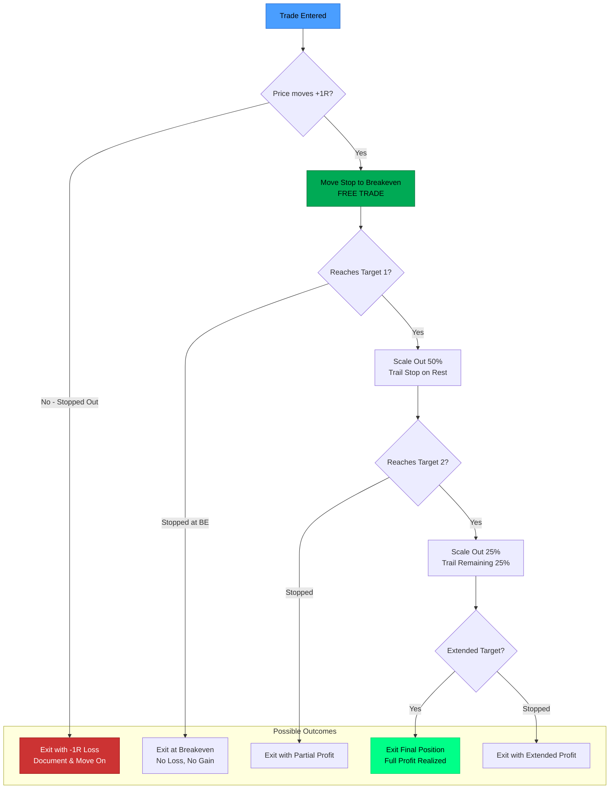

## 9.1 Core Principle: Free Trade ASAP

```
TRADE MANAGEMENT HIERARCHY
──────────────────────────

Priority 1: PROTECT CAPITAL
├── Move to breakeven as soon as possible (+1R)
├── Never move stop further from entry
└── Option: Early exit if thesis clearly wrong

Priority 2: LET WINNERS RUN
├── Scale out at targets (50% → 25% → 25%)
├── Trail stop on remaining position
└── Use multiple trailing methods

Priority 3: CUT LOSERS SHORT
├── If stop hit, exit immediately
├── No hoping, no "just a bit more room"
└── First loss = best loss

Priority 4: TRACK EVERYTHING
├── Update journal with exit
├── Calculate R-multiple
└── Review for learning
```

## 9.2 Trailing Stop Options

```
TRAILING STOP STRATEGIES
────────────────────────

METHOD 1: ATR-BASED
┌───────────────────────────────────────────────────┐
│ • Maintain fixed distance (e.g., 1.5× ATR)        │
│ • Adjusts automatically to volatility             │
│ • Useful for strong trending markets              │
│                                                   │
│ Example: ATR = 50 points                          │
│ Trail distance = 1.5 × 50 = 75 points             │
│ If price at 44,500 → Stop at 44,425               │
└───────────────────────────────────────────────────┘

METHOD 2: STRUCTURE-BASED
┌───────────────────────────────────────────────────┐
│ • Trail stop to each new pullback/pivot           │
│ • Keeps stop at "logical" structure points        │
│ • Respects market structure                       │
│                                                   │
│ Example: Each time price makes new high,          │
│ move stop to below the most recent swing low      │
└───────────────────────────────────────────────────┘

METHOD 3: ADAPTIVE
┌───────────────────────────────────────────────────┐
│ • Tighten trail as approaching reversal zones     │
│ • Lock in more profit at potential turning points │
│ • Requires active monitoring                      │
│                                                   │
│ Example: Price approaching 161.8% extension       │
│ → Reduce trail distance to lock in gains          │
└───────────────────────────────────────────────────┘
```

## 9.3 Scaling Out (Partial Profit Taking)

Scaling out means **closing a portion of your position** at predetermined targets while letting the rest run for potentially larger gains.

```
WHAT IS SCALING OUT?
────────────────────

Instead of closing your entire position at one price, you EXIT IN STAGES:

┌─────────────────────────────────────────────────────────────────────────┐
│                                                                         │
│  FULL POSITION (100%)                                                   │
│  ════════════════════════════════════════════════════════════════════   │
│                                                                         │
│  At Target 1:  Close 50%  ──→  REALIZE partial profit                   │
│                               (money goes into your account)            │
│                                                                         │
│  REMAINING (50%)                                                        │
│  ════════════════════════════════════════                               │
│                                                                         │
│  At Target 2:  Close 25%  ──→  REALIZE more profit                      │
│                               (more money into account)                 │
│                                                                         │
│  REMAINING (25%)                                                        │
│  ════════════════════                                                   │
│                                                                         │
│  Trail the rest: Let final 25% run for extended target or get stopped   │
│                                                                         │
└─────────────────────────────────────────────────────────────────────────┘
```

### Why Scale Out?

```
BENEFITS OF SCALING OUT:
────────────────────────

1. LOCKS IN REALIZED PROFIT
   • Partial close = money in your account (not just unrealized)
   • This profit can be used for future trades
   • Reduces the pain if trade reverses after hitting T1

2. REDUCES PSYCHOLOGICAL PRESSURE
   • You've "paid yourself" at T1
   • Easier to let remaining position run without fear
   • No regret of "I should have taken profit"

3. BALANCES CERTAINTY vs POTENTIAL
   • Certain: Take guaranteed profit at T1
   • Potential: Leave room for extended moves to T2, T3

4. IMPROVES AVERAGE EXIT PRICE ON REVERSALS
   • If price reverses after T1, you already banked 50%
   • Better outcome than holding 100% and watching it reverse
```

### Scaling Out: Complete Example

```
DETAILED EXAMPLE: SCALING OUT A LONG TRADE
──────────────────────────────────────────

SETUP:
  Account Balance:    $10,000
  Risk per trade:     2% = $200
  Position Size:      100 shares
  Entry Price:        $100.00
  Stop Loss:          $98.00 (risk = $2.00 per share)
  Target 1 (T1):      $104.00 (+2R)
  Target 2 (T2):      $106.00 (+3R)
  Target 3 (T3):      $110.00 (+5R)


STAGE 1: ENTRY
──────────────
  • Buy 100 shares at $100.00
  • Stop at $98.00
  • Risk: 100 × $2.00 = $200 (2% of account)
  • Position value: $10,000

  Current P&L: $0 (unrealized)
  Account Balance: $10,000


STAGE 2: MOVE TO BREAKEVEN (at +1R = $102.00)
─────────────────────────────────────────────
  • Price reaches $102.00 (up $2 per share = +1R)
  • Move stop from $98.00 → $100.00 (breakeven)
  • Trade is now "free" - cannot lose money

  Current P&L: +$200 (unrealized - not in account yet)
  Account Balance: $10,000 (unchanged)


STAGE 3: SCALE OUT 50% AT TARGET 1 ($104.00)
────────────────────────────────────────────
  • Price reaches $104.00
  • SELL 50 shares (50% of position) at $104.00
  • Profit on closed portion: 50 × ($104 - $100) = +$200 REALIZED
  • This $200 is NOW IN YOUR ACCOUNT

  Remaining position: 50 shares (still open)
  Unrealized P&L on remaining: 50 × $4.00 = +$200
  REALIZED P&L: +$200 (in account)
  Account Balance: $10,200 ← INCREASED!


STAGE 4: SCALE OUT 25% AT TARGET 2 ($106.00)
────────────────────────────────────────────
  • Price reaches $106.00
  • SELL 25 shares (half of remaining) at $106.00
  • Profit on closed portion: 25 × ($106 - $100) = +$150 REALIZED

  Remaining position: 25 shares (still open)
  Unrealized P&L on remaining: 25 × $6.00 = +$150
  TOTAL REALIZED P&L: $200 + $150 = +$350 (in account)
  Account Balance: $10,350


STAGE 5: FINAL EXIT - TWO SCENARIOS
───────────────────────────────────

SCENARIO A: Price reaches Target 3 ($110.00)
  • SELL final 25 shares at $110.00
  • Profit on final portion: 25 × ($110 - $100) = +$250 REALIZED

  FINAL TOTAL REALIZED P&L: $200 + $150 + $250 = +$600
  Final Account Balance: $10,600
  Return: +6% on account, +3R overall


SCENARIO B: Price reverses, stopped at breakeven ($100.00)
  • Final 25 shares stopped at $100.00
  • Profit on final portion: 25 × ($100 - $100) = $0

  FINAL TOTAL REALIZED P&L: $200 + $150 + $0 = +$350
  Final Account Balance: $10,350
  Return: +3.5% on account, +1.75R overall

  NOTE: Even though the final portion gave $0, you still profited!
        Without scaling, if you held 100% and got stopped at BE: $0 total
```

### Scaling Out Summary Table

```
SCALING OUT: BEFORE vs AFTER COMPARISON
───────────────────────────────────────

┌──────────────────┬────────────────────────────────────────────────────────┐
│ WITHOUT Scaling  │ WITH Scaling Out (50% / 25% / 25%)                     │
│ (Hold 100%)      │                                                        │
├──────────────────┼────────────────────────────────────────────────────────┤
│                  │                                                        │
│ If stopped at BE:│ If stopped at BE after T1:                             │
│ P&L = $0         │ P&L = +$200 (banked at T1)                             │
│                  │                                                        │
│ If exit at T1:   │ If stopped at BE after T2:                             │
│ P&L = +$400      │ P&L = +$350 (banked at T1 + T2)                        │
│ (100 × $4)       │                                                        │
│                  │                                                        │
│ If exit at T3:   │ If all targets hit:                                    │
│ P&L = +$1,000    │ P&L = +$600                                            │
│ (100 × $10)      │                                                        │
│                  │                                                        │
├──────────────────┴────────────────────────────────────────────────────────┤
│                                                                           │
│ ⚠️  KEY INSIGHT: SCALING OUT MAKES LESS IF ALL TARGETS HIT                │
│                                                                           │
│ In this example: $1,000 (no scaling) vs $600 (scaling) = $400 LESS        │
│                                                                           │
│ WHY? Because you sold portions at LOWER prices (T1, T2) instead of        │
│      selling everything at the HIGHEST price (T3).                        │
│                                                                           │
│ THE TRADE-OFF:                                                            │
│ • NO scaling  = Maximum profit potential, but all-or-nothing risk         │
│ • Scaling out = Less maximum profit, but GUARANTEED gains once T1 hit     │
│                                                                           │
│ REALITY CHECK:                                                            │
│ • Price often does NOT reach T3                                           │
│ • Many trades reverse after T1 or T2                                      │
│ • Scaling protects you from "watched profit disappear" syndrome           │
│ • Consistent smaller gains often beat occasional big gains                │
│                                                                           │
└───────────────────────────────────────────────────────────────────────────┘


COMMON SCALING STRATEGIES:
──────────────────────────

Conservative:  Close 50% at T1, close 50% at T2
               (No trailing - all profit locked)

Balanced:      Close 50% at T1, close 25% at T2, trail 25%
               (Mix of certainty and potential)

Aggressive:    Close 33% at T1, close 33% at T2, trail 34%
               (More exposure to extended moves)

Runner:        Close 25% at T1, close 25% at T2, trail 50%
               (Maximum exposure to big moves)
```

### Visual: Scaling Out a Long Trade

```
SCALING OUT VISUALIZATION (Long Trade)
──────────────────────────────────────

Price
  │
  │                                              ─── T3 ($110) ← Exit final 25%
  │                                             /
  │                                            /
  │                          ─── T2 ($106) ← Exit 25% (+$150 realized)
  │                         /
  │                        /
  │      ─── T1 ($104) ← Exit 50% (+$200 realized)
  │     /
  │    /
  │   / ─── +1R ($102) ← Move stop to breakeven
  │  /
  │ /
  ├─── Entry ($100) ════════════════════════════ Stop moved here (BE)
  │
  │
  │─── Original Stop ($98)
  │
  └────────────────────────────────────────────────────────────────▶ Time

  POSITION SIZE THROUGH TRADE:
  ────────────────────────────
  Entry to T1:     100 shares (full position)
  T1 to T2:        50 shares (after 50% scale out)
  T2 to T3:        25 shares (after another 25% scale out)
```

## 9.4 Compounding (Adding to Winners)

```
COMPOUNDING STRATEGY
────────────────────

INITIAL TRADE:
├── Entry: 100
├── Stop: 95
├── Size: 1 unit

Price moves to 108, pulls back to 104...

ADD ON PULLBACK:
├── New Entry: 104
├── New Stop: 100 (breakeven on original)
├── Size: +1 unit
├── Original stop moved: 95 → 100 (FREE TRADE)

RESULT:
├── Total Position: 2 units
├── Average Entry: 102
├── Current Stop: 100 (protects original)
├── Risk: Only on NEW unit

Repeat on subsequent pullbacks to build position
```

---

# 10. Confluence & Probability Stacking

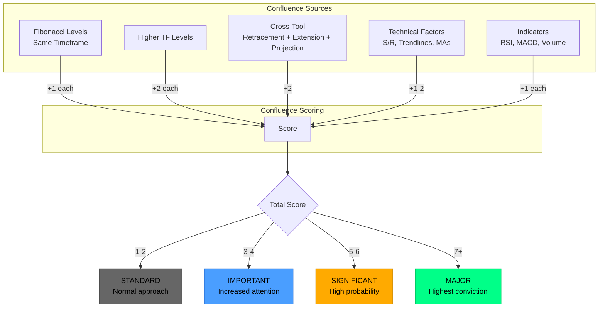

## 10.1 What is Confluence?

Confluence occurs when multiple independent factors align at the same price level, increasing probability.

```
TYPES OF CONFLUENCE
───────────────────

1. FIBONACCI CONFLUENCE (Same Timeframe)
   └── Multiple Fib levels from different swings at same price

2. TIMEFRAME CONFLUENCE (Different Timeframes)
   └── Same level significant on multiple timeframes

3. CROSS-TOOL CONFLUENCE (Different Tools)
   └── Retracement + Projection + Extension all pointing to same level

4. TECHNICAL CONFLUENCE (Fibonacci + Other Factors)
   └── Fib level + Trendline + Moving Average + Structure
```

## 10.2 Confluence Scoring

```
CONFLUENCE SCORE CALCULATION
────────────────────────────

FIBONACCI FACTORS:
├── Base Fibonacci level:           +1
├── Same TF additional Fib level:   +1 each
├── Higher TF Fibonacci level:      +2 each
├── Cross-tool confluence:          +2 (different tools, same price)
└── Harmonic pattern completion:    +3

STRUCTURE FACTORS:
├── Previous major pivot:           +2
├── Trendline intersection:         +1
└── Psychological level nearby:     +1

INDICATOR FACTORS:
├── RSI confirmation:               +1
├── MACD confirmation:              +1
└── Volume spike:                   +1


SCORE INTERPRETATION:
┌─────────────────────────────────────────────────────────┐
│ Score 1-2:   Standard level, normal approach            │
│ Score 3-4:   Important level, increased attention       │
│ Score 5-6:   Significant level, high probability        │
│ Score 7+:    Major level, highest conviction            │
└─────────────────────────────────────────────────────────┘
```

---

# 11. Enhancements & Roadmap

## 11.1 Current Implementation Status

**Implemented:**
- Market structure detection (HH/HL/LH/LL)
- All four Fibonacci tools
- Signal bar detection (Type 1/Type 2)
- Multi-timeframe analysis
- Position sizing by category
- Basic confluence scoring
- RSI and MACD indicators
- Trade journaling

## 11.2 Enhancement Roadmap

```
PHASE 1: CORE IMPROVEMENTS (High Priority)
──────────────────────────────────────────
□ Ranging market detection and warning
□ Cross-tool confluence scoring enhancement
□ Psychological levels in confluence

PHASE 2: ADDITIONAL INDICATORS (High Priority)
──────────────────────────────────────────────
□ Volume analysis integration
□ ATR indicator and suggestions
□ Time of day / session awareness

PHASE 3: TRADE MANAGEMENT (Medium Priority)
───────────────────────────────────────────
□ Multi-attempt budget tracking
□ Adaptive trailing stop options
□ Compounding/layering UI

PHASE 4: FUNDAMENTAL (Lower Priority)
─────────────────────────────────────
□ Economic calendar integration
□ News/event awareness
```

---

# 12. Quick Reference

## 12.1 Fibonacci Formulas

```
CALCULATIONS
────────────

RETRACEMENT:
  BUY:  Level = C - ((C - B) × Ratio)
  SELL: Level = C + ((B - C) × Ratio)

EXTENSION:
  BUY:  Level = C - ((C - B) × Ratio)  [ratio > 1.0]
  SELL: Level = C + ((B - C) × Ratio)  [ratio > 1.0]

PROJECTION:
  BUY:  Level = C - ((A - B) × Ratio)
  SELL: Level = C + ((B - A) × Ratio)

EXPANSION:
  BUY:  Level = C - ((B - C) × Ratio)
  SELL: Level = C + ((C - B) × Ratio)

POSITION SIZING:
  Position = (Account × Risk% × Multiplier) ÷ Stop Distance
```

## 12.2 Quick Decision Tables

```
TRADE CATEGORY SELECTION:
─────────────────────────
Higher TF UP + Lower TF DOWN at support    → WITH_TREND LONG (1-2%)
Higher TF DN + Lower TF UP at resistance   → WITH_TREND SHORT (1-2%)
Higher TF UP at major extension            → COUNTER_TREND SHORT (0.5-1%)
Higher TF DN at major support              → COUNTER_TREND LONG (0.5-1%)
Lower TFs turning before higher TF         → REVERSAL ATTEMPT (0.25-0.5%)


SIGNAL BAR CHECKLIST:
─────────────────────
FOR LONG:                       FOR SHORT:
□ Close > Open                  □ Close < Open
□ Close > Fib Level            □ Close < Fib Level
□ Previous bars declining       □ Previous bars rising
□ Wick tested below = Type 1   □ Wick tested above = Type 1


R:R EVALUATION (Reward-to-Risk):
────────────────────────────────
< 1.5    → POOR (reconsider trade - risking more than potential gain)
1.5-2.0  → MARGINAL (acceptable for high confluence setups)
2.0-3.0  → GOOD (standard trades - gain $2-3 per $1 risked)
≥ 3.0    → EXCELLENT (ideal setup - gain $3+ per $1 risked)
```

---

*Document Version 2.0 | Created from SignalPro methodology, Extended Framework, and collaborative refinement*
