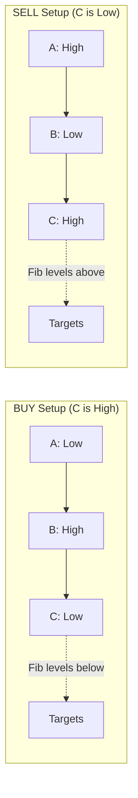
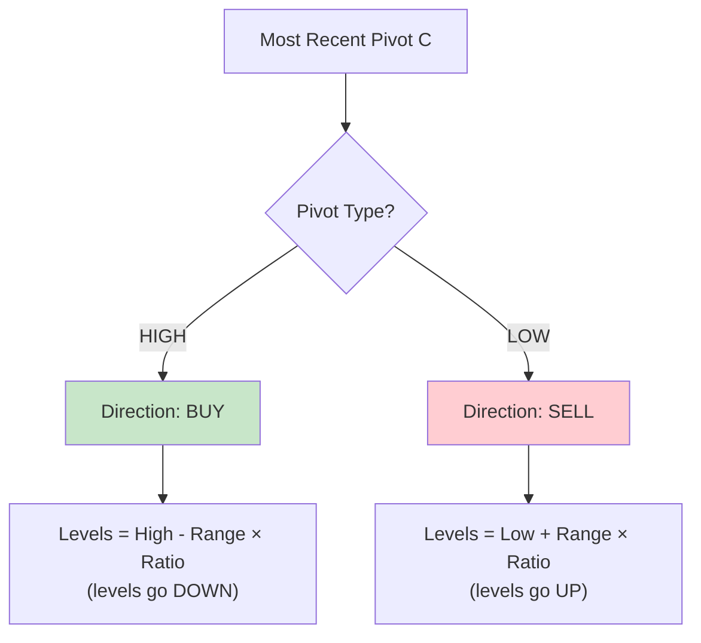
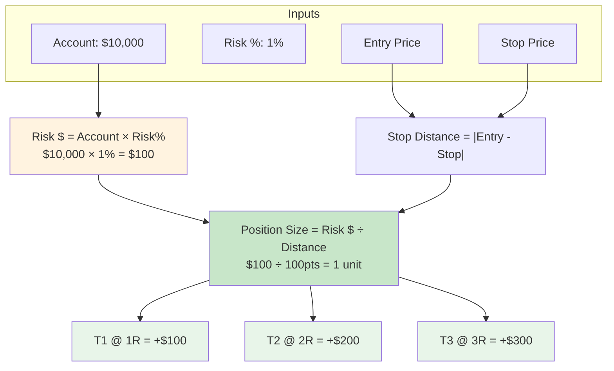

# Pine Script

TradingView Pine Script indicators that mirror functionality from the Trader app backend. These indicators implement the same algorithms as `trader/pivots.py` and `trader/fibonacci.py`.

## Structure

- `indicators/` - Custom indicators matching backend algorithms
- `strategies/` - Trading strategies (planned)
- `libraries/` - Reusable Pine Script libraries (planned)

## Available Indicators

### 1. Swing Detection & Fibonacci (`indicators/swing_detection.pine`)

Single-timeframe swing detection with all four Fibonacci tools. Matches Workflow V2 backend.

**Features:**
- Detects swing highs/lows with configurable lookback
- Classifies swings as HH/HL/LH/LL
- Enforces alternation (high → low → high → low)
- Editable pivot overrides (A, B, C points)
- All 4 Fibonacci tools:
  - Retracement (38.2%, 50%, 61.8%, 78.6%)
  - Extension (127.2%, 161.8%, 261.8%)
  - Projection (3-point ABC pattern)
  - Expansion (range expansion from pivot)
- Trend panel with RSI, MACD, and swing analysis
- BUY/SELL direction based on swing direction

**Settings:**
| Setting | Default | Description |
|---------|---------|-------------|
| Lookback Period | 5 | Bars to check on each side (2-20) |
| Override Pivot A/B/C | 0 | Manual pivot prices (0 = auto-detect) |
| Show Retracement | true | Display retracement levels |
| Show Extension | true | Display extension levels |
| Show Projection | true | Display projection levels |
| Show Expansion | true | Display expansion levels |
| RSI/MACD Periods | 14/12/26/9 | Indicator parameters |

---

### 2. Multi-Timeframe Swing Detection (`indicators/swing_detection_mtf.pine`)

**The flagship indicator** - Shows swing points and Fibonacci levels from ALL 7 timeframes on a single chart.

**Features:**
- View pivots from 1M, 1W, 1D, 4H, 1H, 15m, 1m simultaneously
- Per-timeframe lookback settings (left/right bars)
- Per-timeframe Fibonacci tool toggles
- Per-timeframe ratio selection
- ABC pattern detection for projections
- Trend panel with RSI/MACD per timeframe
- Color-coded by timeframe with adjustable line lengths
- Manual ABC point overrides per timeframe

**Timeframe Settings:**

| Timeframe | Default Color | Line Length | Default Enabled |
|-----------|---------------|-------------|-----------------|
| 1M Monthly | Purple | 100 bars | Yes |
| 1W Weekly | Blue | 85 bars | Yes |
| 1D Daily | Teal | 70 bars | Yes |
| 4H Four Hour | Green | 55 bars | Yes |
| 1H One Hour | Orange | 40 bars | Yes |
| 15m Fifteen Min | Red | 25 bars | No |
| 1m One Minute | Gray | 10 bars | No |

**Per-Timeframe Controls:**
```
Enable/Disable | Color | Left bars | Right bars | Labels | Lines | Price | Extend

Retracement: 23.6% | 38.2% | 50% | 61.8% | 78.6%
Extension:   127.2% | 161.8% | 200% | 261.8%
Projection:  61.8% | 78.6% | 100% | 127.2% | 161.8%
Expansion:   38.2% | 50% | 61.8% | 100% | 161.8%

Auto ABC: Yes/No | Manual A | Manual B | Manual C
```

**Trend Panel:**
| Column | Description |
|--------|-------------|
| TF | Timeframe with color indicator |
| A | Point A price (oldest pivot) |
| B | Point B price (middle pivot) |
| C | Point C price (most recent pivot) |
| Trend | BULL / BEAR / RANG based on RSI+MACD |
| RSI | Current RSI value |
| MACD | + or - for histogram direction |
| L/R | Left/Right lookback bars |

**ABC Pivot Pattern:**



**Algorithm (matches backend):**



**Calculation Formulas:**
```
Retracement/Extension BUY:  Level = High - (Range × Ratio)
Retracement/Extension SELL: Level = Low + (Range × Ratio)
Projection BUY:  Level = C - (|A-B| × Ratio)
Projection SELL: Level = C + (|A-B| × Ratio)
Expansion BUY:   Level = Low - (Range × Ratio)
Expansion SELL:  Level = High + (Range × Ratio)
```

---

### 3. Position Sizing Calculator (`indicators/position_sizing_calculator.pine`)

Calculates position size and displays a detailed breakdown of the math. Educational tool showing every step.



**Features:**
- Account size and risk % inputs
- Auto stop loss using ATR
- Auto targets using R-multiples (1R, 2R, 3R)
- Manual entry/stop/target overrides
- Multi-instrument support (Indices, Forex, Stocks, Crypto, Futures, CFD)
- Formula breakdown table showing each calculation step
- R:R summary table with profit at each target
- Entry/Stop/Target lines on chart

**Account Settings:**
| Setting | Default | Description |
|---------|---------|-------------|
| Account Size | $10,000 | Your trading account balance |
| Risk Per Trade | 1.0% | Max % to risk per trade (1-2% recommended) |

**Trade Setup:**
| Setting | Default | Description |
|---------|---------|-------------|
| Use Current Price | true | Use close as entry, or set manual |
| Trade Direction | Long | Long or Short |
| Auto Stop (ATR) | true | Calculate stop using ATR |
| ATR Period | 14 | Period for ATR calculation |
| ATR Multiplier | 1.5 | Stop = Entry ± (ATR × Multiplier) |

**Auto Targets:**
| Setting | Default | Description |
|---------|---------|-------------|
| T1 Multiple | 1.0 | Target 1 at 1R (same distance as stop) |
| T2 Multiple | 2.0 | Target 2 at 2R |
| T3 Multiple | 3.0 | Target 3 at 3R |

**Formula Breakdown Table:**
```
Step 1: Risk $ = Account × Risk%
        $10,000 × 1% = $100

Step 2: Stop Dist = |Entry - Stop|
        |42500 - 42400| = 100

Step 3: Size = Risk $ ÷ Stop Dist
        $100 ÷ 100 = 1.0 units

R:R = Profit $ ÷ Risk $
T1: $100 ÷ $100 = 1:1
T2: $200 ÷ $100 = 1:2
T3: $300 ÷ $100 = 1:3
```

**Instrument Types:**
| Type | Position Size Unit | Notes |
|------|-------------------|-------|
| Indices | Units | DJI, SPX, NDX |
| Forex | Units / Lots | Standard=100k, Mini=10k, Micro=1k |
| Stocks/ETFs | Shares | Price × Shares = Value |
| Crypto | Units | BTC, ETH, etc. |
| Futures | Contracts | Uses tick value/size |
| CFD | Units | Contract for difference |

---

## Usage

1. Open TradingView
2. Click "Pine Editor" at the bottom
3. Copy the script content and paste
4. Click "Add to Chart"

**Recommended Setup:**
- Use **MTF Swing Detection** on higher timeframe charts (1D, 4H)
- Enable only relevant timeframes for your trading style
- Use **Position Sizing Calculator** after identifying a setup

## Backend Algorithm Matching

These indicators implement the same calculations as the Python backend:

| Indicator | Backend Module |
|-----------|----------------|
| Swing Detection | `trader/pivots.py` |
| Fibonacci Levels | `trader/fibonacci.py` |
| Trend Analysis | `trader/workflow.py` |
| Position Sizing | `trader/position_sizing.py` |

The MTF indicator's ABC point detection and Fibonacci calculations produce identical levels to the backend Workflow V2 endpoints.
